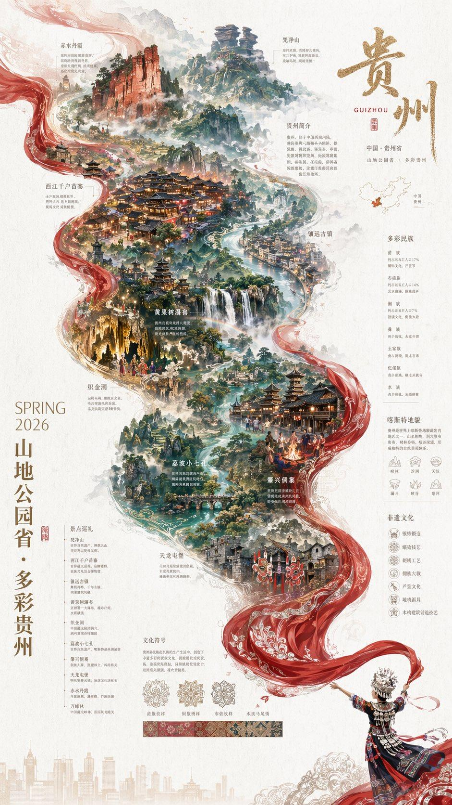
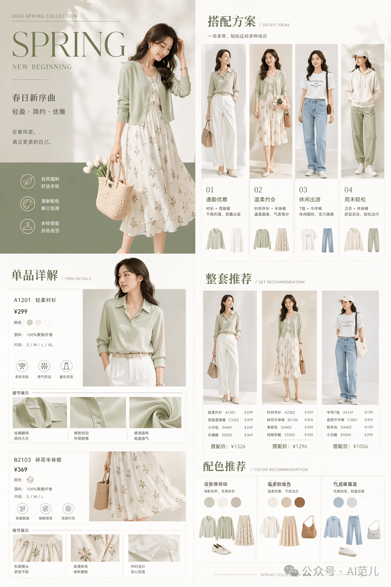
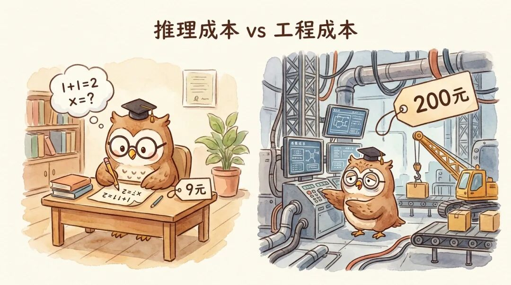

# Image Seed · AI 生图参考库

个人收集的不同风格图片,作为 AI 生图时的参考与灵感。分类体系对齐 [baoyu-skills](https://github.com/JimLiu/baoyu-skills):**场景 × 风格/布局** 两层结构。

## 免责与版权说明

本仓库收录的图片来自个人日常收藏、微信/微博转发及公开信息图，仅供**个人学习与 AI 生图风格参考**，不用于任何商业目的。

对于仓库中所有第三方图片，我深知其背后凝聚着原作者的心血与创意。若您是相关图片的版权所有者，且认为本仓库的收录方式侵犯了您的权益，**请第一时间通过 [issue](../../issues) 或邮件联系我，我会在 24 小时内删除相关内容，并致以诚挚的歉意**。对于未能提前征得许可便收录的情况，在此先行道歉，感谢您的理解与包容。

已知来源的图片均已在各子分类元数据表中标注原作者，如有遗漏请指正。

## 使用方式

1. 选一个**场景**(下方卡片)→ 进入查看该场景的 styles 和 layouts 画廊
2. 点击感兴趣的风格/布局 → 查看该子分类下所有参考图及其来源/prompt
3. 找灵感可先看「精选墙」,再按场景进入
4. 跨场景检索:仓库搜索框输入反引号包裹的标签,如 `` `warm` ``

## 场景导航

| 场景 | 说明 | 子分类数 | 现有图片 |
|---|---|---|---|
| [XHS Images · 小红书图片](./xhs-images/README.md) | 社交平台配图,封面/笔记头图 | 9 styles + 6 layouts | 15 |
| [Infographic · 信息图](./infographic/README.md) | 信息可视化,概念图解 | 17 styles + 20 layouts | 64 |
| [Comic · 漫画](./comic/README.md) | 分镜、连环画、长条漫 | 6 layouts | 7 |
| [Slide Deck · 演示文稿](./slide-deck/README.md) | 幻灯片、Keynote 风格 | 16 styles | 17 |
| [Article Illustrator · 文章插图](./article-illustrator/README.md) | 博客/文章插图 | 8 styles | 10 |
| [Unclassified · 未分类](./unclassified/README.md) | 场景类待归档图片 | — | 0 |

### 按生成模型来源

| 模型 | 说明 | 子分类 | 现有图片 |
|---|---|---|---|
| [GPT Image 2](./gpt-image-2/README.md) | OpenAI GPT Image 2 生成的图片 | ecommerce / infographic / xhs / seasonal / travel / app-ui / poster | 23 |

> **待归类暂存**：`unclassified-gpt-image-2/` 存放尚未归类的 GPT Image 2 图片，处理完后清空。

## 精选墙

各场景挑 1–2 张代表图。随内容补充,点击缩略图查看原图。

|   |   |   |
|:---:|:---:|:---:|
|  |  |  |
| `gpt-image-2 · travel` | `gpt-image-2 · ecommerce` | `gpt-image-2 · infographic` |
|  |  |  |
| `infographic · mind-map` | `infographic · grid-cards` | `article-illustrator · watercolor` |
|  |  |  |
| `article-illustrator · warm` | `slide-deck · sketch-notes` | `xhs-images · pop` |
|  |  |  |
| `comic · standard` | `infographic · comparison-table` | `infographic · layers-stack` |

## 新增图片

详见 [CONTRIBUTING.md](./CONTRIBUTING.md)。

## 约定

- **命名**:`<scenario>-<substyle>-<subject>-<modifier>[-nn].<ext>`,全小写连字符
- **格式**:`.jpg` / `.png` / `.webp` 皆可,单图 < 1MB(上限 2MB,不用 LFS)
- **标签**:元数据表用反引号包裹关键词,便于 GitHub 仓库搜索跨场景找灵感

