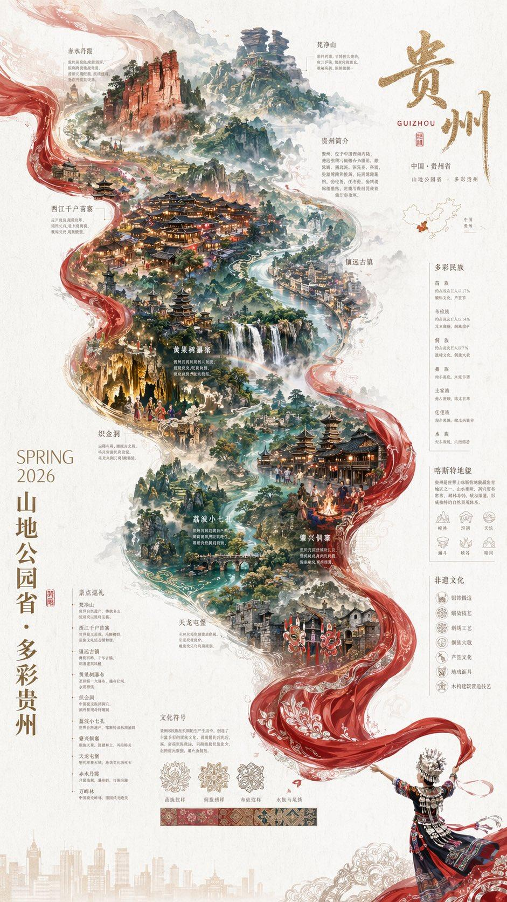
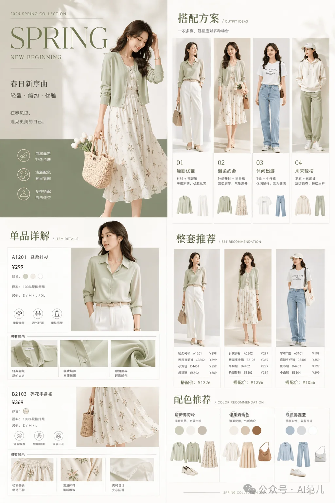
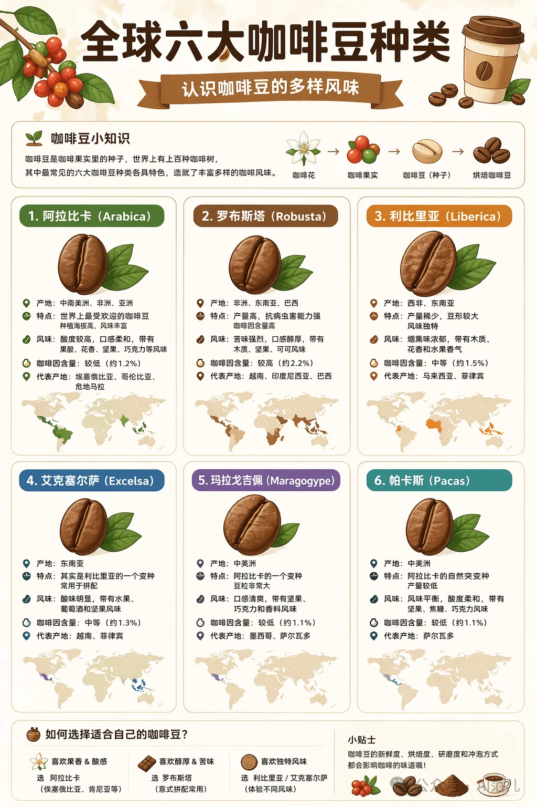
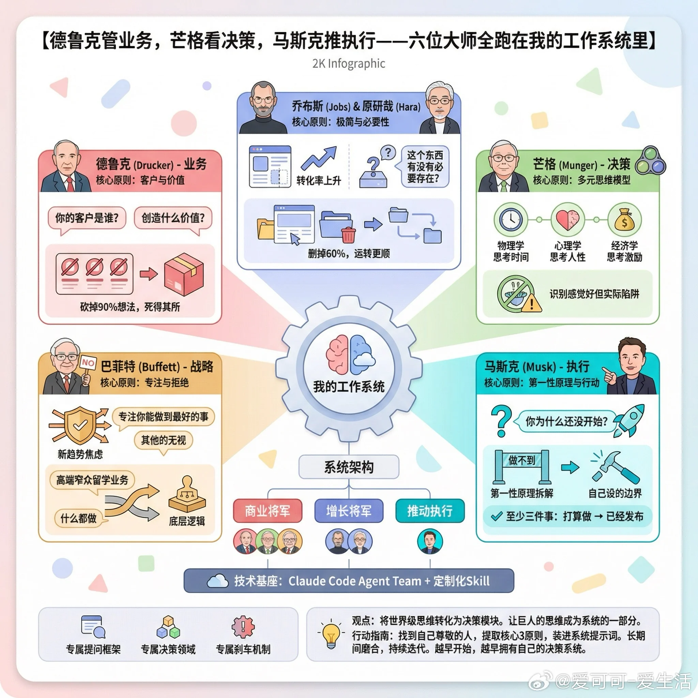
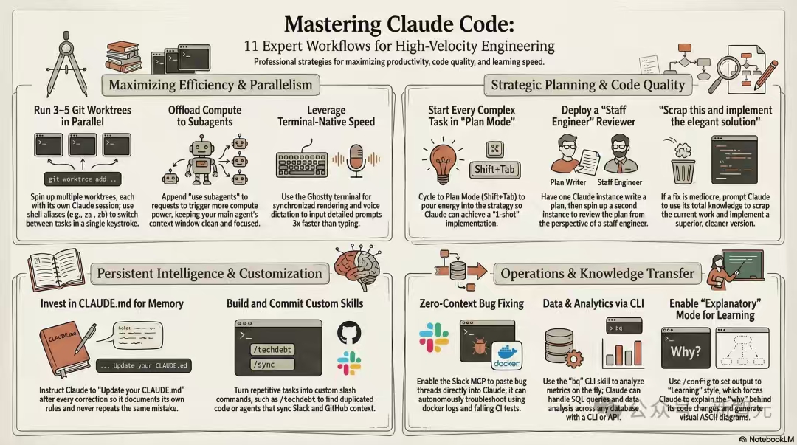
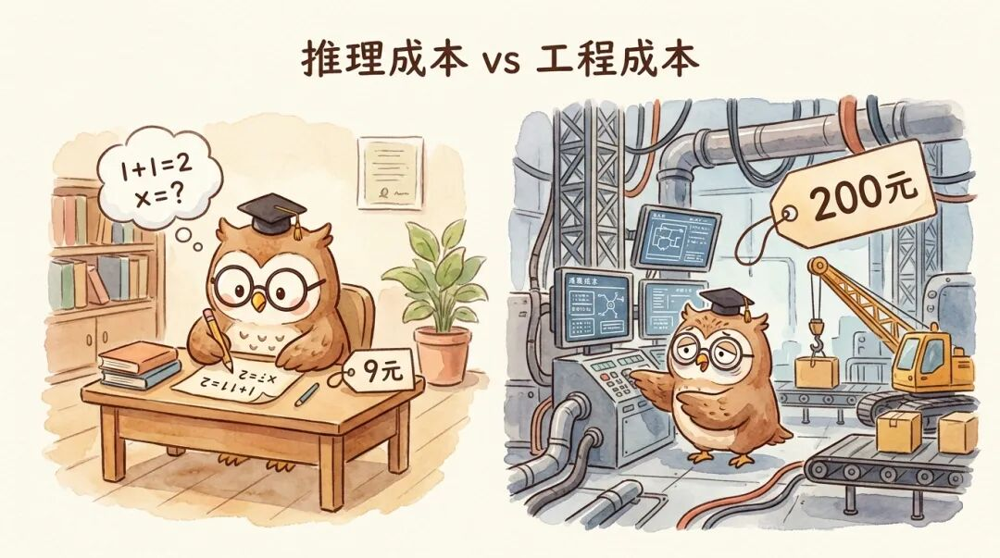
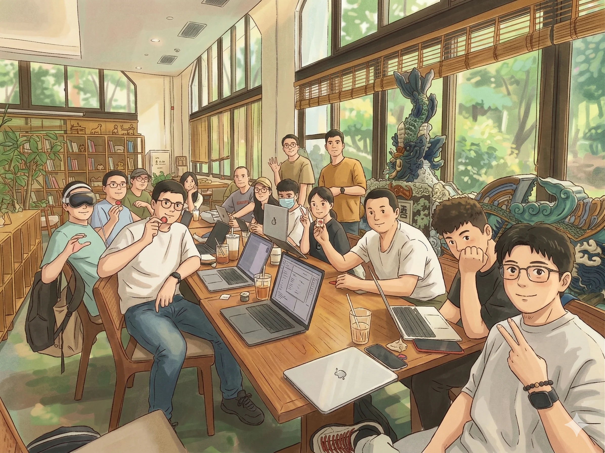
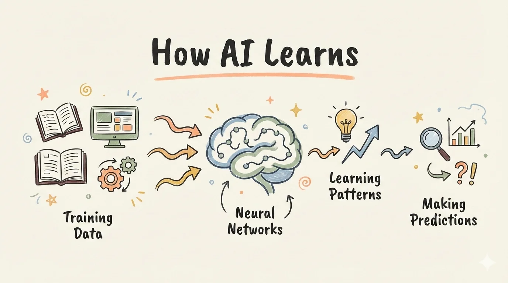
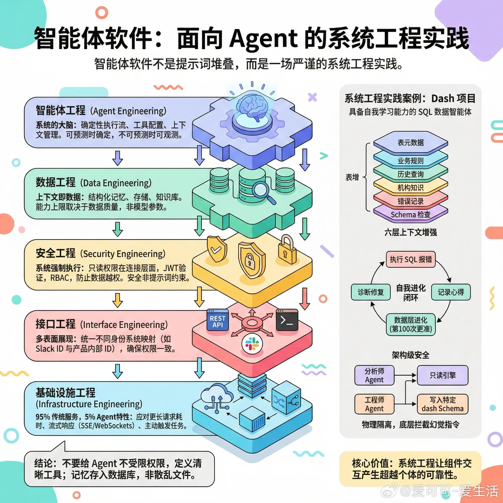

---
hide:
  - navigation
  - toc
---

IMAGE SEED · ISSUE 01 · 2026

# A Reference Library for AI Imagery

个人 AI 生图参考 / 灵感库 · 跨 7 个体系、200+ 张图,任翻随取

## 精选墙

  

    
  

  

    
  

  

    
  

  

    
  

  

    
  

  

    
  

  

    
  

  

    
  

  

    
  

  

    
  

  

    
  

  

    
  

## 场景导航

| 场景 | 说明 | 子分类数 | 现有图片 |
|---|---|---|---|
| [XHS Images · 小红书图片](./xhs-images/README.md) | 社交平台配图,封面/笔记头图 | 9 styles + 6 layouts | 30 |
| [Infographic · 信息图](./infographic/README.md) | 信息可视化,概念图解 | 17 styles + 20 layouts | 131 |
| [Comic · 漫画](./comic/README.md) | 分镜、连环画、长条漫 | 6 layouts | 14 |
| [Slide Deck · 演示文稿](./slide-deck/README.md) | 幻灯片、Keynote 风格 | 16 styles | 17 |
| [Article Illustrator · 文章插图](./article-illustrator/README.md) | 博客/文章插图 | 8 styles | 13 |
| [Poster · 海报](./poster/README.md) | 影视/小说/品牌等单图宣传海报 | 扁平 | 12 |
| [Ecommerce · 电商](./ecommerce/README.md) | 电商详情页、直播间 UI、搭配页 | 扁平 | 4 |
| [Seasonal · 节气节日](./seasonal/README.md) | 节气、传统节日海报与手抄报 | 扁平 | 7 |
| [Travel · 旅游](./travel/README.md) | 旅游目的地宣传海报 | 扁平 | 2 |
| [App UI · 应用界面](./app-ui/README.md) | 应用界面营销截图 | 扁平 | 6 |
| [Product Design · 产品设计](./product-design/README.md) | 实物产品/工业设计/空间装置/创意概念 | 扁平 | 3 |
| [Meme · 梗图](./meme/README.md) | 网络梗图、对比/吐槽 meme、二次创作图 | 扁平 | 1 |
| [Unclassified · 未分类](./unclassified/README.md) | 待归档图片(场景类) | — | 0 |

> **模型来源**通过元数据标签记录(如 `` `gpt-image-2` ``),不再单设顶层目录。跨场景搜索某模型生成的图,GitHub 仓库搜该标签即可。

## 使用方式

1. 选一个**场景**(上方导航)→ 进入查看该场景的 styles 和 layouts 画廊
2. 点击感兴趣的风格/布局 → 查看该子分类下所有参考图及其来源/prompt
3. 找灵感可先看「精选墙」,再按场景进入
4. 跨场景检索:仓库搜索框输入反引号包裹的标签,如 `` `warm` ``

## 约定

- **命名**:`<scenario>-<substyle>-<subject>-<modifier>[-nn].<ext>`,全小写连字符
- **格式**:`.jpg` / `.png` / `.webp` 皆可,单图 < 1MB(上限 2MB,不用 LFS)
- **标签**:元数据表用反引号包裹关键词,便于 GitHub 仓库搜索跨场景找灵感
- **Prompt**:若图有原始 prompt,同 trunk 配 `.md` sidecar(单图 `poster-foo.png` ↔ `poster-foo.md`;多图共享时 `poster-foo-01/02.png` ↔ 同一份 `poster-foo.md`)。sidecar 推荐顶部嵌入图片预览 + 自由 markdown 写 prompt 正文,frontmatter 全选填。元数据表 Prompt 列写 `[prompt: <摘要>…](./trunk.md)` —— 详见 [CONTRIBUTING.md](./CONTRIBUTING.md#prompt-sidecar-文件)

新增图片详见 [CONTRIBUTING.md](./CONTRIBUTING.md)。

---

## 免责与版权说明

本仓库收录的图片来自个人日常收藏、微信/微博转发及公开信息图，仅供**个人学习与 AI 生图风格参考**，不用于任何商业目的。

对于仓库中所有第三方图片，我深知其背后凝聚着原作者的心血与创意。若您是相关图片的版权所有者，且认为本仓库的收录方式侵犯了您的权益，**请第一时间通过 [issue](../../issues) 或邮件联系我，我会在 24 小时内删除相关内容，并致以诚挚的歉意**。对于未能提前征得许可便收录的情况，在此先行道歉，感谢您的理解与包容。

已知来源的图片均已在各子分类元数据表中标注原作者，如有遗漏请指正。
