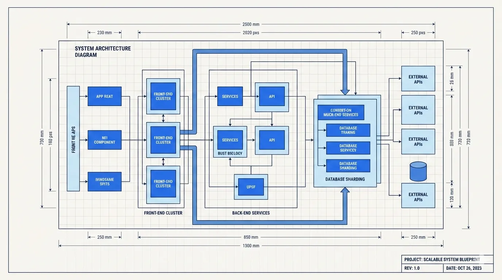
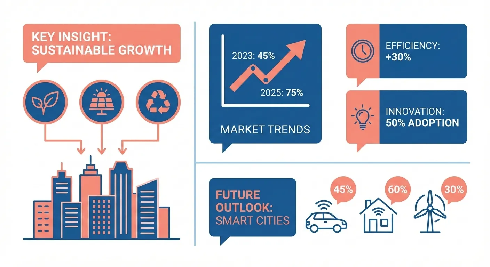
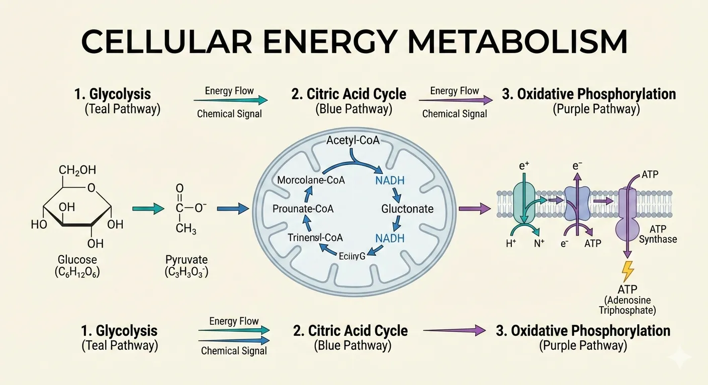

# Article Illustrator · 文章插图

博客、公众号、知识文章的配图。仅有 **Styles(视觉风格)** 维度。

[← 返回总索引](../README.md)

## Styles 风格画廊

  

    
  

  

    
  

  

    
  

  

    
  

  

    
  

  

    
  

  

    
  

  

    
  

  

    
  

  

    
  

  

    
  

  

    
  

  

    
  

## 可用子分类

**Styles**(8):[`notion`](./notion/README.md) · [`elegant`](./elegant/README.md) · [`warm`](./warm/README.md) · [`minimal`](./minimal/README.md) · [`blueprint`](./blueprint/README.md) · [`watercolor`](./watercolor/README.md) · [`editorial`](./editorial/README.md) · [`scientific`](./scientific/README.md)

> 每张图一格,同一子分类的多张图连续相邻(标签相同即为同组)。本地收藏图排前、[baoyu-skills](https://github.com/JimLiu/baoyu-skills) 官方示例排后。点任意格跳转到子分类 README 看完整元数据。
