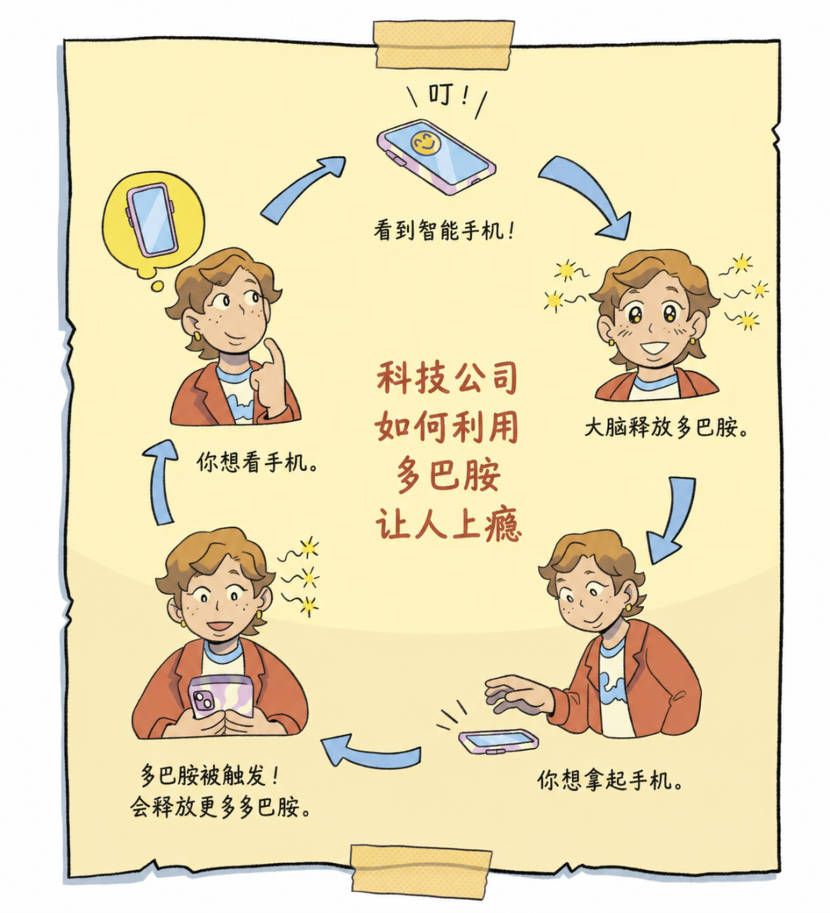
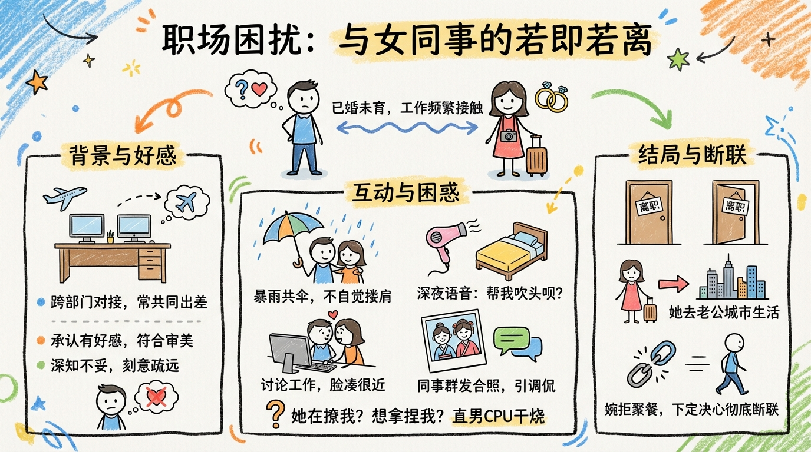
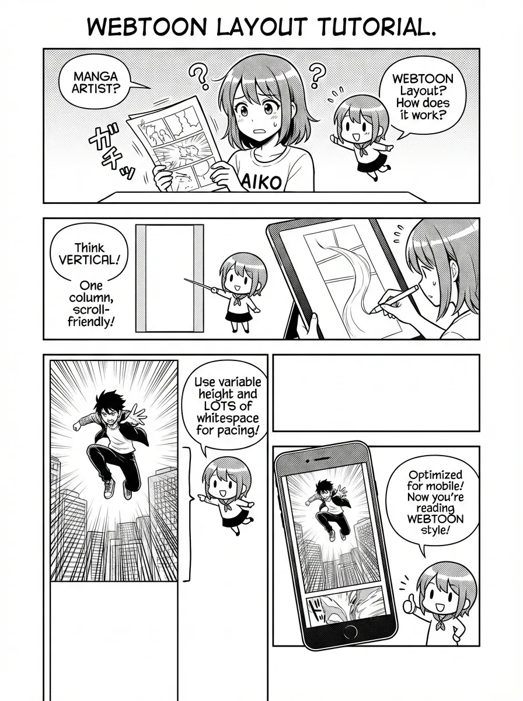

# Comic · 漫画

漫画分镜、连环画、长条漫(webtoon)等。仅有 **Layouts(布局)** 维度。

[← 返回总索引](../README.md)

## Layouts 布局画廊

|   |   |   |
|:---:|:---:|:---:|
|  |  |  |
| [standard](./standard/README.md) | [standard](./standard/README.md) | [standard](./standard/README.md) |
|  |  |  |
| [standard](./standard/README.md) | [cinematic](./cinematic/README.md) | [dense](./dense/README.md) |
|  |  |  |
| [splash](./splash/README.md) | [mixed](./mixed/README.md) | [webtoon](./webtoon/README.md) |

## 可用子分类

**Layouts**(6):[`standard`](./standard/README.md) · [`cinematic`](./cinematic/README.md) · [`dense`](./dense/README.md) · [`splash`](./splash/README.md) · [`mixed`](./mixed/README.md) · [`webtoon`](./webtoon/README.md)

> 每张图一格,同一子分类的多张图连续相邻(标签相同即为同组)。本地收藏图排前、[baoyu-skills](https://github.com/JimLiu/baoyu-skills) 官方示例排后。点任意格跳转到子分类 README 看完整元数据。
