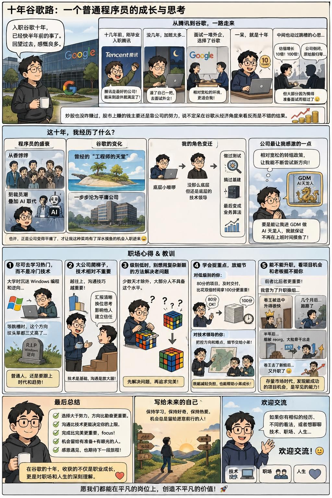
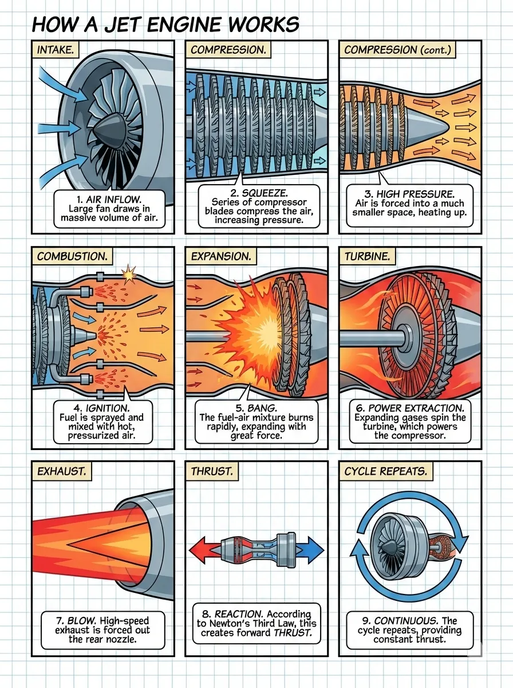

# Comic · Dense

`dense` 风格的参考图。高密度多格漫画,远超 standard 的 3-6 格规模。

[← 返回场景索引](../README.md) | [← 返回总索引](../../README.md)

## 画廊

<!-- 由 scripts/gen_scenario_readmes.py 自动生成,勿手编 -->

  

    
  

  

    
  

## 元数据

| 文件 | 主体 | 标签 | 来源 | Prompt |
|---|---|---|---|---|
| [comic-dense-google-decade-story](./comic-dense-google-decade-story.jpeg) | 十年谷歌路:一个普通程序员的成长与思考,密集多格漫画式经验记录 | `dense` `career` `programmer` `growth` `chinese` `pastel` `gpt-image-2` | — | — |
| [comic-dense-baoyu](./comic-dense-baoyu.webp) | `dense` 参考示例 | `baoyu-skills` `dense` | [baoyu-skills](https://github.com/JimLiu/baoyu-skills) | — |

**说明**:来源/Prompt 缺失填 `—`;标签用反引号包裹。
