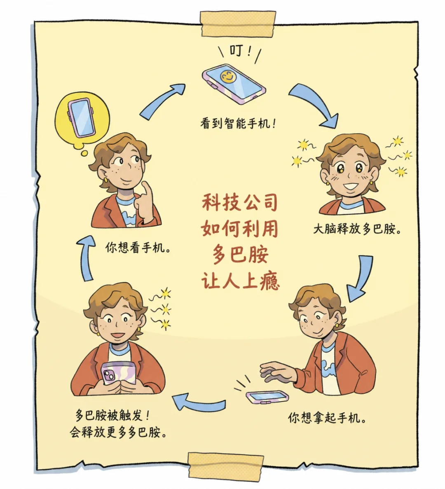
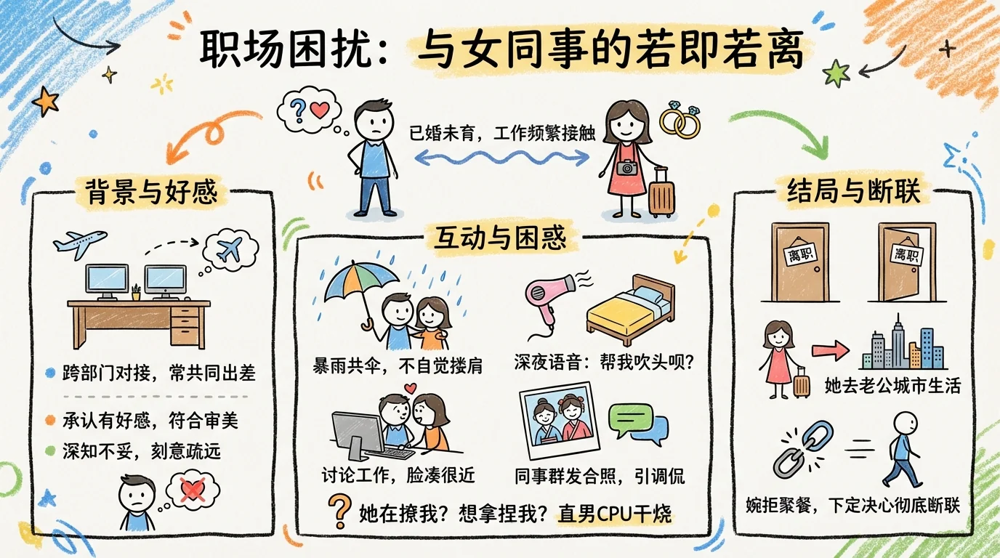
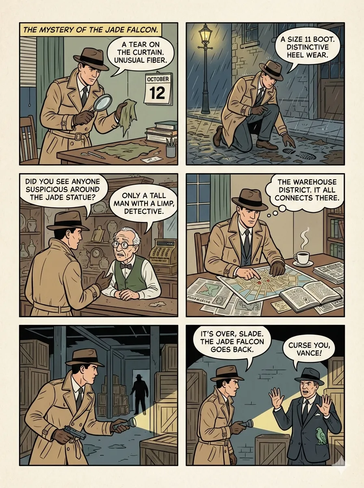

# Comic · Standard

`standard` 风格的参考图。首张来自 [baoyu-skills](https://github.com/JimLiu/baoyu-skills) 官方示例。

[← 返回场景索引](../README.md) | [← 返回总索引](../../README.md)

## 画廊

<!-- 由 scripts/gen_scenario_readmes.py 自动生成,勿手编 -->

|   |   |   |
|:---:|:---:|:---:|
|  |  |  |
| chatgpt-plus-subscription | dopamine-loop | ultraman-vs-calabash-brothers-0 |
|  |  |  |
| ultraman-vs-calabash-brothers-1 | ultraman-vs-calabash-brothers-2 | ultraman-vs-calabash-brothers-3 |
|  |  |    |
| workplace-colleague-story | baoyu |    |

## 元数据

| 文件 | 主体 | 标签 | 来源 | Prompt |
|---|---|---|---|---|
| [comic-standard-chatgpt-plus-subscription](./comic-standard-chatgpt-plus-subscription.webp) | ChatGPT Plus 订阅四格漫画 | `chatgpt` `subscription` `comic-strip` `xhs-style` | — | — |
| [comic-standard-dopamine-loop](./comic-standard-dopamine-loop.webp) | 科技公司如何利用多巴胺让人上瘾:6 格循环漫画(看到提醒→大脑释放多巴胺→拿起手机→…) | `dopamine` `tech-critique` `loop` `psychology` `xhs-style` | — | — |
| [comic-standard-ultraman-vs-calabash-brothers-0](./comic-standard-ultraman-vs-calabash-brothers-0.jpg) | 奥特曼大战葫芦娃绘本 Page 1:奥特曼来到葫芦山,七个葫芦娃惊呆,「你是谁?」 | `comic` `story-book` `kids` `ultraman` `calabash` `watercolor` `chinese` `series` `gpt-image-2` | — | [prompt: 儿童绘本内页插画模板…](./comic-standard-ultraman-vs-calabash-brothers.md) |
| [comic-standard-ultraman-vs-calabash-brothers-1](./comic-standard-ultraman-vs-calabash-brothers-1.jpg) | Page 2:大娃举石头 / 二娃凝视,奥特曼摆姿势光光闪过,池边比试热闹 | `comic` `story-book` `kids` `ultraman` `calabash` `watercolor` `chinese` `series` `gpt-image-2` | — | [prompt: 儿童绘本内页插画模板…](./comic-standard-ultraman-vs-calabash-brothers.md) |
| [comic-standard-ultraman-vs-calabash-brothers-2](./comic-standard-ultraman-vs-calabash-brothers-2.jpg) | Page 3:三娃铁头功 / 四娃火焰 / 五娃水浪攻击,奥特曼光盾挡下,原来山谷里是大怪兽 | `comic` `story-book` `kids` `ultraman` `calabash` `watercolor` `chinese` `series` `gpt-image-2` | — | [prompt: 儿童绘本内页插画模板…](./comic-standard-ultraman-vs-calabash-brothers.md) |
| [comic-standard-ultraman-vs-calabash-brothers-3](./comic-standard-ultraman-vs-calabash-brothers-3.jpg) | Page 4:奥特曼与葫芦娃肩并肩打败怪兽,夕阳下大家开心笑,从那天起成了最勇敢的朋友 | `comic` `story-book` `kids` `ultraman` `calabash` `watercolor` `chinese` `series` `gpt-image-2` | — | [prompt: 儿童绘本内页插画模板…](./comic-standard-ultraman-vs-calabash-brothers.md) |
| [comic-standard-workplace-colleague-story](./comic-standard-workplace-colleague-story.webp) | 职场困扰:与女同事的若即若离 | `workplace` `story` `xhs-style` `comic-strip` | — | — |
| [comic-standard-baoyu](./comic-standard-baoyu.webp) | `standard` 参考示例 | `baoyu-skills` `standard` | [baoyu-skills](https://github.com/JimLiu/baoyu-skills) | — |

**说明**:来源缺失填 `—`;Prompt 有 sidecar 写带 20 字摘要的链接 `[prompt: <摘要>…](./<trunk>.md)`(trunk = basename 去 `-NN`,多图共享时多行指向同一个 sidecar),无则填 `—`;标签用反引号包裹。
