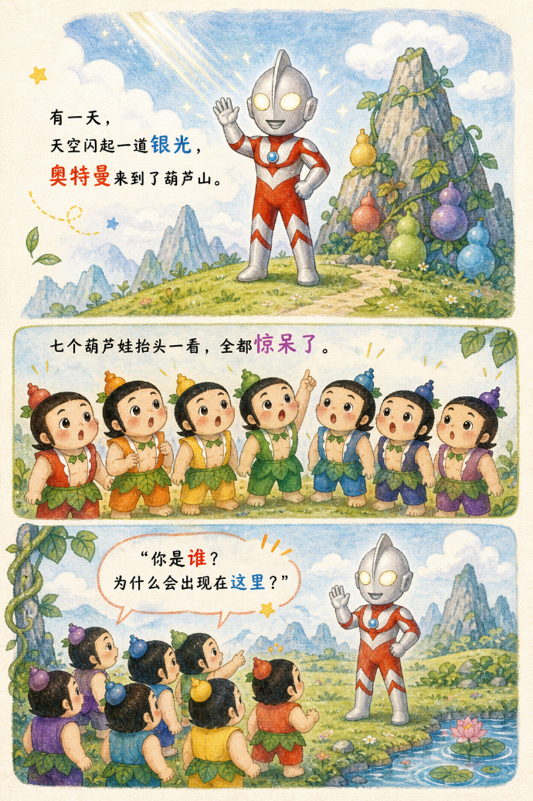
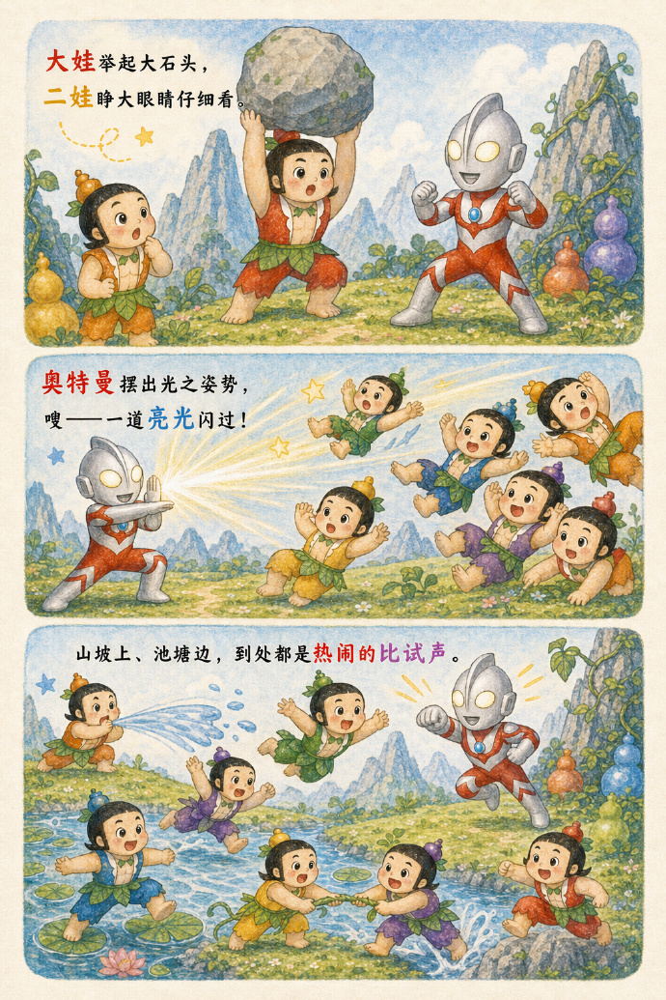
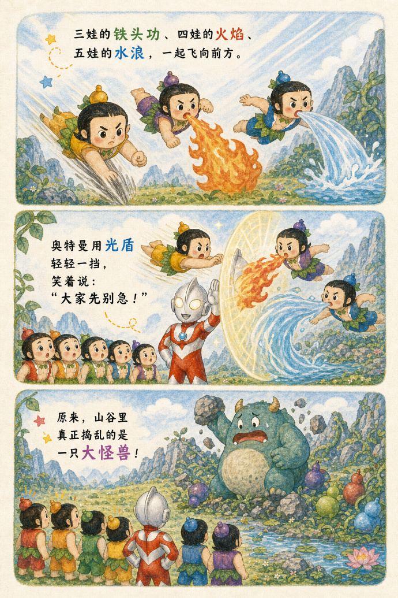
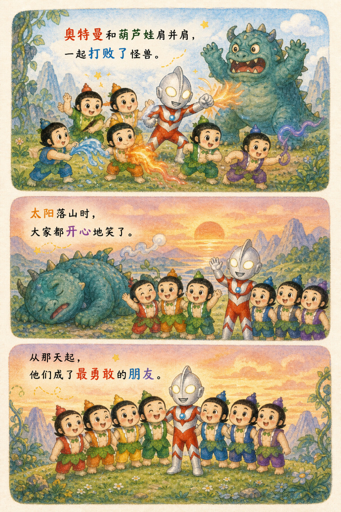

|   |   |   |   |
|:---:|:---:|:---:|:---:|
|  |  |  |  |
| Page 1 | Page 2 | Page 3 | Page 4 |

# 儿童绘本内页插画模板(本实例:奥特曼大战葫芦娃 4 页)

> 这是一个 **prompt 模板**(故事内容可换),用于生成竖版儿童绘本内页插画。多张图共享本 sidecar:`-0` 到 `-3` 各 1 页。

<div class="prompt-head" id="prompt">Prompt 正文</div>

```text
一页儿童绘本内页插画,竖版构图,米白色纸张背景,多段式分镜布局。
风格为手绘儿童绘本风格,柔和水粉、彩铅、蜡笔质感,纸张颗粒,线条自然,角色圆润可爱。
页面里加入清晰可读的绘本文字,像真实绘本一样排版,重点词可用彩色高亮,并加入少量手绘装饰。

故事内容:
【奥特曼大战葫芦娃】,【可以多页】
```
