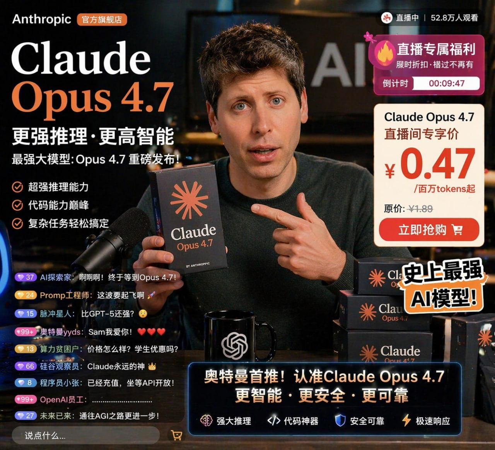
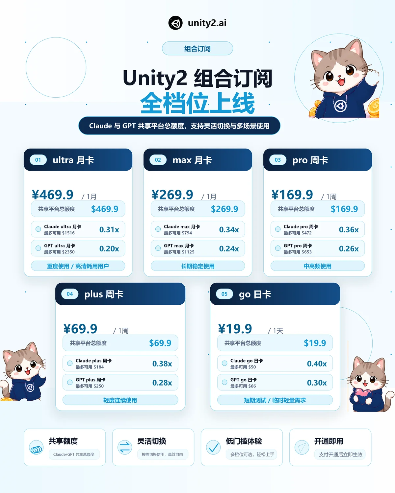

# Ecommerce · 电商详情页

电商场景图：产品详情页、直播间 UI、穿搭搭配页。

[← 返回总索引](../README.md)

## 画廊

<!-- 由 scripts/gen_scenario_readmes.py 自动生成,勿手编 -->

|   |   |   |
|:---:|:---:|:---:|
|  |  |  |
| ai-glasses-detail | livestream-claude-opus | spring-fashion-lookbook |
|  |    |    |
| unity2-subscription-plans |    |    |

## 元数据

| 文件 | 主体 | 标签 | 来源 | Prompt |
|---|---|---|---|---|
| [ecommerce-spring-fashion-lookbook](./ecommerce-spring-fashion-lookbook.webp) | 春季女装搭配方案详情页：单品详解 + 整套推荐 + 配色推荐 | `ecommerce` `fashion` `spring` `lookbook` `detail-page` `gpt-image-2` | — | — |
| [ecommerce-ai-glasses-detail](./ecommerce-ai-glasses-detail.webp) | AI 智能眼镜产品详情页：功能介绍 + 场景图 + 参数表 | `ecommerce` `tech` `product-detail` `dark` `gpt-image-2` | — | — |
| [ecommerce-livestream-claude-opus](./ecommerce-livestream-claude-opus.jpg) | Claude Opus 4.7 AI 带货直播间 UI（仿淘宝/小红书直播间） | `ecommerce` `livestream` `ui-mockup` `dark` `meme` `gpt-image-2` | — | — |
| [ecommerce-unity2-subscription-plans](./ecommerce-unity2-subscription-plans.webp) | Unity2.ai 组合订阅全档位营销页:ultra/max 月卡 + pro/plus 周卡 + go 日卡 共 5 张套餐卡 + 卡通猫吉祥物,清爽蓝色 SaaS 风 | `ecommerce` `saas` `pricing` `subscription` `mascot` `blue` `chinese` `gpt-image-2` | Unity2.ai | — |

**说明**:来源/Prompt 缺失填 `—`;标签用反引号包裹。
