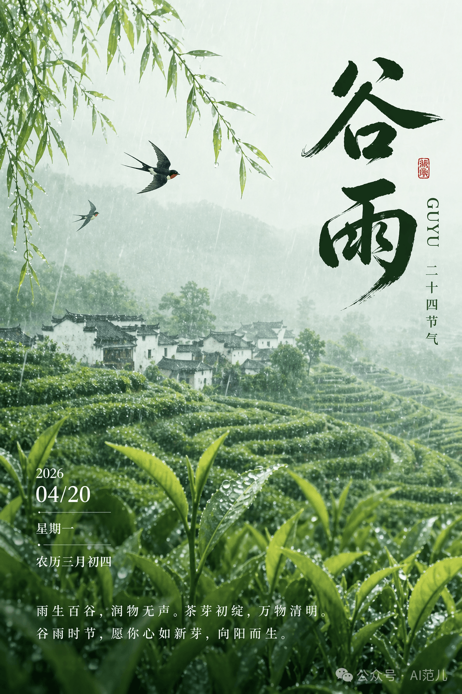
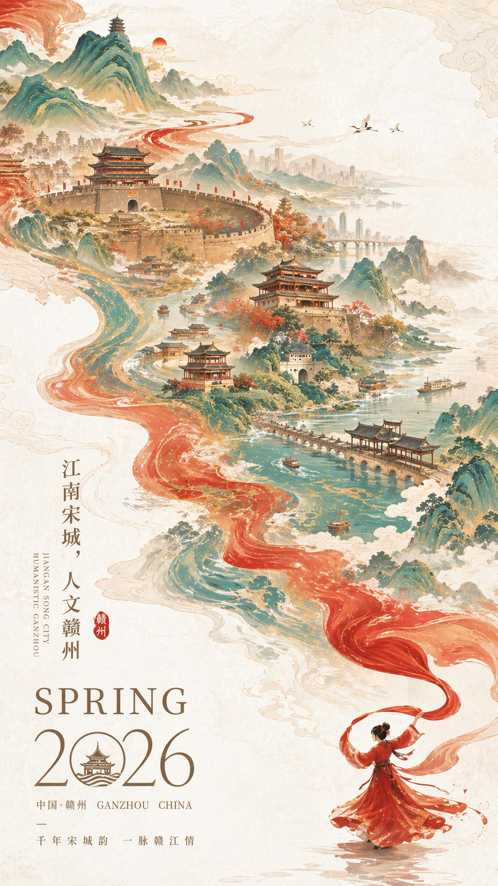
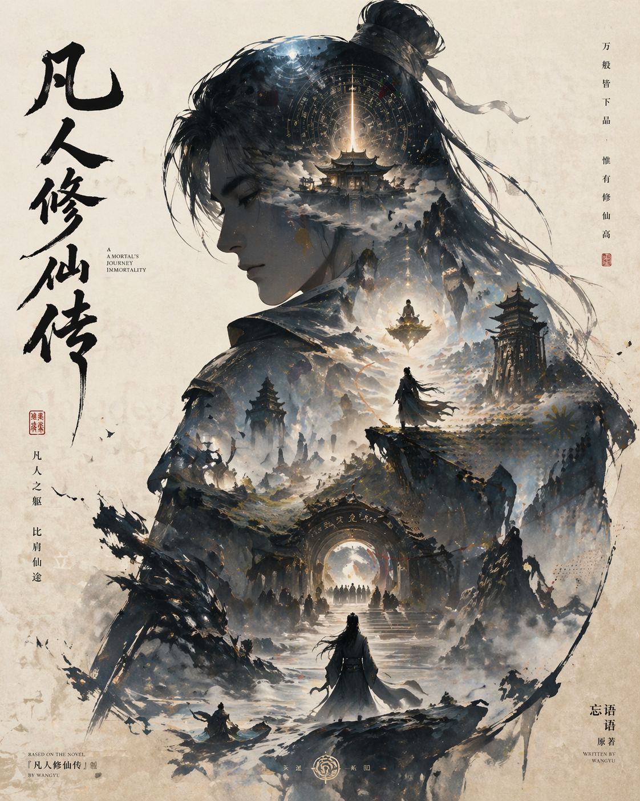

# GPT Image 2 · 按模型来源分类

OpenAI **GPT Image 2** 模型生成的图片集合。按「生成模型来源」组织,作为主体「场景 × 风格/布局」分类体系之外的补充维度 — 适合想参考某个模型风格/质感时直接检索。

[← 返回总索引](../README.md)

## 子分类导航

| 子分类 | 说明 | 图片数 |
|---|---|---|
| [ecommerce](./ecommerce/README.md) | 电商详情页、直播间 UI、搭配页 | 3 |
| [infographic](./infographic/README.md) | 知识百科、科普教育类信息图 | 5 |
| [xhs](./xhs/README.md) | 小红书风格图文：生活记录、穿搭指南 | 3 |
| [seasonal](./seasonal/README.md) | 二十四节气、传统节日海报与手抄报 | 2 |
| [travel](./travel/README.md) | 旅游目的地宣传海报，中国风水墨插画 | 2 |
| [app-ui](./app-ui/README.md) | 应用界面营销截图 | 6 |
| [poster](./poster/README.md) | 影视/小说/品牌等单图宣传海报 | 2 |

## 精选预览

|   |   |   |
|:---:|:---:|:---:|
|  |  |  |
| [ecommerce](./ecommerce/README.md) | [infographic](./infographic/README.md) | [xhs](./xhs/README.md) |
|  |  |  |
| [seasonal](./seasonal/README.md) | [travel](./travel/README.md) | [app-ui](./app-ui/README.md) |
|  |    |    |
| [poster](./poster/README.md) |    |    |
