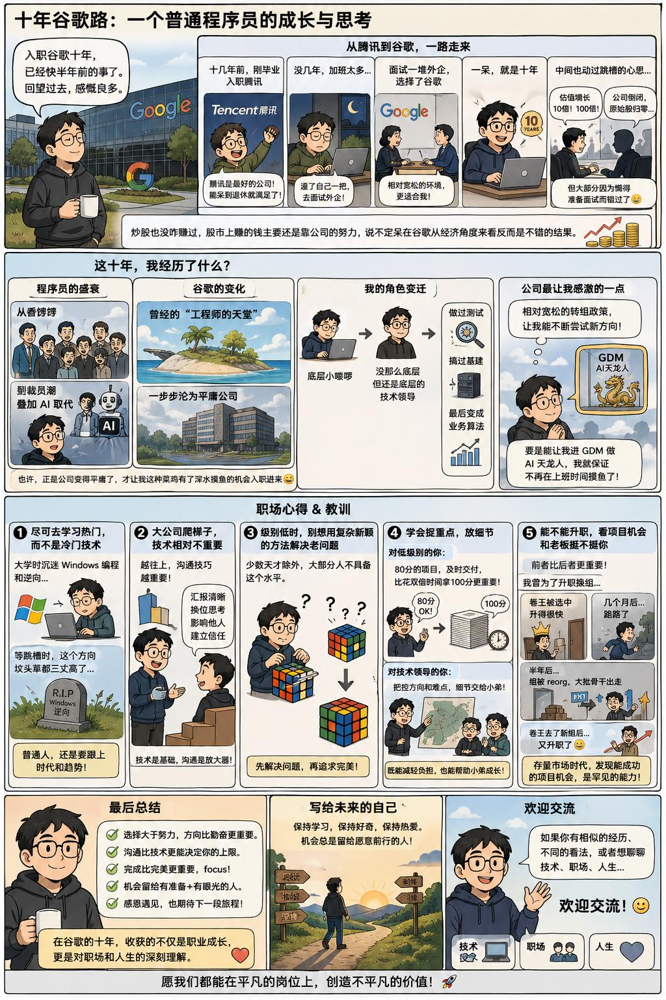

# GPT Image 2 · Anime · 动漫风格

动漫/漫画风格图片：分镜叙事、卡通人物、生活感故事图。

[← 返回模型索引](../README.md) | [← 返回总索引](../../README.md)

## 画廊

|   |   |   |
|:---:|:---:|:---:|
|  |   |   |
| google-decade-story |   |   |

## 元数据

| 文件 | 主体 | 标签 | 来源 | Prompt |
|---|---|---|---|---|
| [gpt-image-2-anime-google-decade-story](./gpt-image-2-anime-google-decade-story.jpeg) | 十年谷歌路：一个普通程序员的成长与思考，9 格漫画式经验记录 | `anime` `comic-grid` `career` `programmer` `growth` `chinese` `pastel` | — | — |

**说明**:来源/Prompt 缺失填 `—`;标签用反引号包裹。
