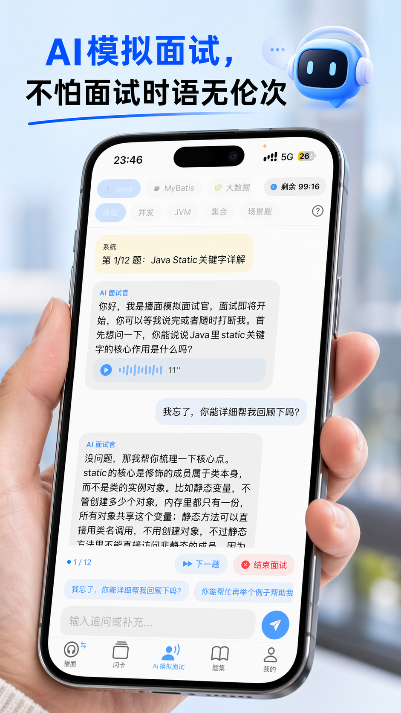
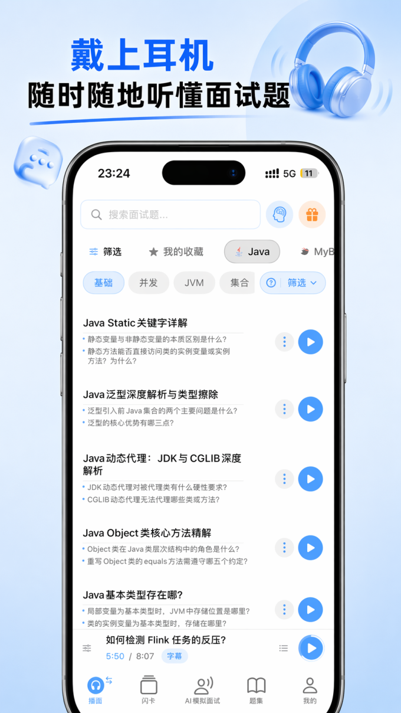
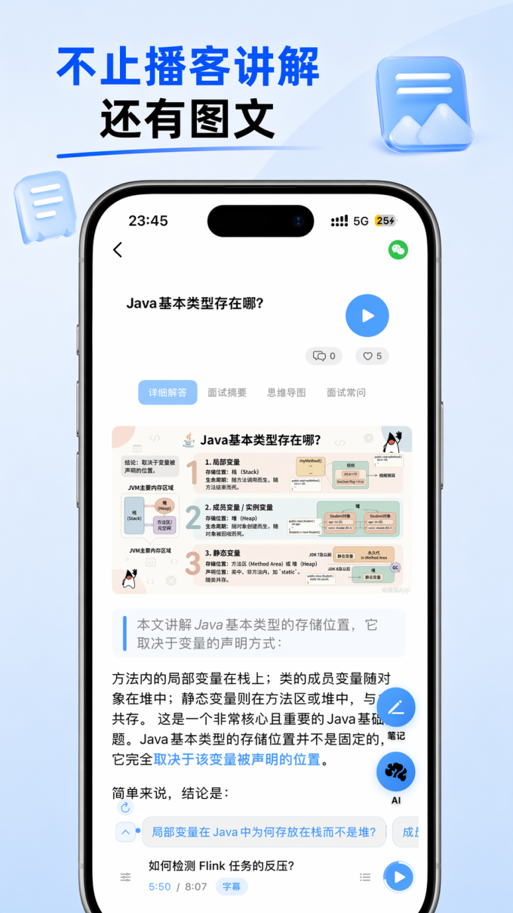
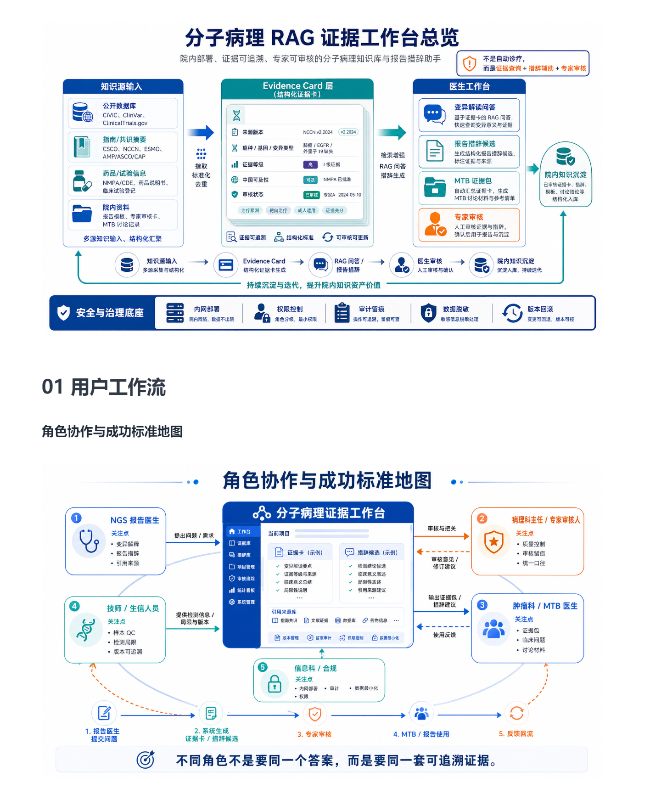
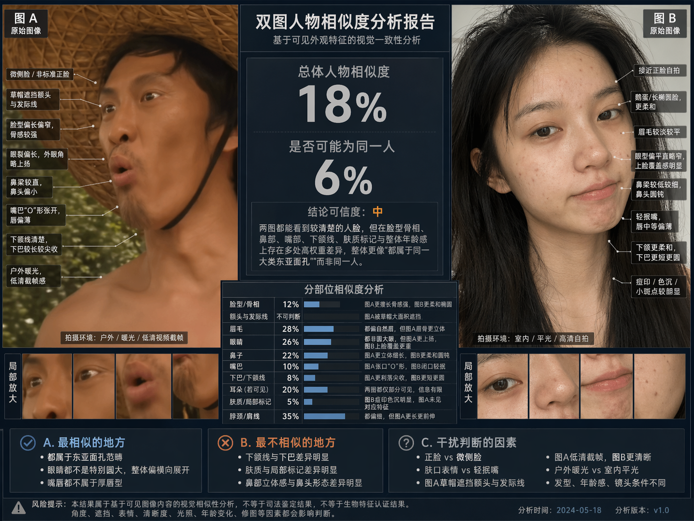

# GPT Image 2 · App UI · 应用界面截图

应用界面营销截图：AI 面试题 App、医疗 SaaS、人物分析报告等。

[← 返回模型索引](../README.md) | [← 返回总索引](../../README.md)

## 画廊

|   |   |   |
|:---:|:---:|:---:|
|  |  |  |
| ai-interview-home | ai-interview-chat | ai-interview-listen |
|  |  |  |
| ai-interview-graphic | molecular-pathology-rag | face-similarity-report |

## 元数据

| 文件 | 主体 | 标签 | 来源 | Prompt |
|---|---|---|---|---|
| [gpt-image-2-app-ui-ai-interview-home](./gpt-image-2-app-ui-ai-interview-home.png) | AI 面试题 App 首页：题库列表 + 分类导航 | `app-ui` `ai` `interview` `blue` `mobile` | — | — |
| [gpt-image-2-app-ui-ai-interview-chat](./gpt-image-2-app-ui-ai-interview-chat.png) | AI 模拟面试对话界面：深色模式，AI 助手回答示例 | `app-ui` `ai` `interview` `chat` `dark` `mobile` | — | — |
| [gpt-image-2-app-ui-ai-interview-listen](./gpt-image-2-app-ui-ai-interview-listen.png) | AI 面试题 App 听力模式：随时随地听题，浅色列表视图 | `app-ui` `ai` `interview` `audio` `light` `mobile` | — | — |
| [gpt-image-2-app-ui-ai-interview-graphic](./gpt-image-2-app-ui-ai-interview-graphic.png) | AI 面试题 App 图文模式：播客讲解 + 配图内容展示 | `app-ui` `ai` `interview` `graphic` `light` `mobile` | — | — |
| [gpt-image-2-app-ui-molecular-pathology-rag](./gpt-image-2-app-ui-molecular-pathology-rag.png) | 分子病理 RAG 证据工作台：产品概览 + 角色协作流程图 | `app-ui` `saas` `medical` `rag` `flow-diagram` `chinese` | — | — |
| [gpt-image-2-app-ui-face-similarity-report](./gpt-image-2-app-ui-face-similarity-report.png) | 双图人物相似度分析报告：A/B 对比 + 部位评分 + 干扰因素 | `app-ui` `analysis-report` `dashboard` `dark` `data-viz` `chinese` | — | — |

**说明**:来源/Prompt 缺失填 `—`;标签用反引号包裹。
