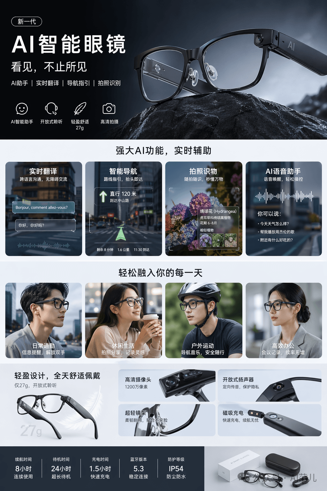
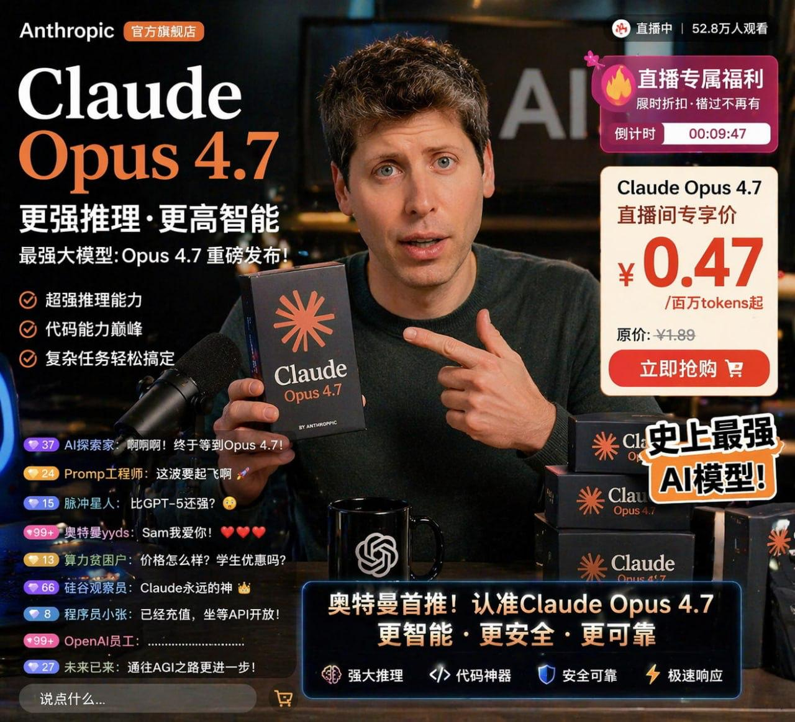

# GPT Image 2 · Ecommerce · 电商详情页

电商场景图：产品详情页、直播间 UI、穿搭搭配页。

[← 返回模型索引](../README.md) | [← 返回总索引](../../README.md)

## 画廊

|   |   |   |
|:---:|:---:|:---:|
|  |  |  |
| spring-fashion-lookbook | ai-glasses-detail | livestream-claude-opus |

## 元数据

| 文件 | 主体 | 标签 | 来源 | Prompt |
|---|---|---|---|---|
| [gpt-image-2-ecommerce-spring-fashion-lookbook](./gpt-image-2-ecommerce-spring-fashion-lookbook.png) | 春季女装搭配方案详情页：单品详解 + 整套推荐 + 配色推荐 | `ecommerce` `fashion` `spring` `lookbook` `detail-page` | — | — |
| [gpt-image-2-ecommerce-ai-glasses-detail](./gpt-image-2-ecommerce-ai-glasses-detail.png) | AI 智能眼镜产品详情页：功能介绍 + 场景图 + 参数表 | `ecommerce` `tech` `product-detail` `dark` | — | — |
| [gpt-image-2-ecommerce-livestream-claude-opus](./gpt-image-2-ecommerce-livestream-claude-opus.jpg) | Claude Opus 4.7 AI 带货直播间 UI（仿淘宝/小红书直播间） | `ecommerce` `livestream` `ui-mockup` `dark` `meme` | — | — |

**说明**:来源/Prompt 缺失填 `—`;标签用反引号包裹。
