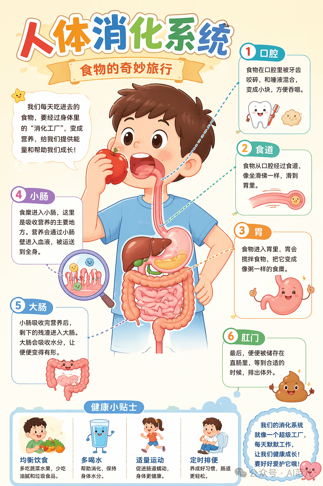
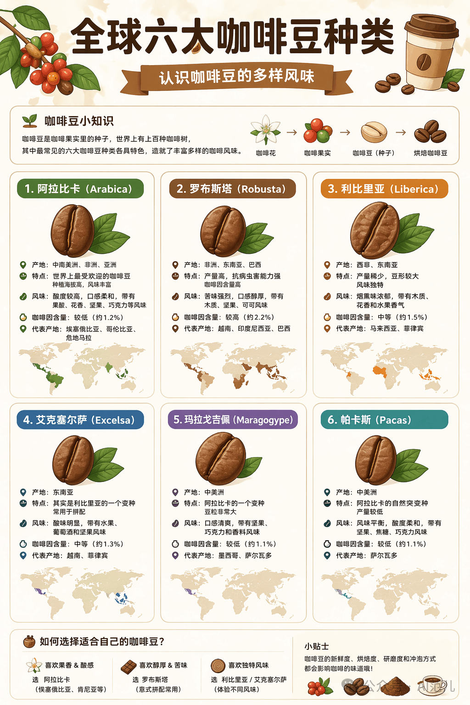
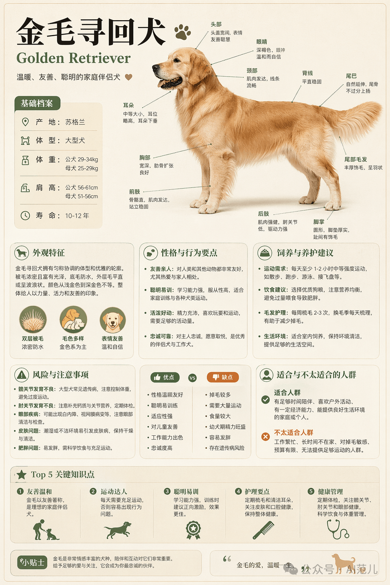
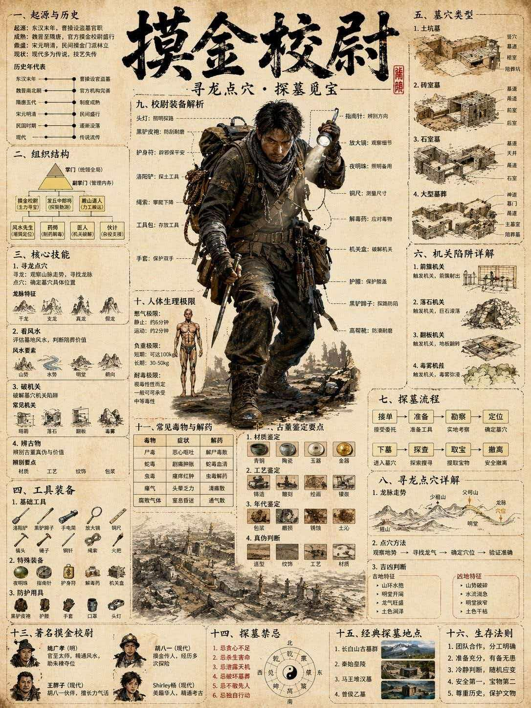

# GPT Image 2 · Infographic · 知识科普信息图

知识百科、科普教育类信息图。

[← 返回模型索引](../README.md) | [← 返回总索引](../../README.md)

## 画廊

|   |   |   |
|:---:|:---:|:---:|
|  |  |  |
| human-digestion | six-coffee-beans | golden-retriever |
|  |    |    |
| mojin-xiaowei |    |    |

## 元数据

| 文件 | 主体 | 标签 | 来源 | Prompt |
|---|---|---|---|---|
| [gpt-image-2-infographic-human-digestion](./gpt-image-2-infographic-human-digestion.png) | 人体消化系统：食物的奇妙旅行，卡通科普风 | `science` `education` `kawaii` `biology` `children` | — | — |
| [gpt-image-2-infographic-six-coffee-beans](./gpt-image-2-infographic-six-coffee-beans.png) | 全球六大咖啡豆种类：产地、风味、咖啡因含量全解析 | `coffee` `food` `knowledge` `warm` `grid-cards` | — | — |
| [gpt-image-2-infographic-golden-retriever](./gpt-image-2-infographic-golden-retriever.png) | 金毛寻回犬百科：习性、养护、风险注意事项 | `pet` `dog` `knowledge` `warm` `feature-list` | — | — |
| [gpt-image-2-infographic-mojin-xiaowei](./gpt-image-2-infographic-mojin-xiaowei.jpeg) | 摸金校尉知识图谱：组织、技能、装备、探墓流程全解 | `culture` `comprehensive` `dark` `technical-schematic` | — | — |

**说明**:来源/Prompt 缺失填 `—`;标签用反引号包裹。
