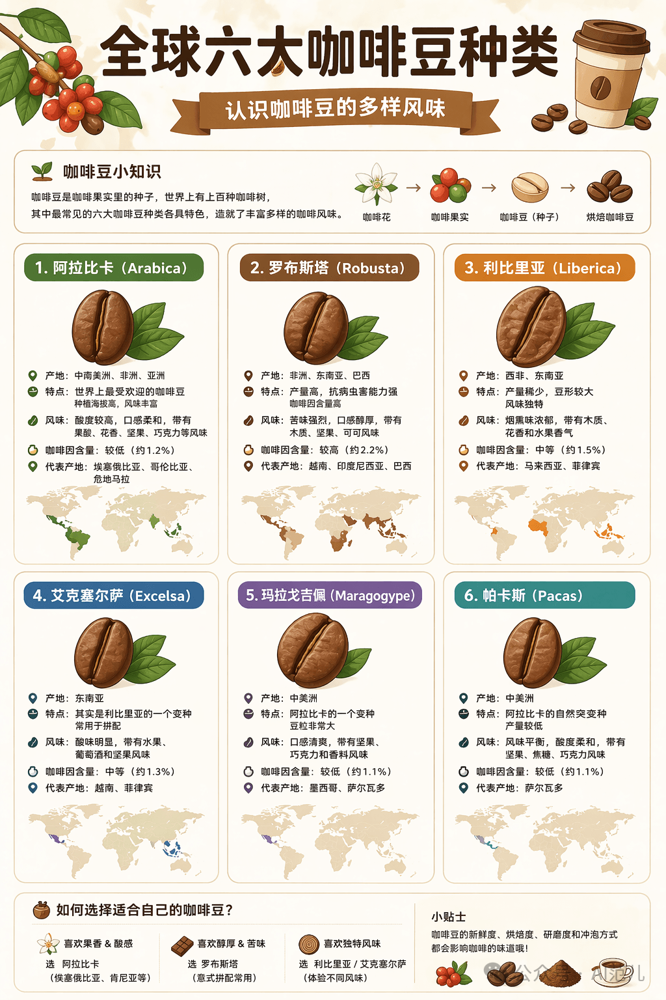
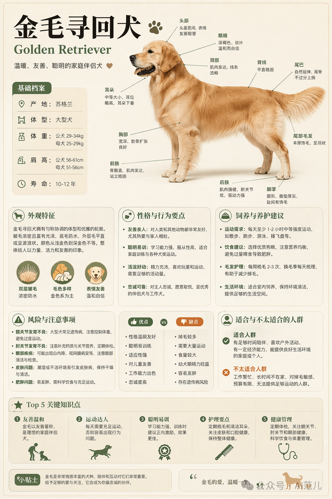
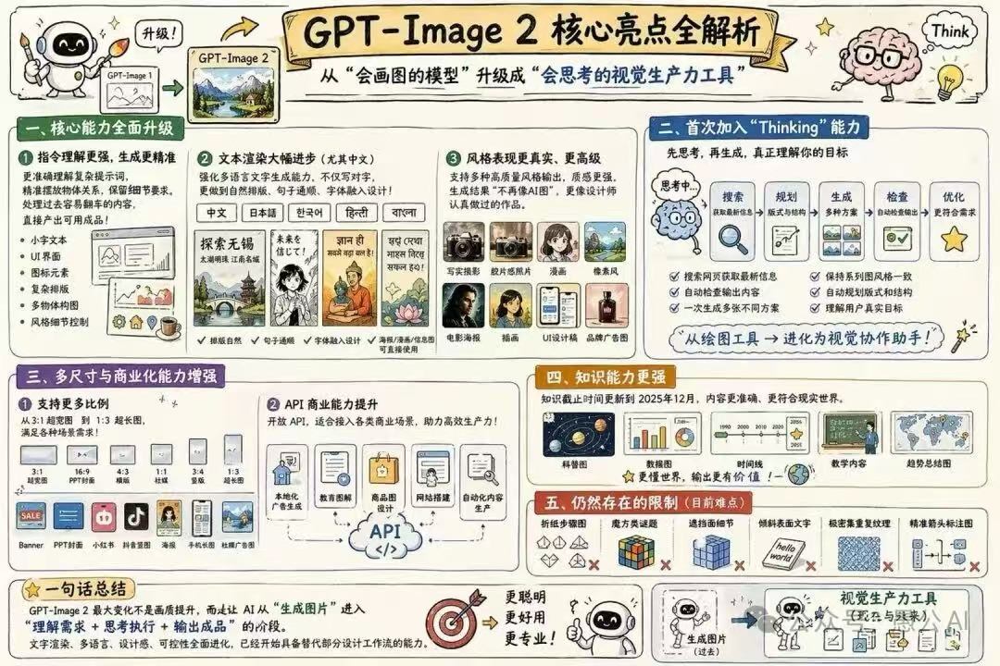
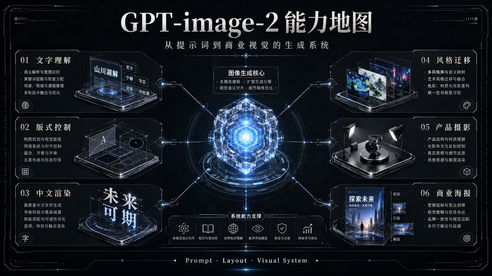
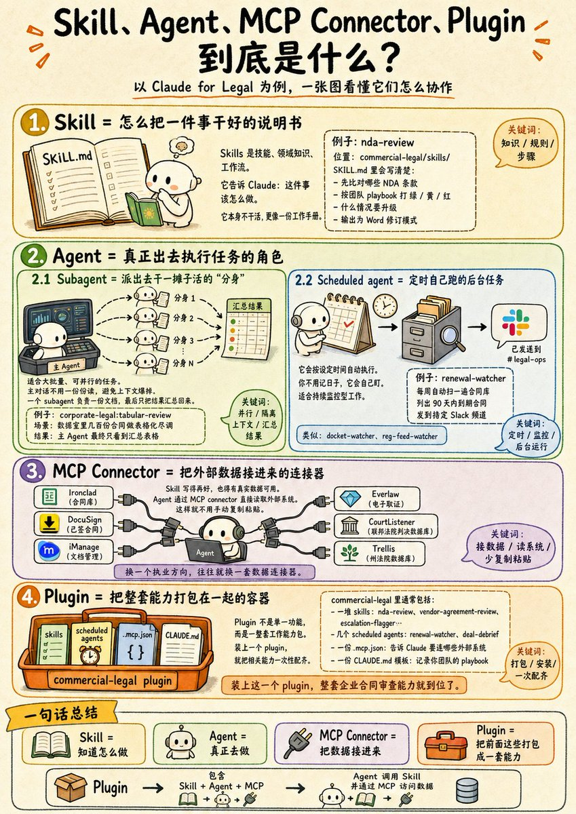
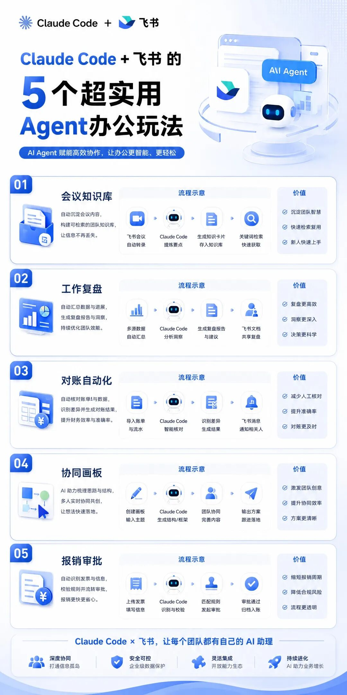
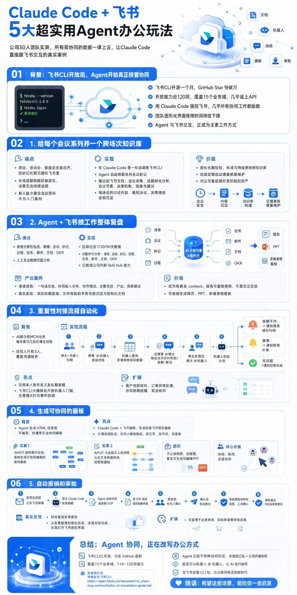
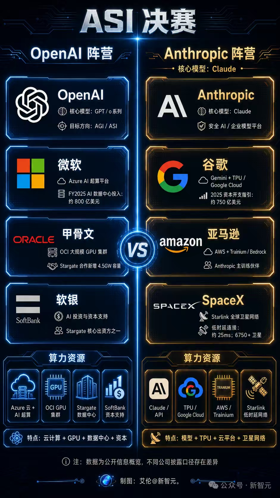

# GPT Image 2 · Infographic · 知识科普信息图

知识百科、科普教育类信息图。

[← 返回模型索引](../README.md) | [← 返回总索引](../../README.md)

## 画廊

|   |   |   |
|:---:|:---:|:---:|
|  |  |  |
| human-digestion | six-coffee-beans | golden-retriever |
|  |  |  |
| mojin-xiaowei | features-overview | claude-code-three-frameworks |
|  |  |  |
| nvidia-openai-corewrave-path | gpt-image-2-capability-map | skill-agent-mcp-plugin |
|  |  |  |
| claude-feishu-5-agent-flows | claude-feishu-5-agent-overview | asi-finals-openai-vs-anthropic |

## 元数据

| 文件 | 主体 | 标签 | 来源 | Prompt |
|---|---|---|---|---|
| [gpt-image-2-infographic-human-digestion](./gpt-image-2-infographic-human-digestion.png) | 人体消化系统：食物的奇妙旅行，卡通科普风 | `science` `education` `kawaii` `biology` `children` | — | — |
| [gpt-image-2-infographic-six-coffee-beans](./gpt-image-2-infographic-six-coffee-beans.png) | 全球六大咖啡豆种类：产地、风味、咖啡因含量全解析 | `coffee` `food` `knowledge` `warm` `grid-cards` | — | — |
| [gpt-image-2-infographic-golden-retriever](./gpt-image-2-infographic-golden-retriever.png) | 金毛寻回犬百科：习性、养护、风险注意事项 | `pet` `dog` `knowledge` `warm` `feature-list` | — | — |
| [gpt-image-2-infographic-mojin-xiaowei](./gpt-image-2-infographic-mojin-xiaowei.jpeg) | 摸金校尉知识图谱：组织、技能、装备、探墓流程全解 | `culture` `comprehensive` `dark` `technical-schematic` | — | — |
| [gpt-image-2-infographic-features-overview](./gpt-image-2-infographic-features-overview.jpg) | GPT-Image 2 核心亮点全解析：能力升级 / Thinking / 多尺寸 / 知识能力 / 仍存局限 | `gpt-image-2` `model-features` `tech-popularization` `chinese` `comprehensive` | — | — |
| [gpt-image-2-infographic-claude-code-three-frameworks](./gpt-image-2-infographic-claude-code-three-frameworks.jpeg) | 2026 Claude Code 编程革命:Superpowers / GSD / Gstack 三大开源框架深度对比手绘信息图 | `claude-code` `framework-comparison` `hand-drawn` `kawaii` `chinese` `dev` | — | — |
| [gpt-image-2-infographic-nvidia-openai-corewrave-path](./gpt-image-2-infographic-nvidia-openai-corewrave-path.jpeg) | NVIDIA→OpenAI→CoreWeave→Anthropic 算力资本路径,METR 趋势线推向 AGI 门槛,赛博机库背景 | `nvidia` `openai` `agi` `path-diagram` `sci-fi` `chinese` | 新智元 | — |
| [gpt-image-2-infographic-gpt-image-2-capability-map](./gpt-image-2-infographic-gpt-image-2-capability-map.jpeg) | GPT-image-2 能力地图:文字理解/版式控制/中文渲染/风格迁移/产品摄影/商业海报六大模块 | `gpt-image-2` `capability-map` `dark-ui` `sci-fi` `hexagon` `chinese` | — | — |
| [gpt-image-2-infographic-skill-agent-mcp-plugin](./gpt-image-2-infographic-skill-agent-mcp-plugin.jpeg) | Skill / Agent / MCP Connector / Plugin 概念解析:以 Claude for Legal 为例,4 层手绘信息图 | `claude-code` `skill` `agent` `mcp` `plugin` `hand-drawn` `chinese` | — | — |
| [gpt-image-2-infographic-claude-feishu-5-agent-flows](./gpt-image-2-infographic-claude-feishu-5-agent-flows.jpg) | Claude Code × 飞书 5 个超实用 Agent 办公玩法:会议知识库/工作复盘/对账/协同画板/报销审批,长图 | `claude-code` `feishu` `agent` `workflow` `office` `chinese` | — | — |
| [gpt-image-2-infographic-claude-feishu-5-agent-overview](./gpt-image-2-infographic-claude-feishu-5-agent-overview.jpg) | Claude Code × 飞书 5 大玩法总览版:CLI 协同/会议系列/工作流编排/重复任务/生成可视化网页,科技蓝 | `claude-code` `feishu` `agent` `overview` `tech-blue` `chinese` | — | — |
| [gpt-image-2-infographic-asi-finals-openai-vs-anthropic](./gpt-image-2-infographic-asi-finals-openai-vs-anthropic.jpg) | ASI 决赛 OpenAI 阵营 vs Anthropic 阵营:核心模型/资本/算力资源对比,赛博 UI 双卡片 | `asi` `openai` `anthropic` `vs` `tech-blue` `chinese` `versus` | 新智元 | — |

**说明**:来源/Prompt 缺失填 `—`;标签用反引号包裹。
