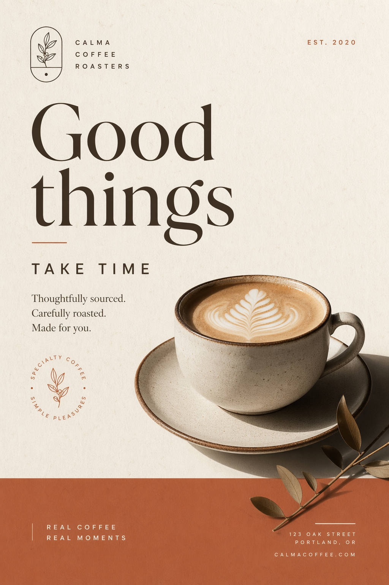
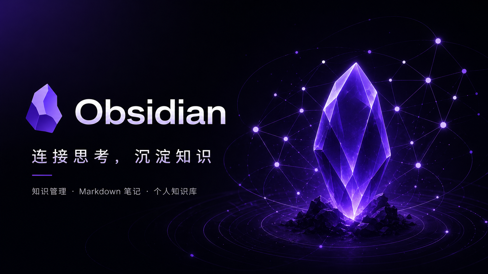

# GPT Image 2 · Poster · 海报

影视/小说/品牌等单图宣传海报，强主视觉。

[← 返回模型索引](../README.md) | [← 返回总索引](../../README.md)

## 画廊

|   |   |   |
|:---:|:---:|:---:|
|  |  |  |
| mortal-cultivation | calma-coffee | obsidian-crystal |

## 元数据

| 文件 | 主体 | 标签 | 来源 | Prompt |
|---|---|---|---|---|
| [gpt-image-2-poster-mortal-cultivation](./gpt-image-2-poster-mortal-cultivation.png) | 《凡人修仙传》水墨人物剪影海报：人物轮廓融合修仙世界场景 | `poster` `ink-wash` `chinese` `cinematic` `silhouette` `dark` | — | — |
| [gpt-image-2-poster-calma-coffee](./gpt-image-2-poster-calma-coffee.png) | Calma Coffee 品牌海报：Good things take time，米白 + 拿铁主图 | `poster` `coffee` `brand` `minimal` `warm` `english` | — | — |
| [gpt-image-2-poster-obsidian-crystal](./gpt-image-2-poster-obsidian-crystal.png) | Obsidian「连接思考·沉淀知识」品牌封面:紫色水晶主视觉 + 暗色星网背景 | `poster` `brand` `obsidian` `dark` `purple` `crystal` | — | — |

**说明**:来源/Prompt 缺失填 `—`;标签用反引号包裹。
