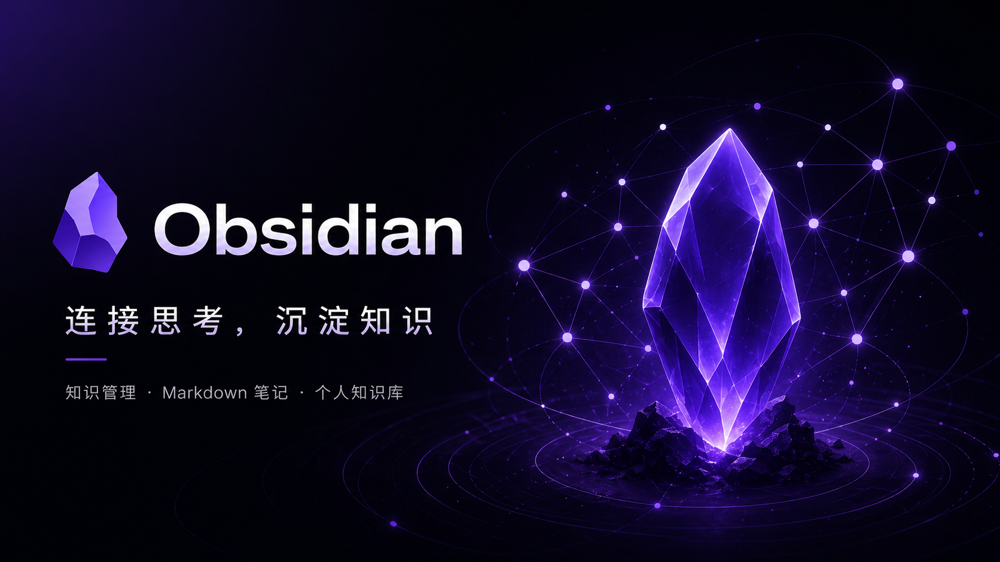
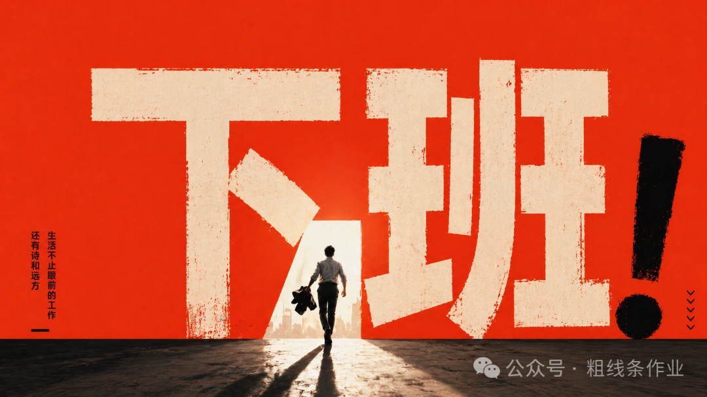
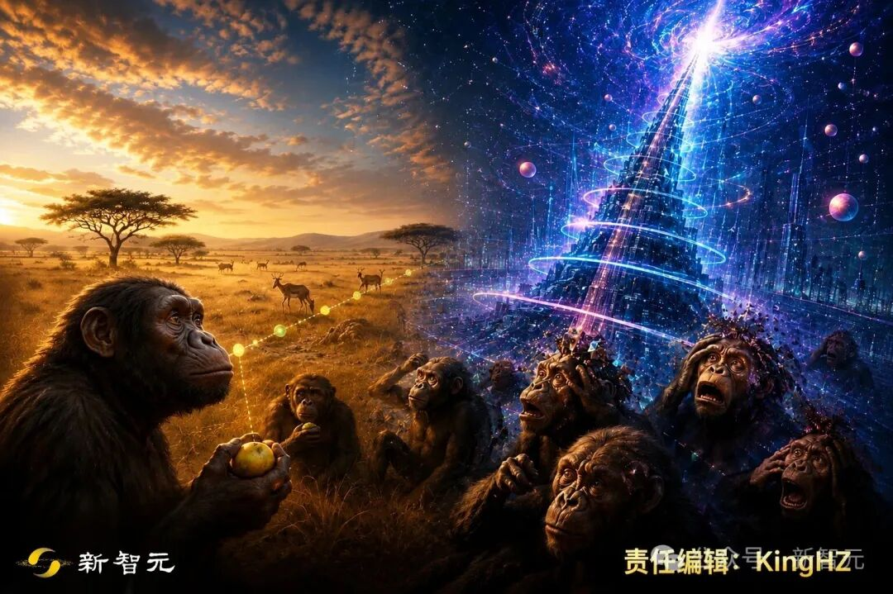

# GPT Image 2 · Poster · 海报

影视/小说/品牌等单图宣传海报，强主视觉。

[← 返回模型索引](../README.md) | [← 返回总索引](../../README.md)

## 画廊

|   |   |   |
|:---:|:---:|:---:|
|  |  |  |
| mortal-cultivation | calma-coffee | obsidian-crystal |
|  |  |  |
| xiaban-red | ai-evolution-stairs | monkey-singularity |
|  |  |    |
| mythos-cyber-attack | digital-nomad-remote-work |    |

## 元数据

| 文件 | 主体 | 标签 | 来源 | Prompt |
|---|---|---|---|---|
| [gpt-image-2-poster-mortal-cultivation](./gpt-image-2-poster-mortal-cultivation.png) | 《凡人修仙传》水墨人物剪影海报：人物轮廓融合修仙世界场景 | `poster` `ink-wash` `chinese` `cinematic` `silhouette` `dark` | — | — |
| [gpt-image-2-poster-calma-coffee](./gpt-image-2-poster-calma-coffee.png) | Calma Coffee 品牌海报：Good things take time，米白 + 拿铁主图 | `poster` `coffee` `brand` `minimal` `warm` `english` | — | — |
| [gpt-image-2-poster-obsidian-crystal](./gpt-image-2-poster-obsidian-crystal.png) | Obsidian「连接思考·沉淀知识」品牌封面:紫色水晶主视觉 + 暗色星网背景 | `poster` `brand` `obsidian` `dark` `purple` `crystal` | — | — |
| [gpt-image-2-poster-xiaban-red](./gpt-image-2-poster-xiaban-red.png) | 「下班!」朱红巨字 + 人物剪影海报,粗线条作业风 | `poster` `red` `bold-type` `chinese` `silhouette` `mood` | 公众号:粗线条作业 | — |
| [gpt-image-2-poster-ai-evolution-stairs](./gpt-image-2-poster-ai-evolution-stairs.jpeg) | AI 进化阶梯:8 秒 / 1 分钟 / 1 小时 / 16 小时,2025→2026 报废通知,赛博废墟背景 | `poster` `ai-evolution` `sci-fi` `cyberpunk` `dystopian` `chinese` | 新智元 | — |
| [gpt-image-2-poster-monkey-singularity](./gpt-image-2-poster-monkey-singularity.jpeg) | 草原猿猴回望奇点能量塔,左侧自然黄昏 / 右侧紫色赛博粒子,意识跃迁意象 | `poster` `singularity` `evolution` `monkey` `split-scene` `surreal` | 新智元 | — |
| [gpt-image-2-poster-mythos-cyber-attack](./gpt-image-2-poster-mythos-cyber-attack.jpeg) | Mythos 降维打击:25 分钟入侵 vs 数周 MTTR,绿色幽灵 + 红色裂缝 + 服务器机房 | `poster` `cybersecurity` `mythos` `dark` `green-red` `dramatic` | 新智元 | — |
| [gpt-image-2-poster-digital-nomad-remote-work](./gpt-image-2-poster-digital-nomad-remote-work.jpeg) | 数字游民概念插画:一家三口湖畔露营 + 半透明远程办公小屋叠加,温润水彩风 | `poster` `digital-nomad` `remote-work` `watercolor` `family` `nature` `concept` | — | — |

**说明**:来源/Prompt 缺失填 `—`;标签用反引号包裹。
