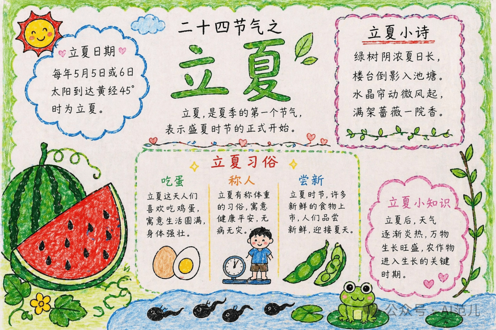

# GPT Image 2 · Seasonal · 节气节日

二十四节气、传统节日主题海报与手抄报。

[← 返回模型索引](../README.md) | [← 返回总索引](../../README.md)

## 画廊

|   |   |   |
|:---:|:---:|:---:|
|  |  |    |
| lixia-handnote | guyu-tea-field |    |

## 元数据

| 文件 | 主体 | 标签 | 来源 | Prompt |
|---|---|---|---|---|
| [gpt-image-2-seasonal-lixia-handnote](./gpt-image-2-seasonal-lixia-handnote.png) | 立夏节气手抄报：习俗、节令、食物，卡通插画风 | `seasonal` `lixia` `handnote` `kawaii` `chinese-culture` | — | — |
| [gpt-image-2-seasonal-guyu-tea-field](./gpt-image-2-seasonal-guyu-tea-field.png) | 谷雨节气海报：茶田烟雨实景摄影合成，水墨意境 | `seasonal` `guyu` `tea` `photography` `ink` `green` | — | — |

**说明**:来源/Prompt 缺失填 `—`;标签用反引号包裹。
