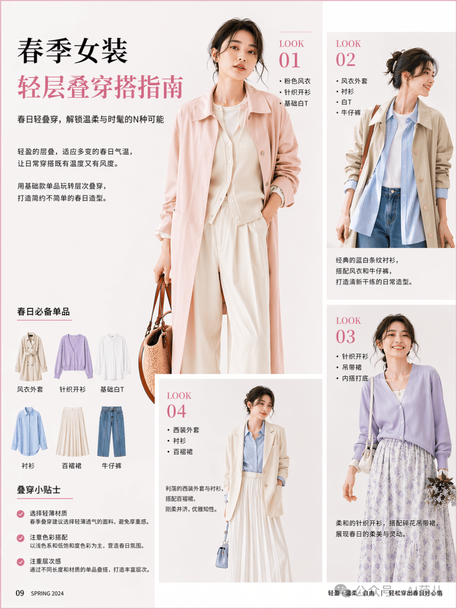
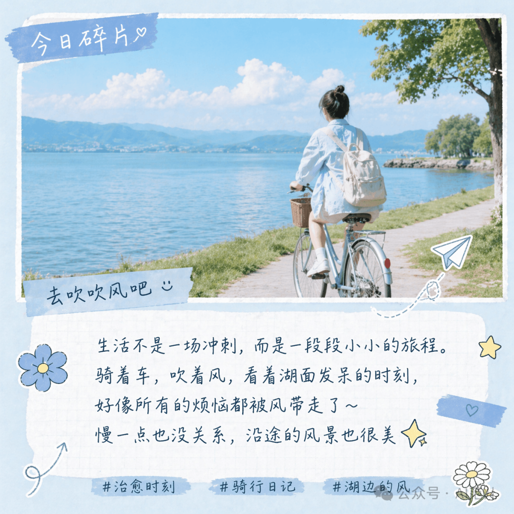

# GPT Image 2 · XHS · 小红书图文

小红书风格图文：生活记录、穿搭指南。

[← 返回模型索引](../README.md) | [← 返回总索引](../../README.md)

## 画廊

|   |   |   |
|:---:|:---:|:---:|
|  |  |   |
| spring-layering-guide | cycling-diary |   |

## 元数据

| 文件 | 主体 | 标签 | 来源 | Prompt |
|---|---|---|---|---|
| [gpt-image-2-xhs-spring-layering-guide](./gpt-image-2-xhs-spring-layering-guide.png) | 春季女装轻层叠穿搭指南：Look 示范 + 单品清单 + 生活贴士 | `fashion` `spring` `xhs` `guide` `minimal` | — | — |
| [gpt-image-2-xhs-cycling-diary](./gpt-image-2-xhs-cycling-diary.png) | 今日碎片：骑行湖边生活记录，小清新图文 | `lifestyle` `cycling` `diary` `fresh` `xhs` | — | — |

**说明**:来源/Prompt 缺失填 `—`;标签用反引号包裹。
