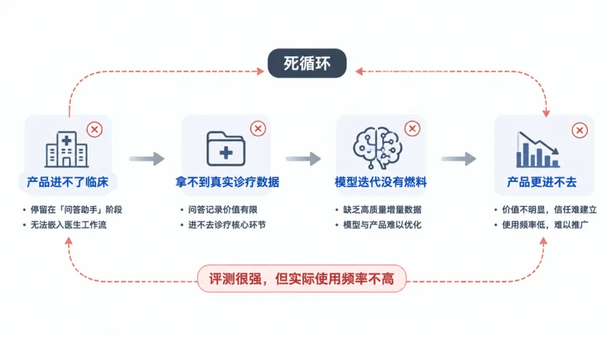

# Infographic · Circular Flow

`circular-flow` 风格的参考图。首张来自 [baoyu-skills](https://github.com/JimLiu/baoyu-skills) 官方示例。

[← 返回场景索引](../README.md) | [← 返回总索引](../../README.md)

## 画廊

<!-- 由 scripts/gen_scenario_readmes.py 自动生成,勿手编 -->

  

    
  

  

    
  

  

    
  

  

    
  

## 元数据

| 文件 | 主体 | 标签 | 来源 | Prompt |
|---|---|---|---|---|
| [info-circular-flow-agent-architecture](./info-circular-flow-agent-architecture.webp) | 代码智能体架构 / while true 循环 | `agent` `architecture` `isometric` `blue` `tech` | — | — |
| [info-circular-flow-agent-loop-diagram](./info-circular-flow-agent-loop-diagram.webp) | Agent 主循环图(while true):用户输入 → LLM 思考 → 工具调用决策 → 执行工具 → 结果回传 → LLM 继续 →(回到用户输入),中心 `while(true) { // Agent 循环 }` 代码块,蓝色手绘 sketch 风 | `agent` `agent-loop` `while-true` `hand-drawn` `blue` `sketch` `chinese` | — | — |
| [info-circular-flow-product-death-loop](./info-circular-flow-product-death-loop.webp) | 产品「死循环」:产品不了解效率 → 拿不到执行数据 → 模型迭代变差 → 产品交付变差 →(回到开头),浅色扁平商务卡片 + 蓝色图标 + 循环箭头,底部「评测很爽,但实际使用频率不高」 | `product` `feedback-loop` `flat` `business` `blue` `circular` `chinese` | — | — |
| [info-circular-flow-baoyu](./info-circular-flow-baoyu.webp) | `circular-flow` 参考示例 | `baoyu-skills` `circular-flow` | [baoyu-skills](https://github.com/JimLiu/baoyu-skills) | — |

**说明**:来源/Prompt 缺失填 `—`;标签用反引号包裹。
