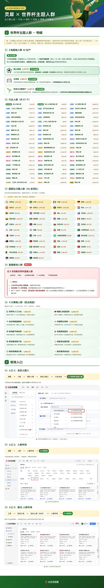

# Infographic · Comparison Table

`comparison-table` 风格的参考图。首张来自 [baoyu-skills](https://github.com/JimLiu/baoyu-skills) 官方示例。

[← 返回场景索引](../README.md) | [← 返回总索引](../../README.md)

## 画廊

<!-- 由 scripts/gen_scenario_readmes.py 自动生成,勿手编 -->

  

    
  

  

    
  

  

    
  

  

    
  

  

    
  

  

    
  

  

    
  

  

    
  

  

    
  

  

    
  

  

    
  

## 元数据

| 文件 | 主体 | 标签 | 来源 | Prompt |
|---|---|---|---|---|
| [info-comparison-table-ai-coding-era](./info-comparison-table-ai-coding-era.jpg) | AI 编程时代核心资产(传统代码 vs 提示与设计) | `ai` `coding` `blue` `notebooklm` `illustration` | NotebookLM 生成 | — |
| [info-comparison-table-claude-code-access](./info-comparison-table-claude-code-access.webp) | 接入 Claude Code 的两种方式(官方订阅 vs 中转站) | `claude-code` `blue` `flowchart` `gemini` `handwritten` | Gemini 生成 | — |
| [info-comparison-table-cache-hit-miss](./info-comparison-table-cache-hit-miss.webp) | 缓存命中 vs 未命中：1/10 vs 10× 成本对比 | `claude-code` `cache` `cost` `kawaii` `baoyu-skills` | [宝玉](https://weibo.com/1727858283) | — |
| [info-comparison-table-1m-context-risk](./info-comparison-table-1m-context-risk.webp) | 1M 上下文的陷阱：200K vs 1M 缓存失效风险 | `claude-code` `context` `risk` `kawaii` `baoyu-skills` | [宝玉](https://weibo.com/1727858283) | — |
| [info-comparison-table-cache-prefix-match](./info-comparison-table-cache-prefix-match.webp) | 缓存命中秘密：前缀必须完全一致可视化 | `claude-code` `cache` `prefix` `kawaii` `baoyu-skills` | [宝玉](https://weibo.com/1727858283) | — |
| [info-comparison-table-chatbot-copilot-agent](./info-comparison-table-chatbot-copilot-agent.webp) | 三种 AI 范式:Chatbot vs Copilot vs Agent — 对话式 / 代码副驾驶 / Code Agent,蓝色手绘风对比图 | `ai` `chatbot` `copilot` `agent` `hand-drawn` `blue` `chinese` `baoyu-skills` | [宝玉](https://weibo.com/1727858283) | — |
| [info-comparison-table-script-vs-skills](./info-comparison-table-script-vs-skills.webp) | 脚本 vs Skills：固定代码 vs 自然语言目标特性对比 | `skills` `script` `agent` `kawaii` `baoyu-skills` | [宝玉](https://weibo.com/1727858283) | — |
| [info-comparison-table-script-vs-agent](./info-comparison-table-script-vs-agent.webp) | 什么时候用脚本 vs Agent：银行柜台 vs 项目经理比喻 | `script` `agent` `kawaii` `baoyu-skills` | [宝玉](https://weibo.com/1727858283) | — |
| [info-comparison-table-us-chip-giants-chinese-ceos](./info-comparison-table-us-chip-giants-chinese-ceos.jpeg) | 美国四大芯片巨头(NVIDIA/Broadcom/AMD/Intel)CEO 全是华人:黄仁勋/陈福阳/苏姿丰/陈立武 4 列卡片对比(出生年/出生地/祖籍/市值),深蓝电路板背景 | `chip-giants` `ceo` `chinese-american` `nvidia` `amd` `intel` `broadcom` `tech-blue` `card-comparison` `chinese` `gpt-image-2` | 公众号·黑科技派 | — |
| [info-comparison-table-worldcup-audience-segments](./info-comparison-table-worldcup-audience-segments.jpg) | 灵犀 × 世界杯主题人群营销人群方案(超长数据报表):全三期上线·行业×球队×时效×策略全维覆盖;3 档基础人群 DI 生产 + 行业人群共 57 个分类(各带核心/泛兴趣人群规模数字)+ 产品 UI 截图,浅色绿头企业数据报告风 | `audience-segmentation` `marketing` `data-report` `worldcup` `long-form` `table` `chinese` | 灵犀 | — |
| [info-comparison-table-baoyu](./info-comparison-table-baoyu.webp) | `comparison-table` 参考示例 | `baoyu-skills` `comparison-table` | [baoyu-skills](https://github.com/JimLiu/baoyu-skills) | — |

**说明**:来源/Prompt 缺失填 `—`;标签用反引号包裹。
