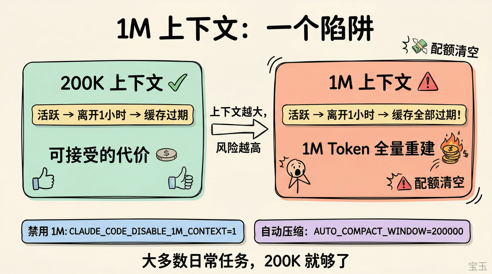
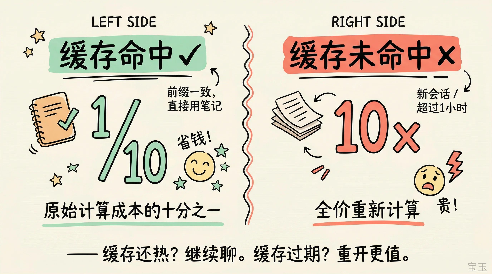
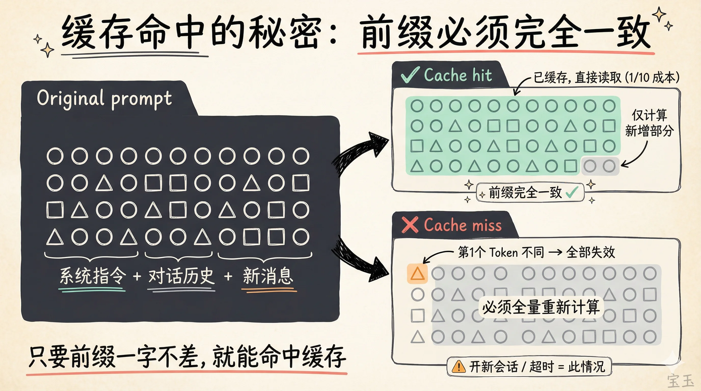
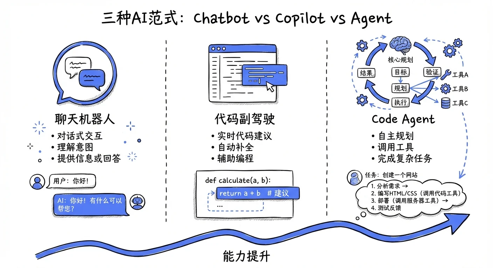
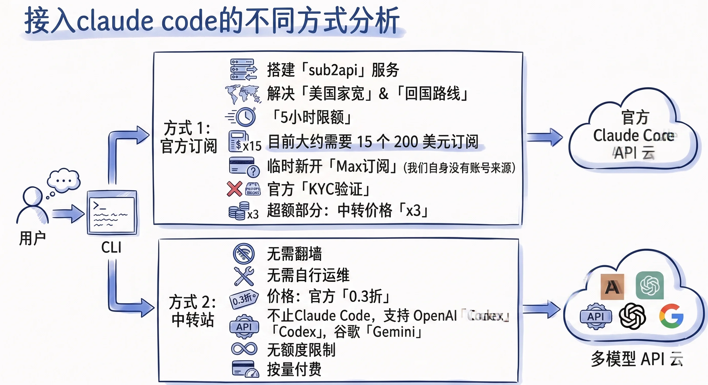
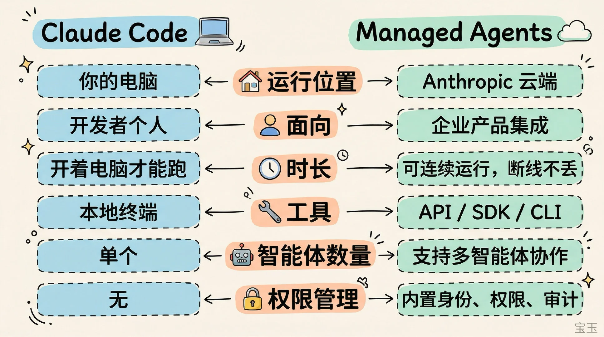
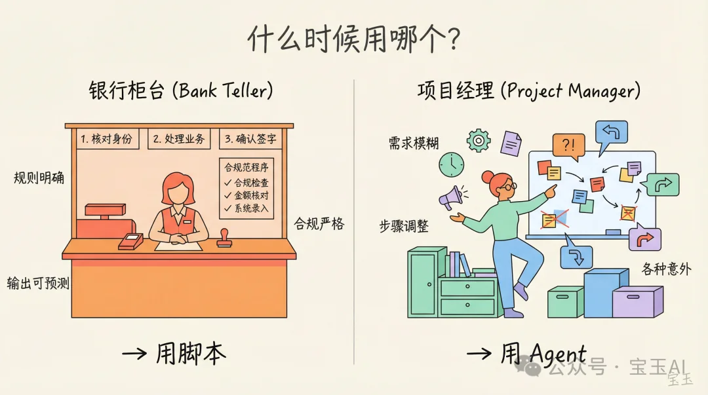
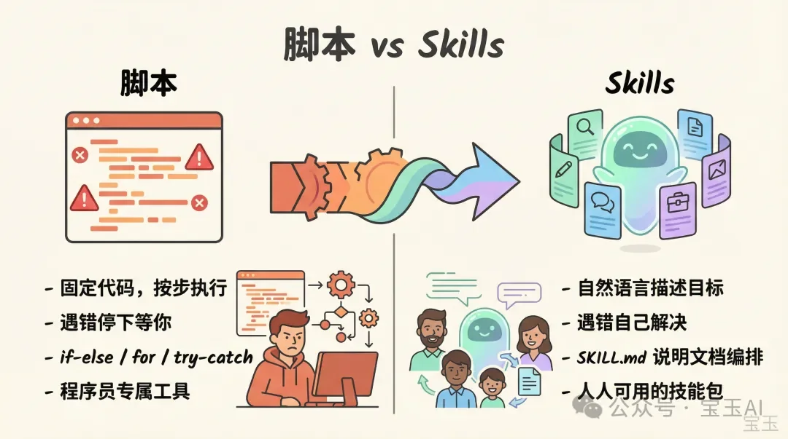
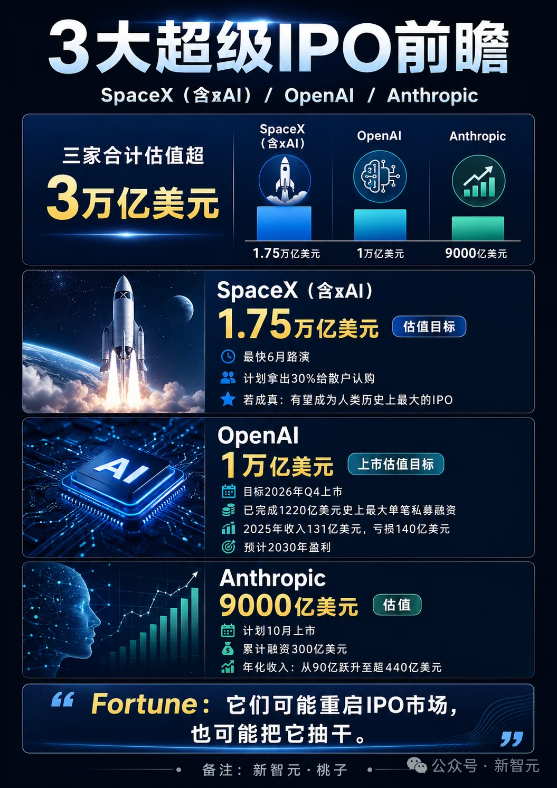
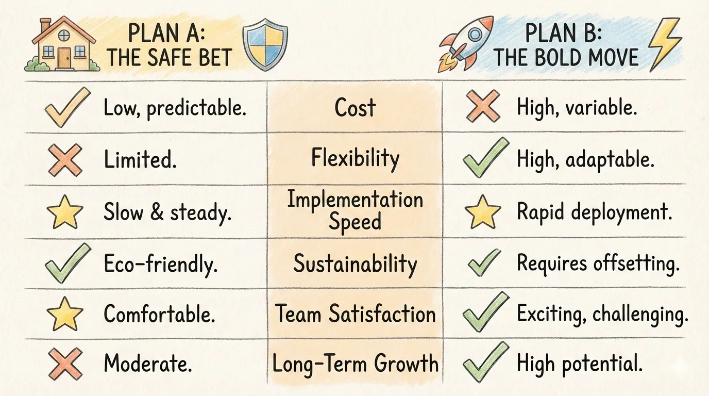

# Infographic · Comparison Table

`comparison-table` 风格的参考图。首张来自 [baoyu-skills](https://github.com/JimLiu/baoyu-skills) 官方示例。

[← 返回场景索引](../README.md) | [← 返回总索引](../../README.md)

## 画廊

<!-- 由 scripts/gen_scenario_readmes.py 自动生成,勿手编 -->

|   |   |   |
|:---:|:---:|:---:|
|  |  |  |
| 1m-context-risk | ai-coding-era | asi-finals-openai-vs-anthropic |
|  |  |  |
| cache-hit-miss | cache-prefix-match | chatbot-copilot-agent |
|  |  |  |
| claude-code-access | claude-code-three-frameworks | claude-code-vs-managed-agents |
|  |  |  |
| script-vs-agent | script-vs-skills | three-super-ipo-preview |
|  |  |    |
| us-chip-giants-chinese-ceos | baoyu |    |

## 元数据

| 文件 | 主体 | 标签 | 来源 | Prompt |
|---|---|---|---|---|
| [info-comparison-table-ai-coding-era](./info-comparison-table-ai-coding-era.jpg) | AI 编程时代核心资产(传统代码 vs 提示与设计) | `ai` `coding` `blue` `notebooklm` `illustration` | NotebookLM 生成 | — |
| [info-comparison-table-claude-code-access](./info-comparison-table-claude-code-access.webp) | 接入 Claude Code 的两种方式(官方订阅 vs 中转站) | `claude-code` `blue` `flowchart` `gemini` `handwritten` | Gemini 生成 | — |
| [info-comparison-table-cache-hit-miss](./info-comparison-table-cache-hit-miss.webp) | 缓存命中 vs 未命中：1/10 vs 10× 成本对比 | `claude-code` `cache` `cost` `kawaii` `baoyu-skills` | [宝玉](https://weibo.com/1727858283) | — |
| [info-comparison-table-1m-context-risk](./info-comparison-table-1m-context-risk.webp) | 1M 上下文的陷阱：200K vs 1M 缓存失效风险 | `claude-code` `context` `risk` `kawaii` `baoyu-skills` | [宝玉](https://weibo.com/1727858283) | — |
| [info-comparison-table-cache-prefix-match](./info-comparison-table-cache-prefix-match.webp) | 缓存命中秘密：前缀必须完全一致可视化 | `claude-code` `cache` `prefix` `kawaii` `baoyu-skills` | [宝玉](https://weibo.com/1727858283) | — |
| [info-comparison-table-chatbot-copilot-agent](./info-comparison-table-chatbot-copilot-agent.webp) | 三种 AI 范式:Chatbot vs Copilot vs Agent — 对话式 / 代码副驾驶 / Code Agent,蓝色手绘风对比图 | `ai` `chatbot` `copilot` `agent` `hand-drawn` `blue` `chinese` `baoyu-skills` | [宝玉](https://weibo.com/1727858283) | — |
| [info-comparison-table-claude-code-vs-managed-agents](./info-comparison-table-claude-code-vs-managed-agents.webp) | Claude Code vs Managed Agents:运行位置/面向/时长/工具/智能体数量/权限管理 6 维对比 | `claude-code` `managed-agents` `comparison` `kawaii` `chinese` `baoyu-skills` | [宝玉](https://weibo.com/1727858283) | — |
| [info-comparison-table-script-vs-skills](./info-comparison-table-script-vs-skills.webp) | 脚本 vs Skills：固定代码 vs 自然语言目标特性对比 | `skills` `script` `agent` `kawaii` `baoyu-skills` | [宝玉](https://weibo.com/1727858283) | — |
| [info-comparison-table-script-vs-agent](./info-comparison-table-script-vs-agent.webp) | 什么时候用脚本 vs Agent：银行柜台 vs 项目经理比喻 | `script` `agent` `kawaii` `baoyu-skills` | [宝玉](https://weibo.com/1727858283) | — |
| [info-comparison-table-claude-code-three-frameworks](./info-comparison-table-claude-code-three-frameworks.jpeg) | 2026 Claude Code 编程革命:Superpowers / GSD / Gstack 三大开源框架深度对比手绘信息图 | `claude-code` `framework-comparison` `hand-drawn` `kawaii` `chinese` `dev` `gpt-image-2` | — | — |
| [info-comparison-table-asi-finals-openai-vs-anthropic](./info-comparison-table-asi-finals-openai-vs-anthropic.jpg) | ASI 决赛 OpenAI 阵营 vs Anthropic 阵营:核心模型/资本/算力资源对比,赛博 UI 双卡片 | `asi` `openai` `anthropic` `vs` `tech-blue` `chinese` `versus` `gpt-image-2` | 新智元 | — |
| [info-comparison-table-three-super-ipo-preview](./info-comparison-table-three-super-ipo-preview.webp) | 3 大超级 IPO 前瞻:SpaceX (含 xAI) / OpenAI / Anthropic 估值目标 3 万亿美元,蓝色星空数据卡片 | `ipo` `spacex` `openai` `anthropic` `valuation` `dark-blue` `chinese` `gpt-image-2` | 新智元·桃子 | — |
| [info-comparison-table-us-chip-giants-chinese-ceos](./info-comparison-table-us-chip-giants-chinese-ceos.jpeg) | 美国四大芯片巨头(NVIDIA/Broadcom/AMD/Intel)CEO 全是华人:黄仁勋/陈福阳/苏姿丰/陈立武 4 列卡片对比(出生年/出生地/祖籍/市值),深蓝电路板背景 | `chip-giants` `ceo` `chinese-american` `nvidia` `amd` `intel` `broadcom` `tech-blue` `card-comparison` `chinese` `gpt-image-2` | 公众号·黑科技派 | — |
| [info-comparison-table-baoyu](./info-comparison-table-baoyu.webp) | `comparison-table` 参考示例 | `baoyu-skills` `comparison-table` | [baoyu-skills](https://github.com/JimLiu/baoyu-skills) | — |

**说明**:来源/Prompt 缺失填 `—`;标签用反引号包裹。
