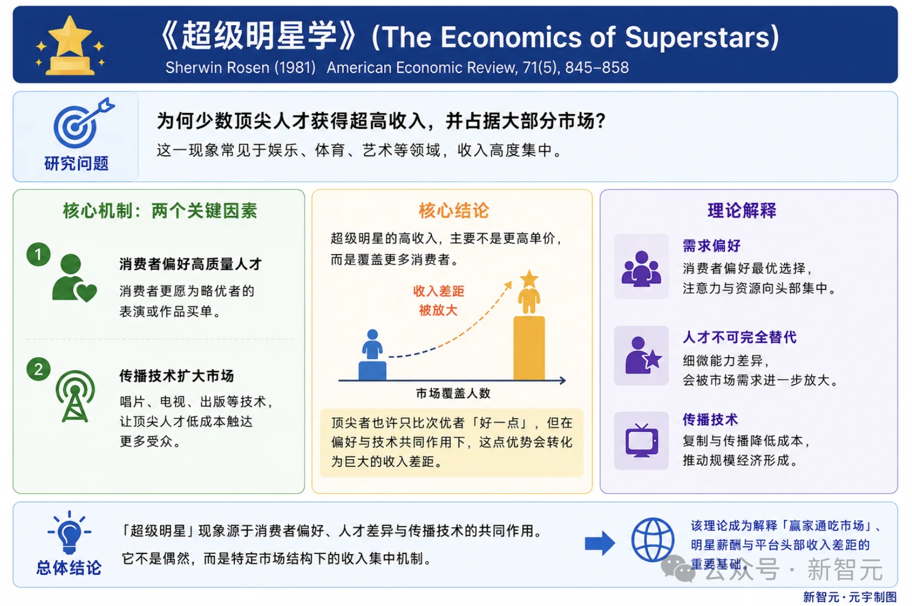

# Infographic · Corporate Memphis

`corporate-memphis` 风格的参考图。首张来自 [baoyu-skills](https://github.com/JimLiu/baoyu-skills) 官方示例。

[← 返回场景索引](../README.md) | [← 返回总索引](../../README.md)

## 画廊

<!-- 由 scripts/gen_scenario_readmes.py 自动生成,勿手编 -->

  

    
  

  

    
  

  

    
  

## 元数据

| 文件 | 主体 | 标签 | 来源 | Prompt |
|---|---|---|---|---|
| [info-corporate-memphis-superstar-economics](./info-corporate-memphis-superstar-economics.webp) | 《超级明星学》(The Economics of Superstars, Sherwin Rosen 1981)经济学解读:为何少数顶尖人才获超高收入并占据大部分市场 — 消费者偏好高质量人才 + 传播技术扩大市场,核心机制 / 结论 / 理论解释三栏,蓝白学术清爽风 + 扁平图标 | `economics` `superstar` `academic` `flat-icon` `tech-blue` `chinese` | 新智元·元宇 | — |
| [info-corporate-memphis-enterprise-invisible-assets](./info-corporate-memphis-enterprise-invisible-assets.jpg) | 企业最值钱的资产 — 隐形资产:业务流程 / 操作经验 / 数据处理规则 / 分析逻辑 / 制度方法论,藏在软件里 / 系统里 / 老员工脑袋里,蓝色线描图标 + 简笔人物 | `enterprise` `invisible-assets` `flat-icon` `tech-blue` `chinese` | — | — |
| [info-corporate-memphis-baoyu](./info-corporate-memphis-baoyu.webp) | `corporate-memphis` 参考示例 | `baoyu-skills` `corporate-memphis` | [baoyu-skills](https://github.com/JimLiu/baoyu-skills) | — |

**说明**:来源/Prompt 缺失填 `—`;标签用反引号包裹。
