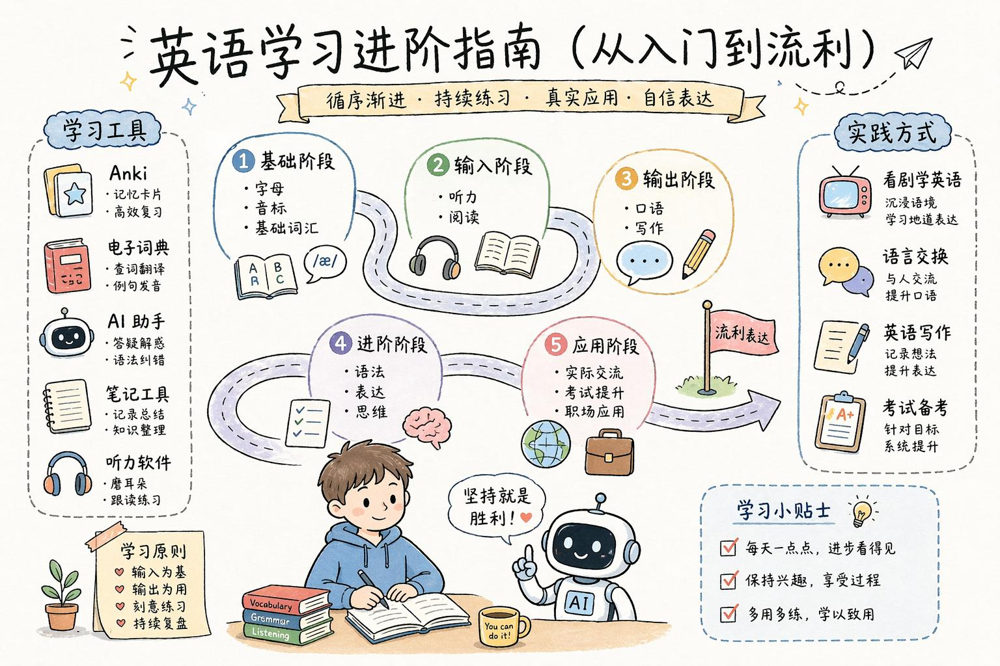

# Infographic · Craft Handmade

`craft-handmade` 风格的参考图。首张来自 [baoyu-skills](https://github.com/JimLiu/baoyu-skills) 官方示例。

[← 返回场景索引](../README.md) | [← 返回总索引](../../README.md)

## 画廊

|   |   |   |
|:---:|:---:|:---:|
|  |  |  |
| agent-architecture-cli | core-ability-to-skill | english-learning-guide |
|  |    |    |
| baoyu |    |    |

## 元数据

| 文件 | 主体 | 标签 | 来源 | Prompt |
|---|---|---|---|---|
| [info-craft-handmade-agent-architecture-cli](./info-craft-handmade-agent-architecture-cli.png) | 代码智能体架构:CLI → 智能体循环 → 工具系统 → LLM | `agent` `architecture` `cli` `chinese` | — | — |
| [info-craft-handmade-core-ability-to-skill](./info-craft-handmade-core-ability-to-skill.png) | 企业核心能力封装成 Skill:内部流程 / 操作经验 / 方法论 | `skill` `enterprise` `linework` `chinese` | — | — |
| [info-craft-handmade-english-learning-guide](./info-craft-handmade-english-learning-guide.jpeg) | 英语学习进阶指南(从入门到流利):5 个阶段 + 学习工具 + 实践方式 | `learning-path` `english` `pastel` `chinese` | — | — |
| [info-craft-handmade-baoyu](./info-craft-handmade-baoyu.webp) | `craft-handmade` 参考示例 | `baoyu-skills` `craft-handmade` | [baoyu-skills](https://github.com/JimLiu/baoyu-skills) | — |

**说明**:来源/Prompt 缺失填 `—`;标签用反引号包裹。
