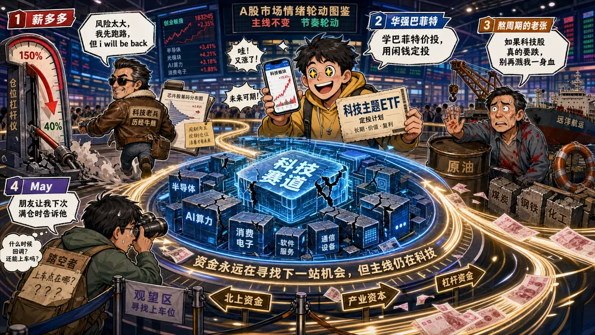
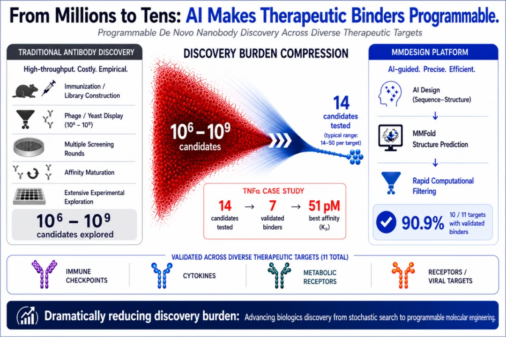
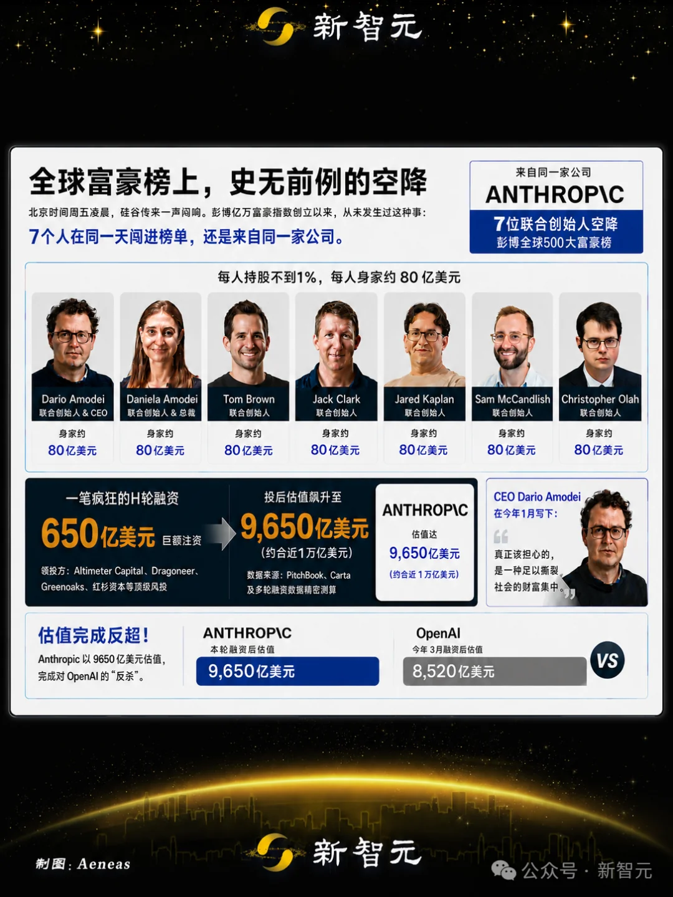
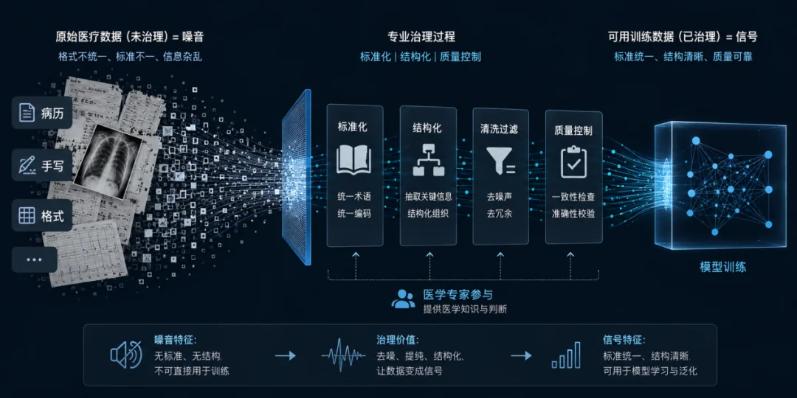
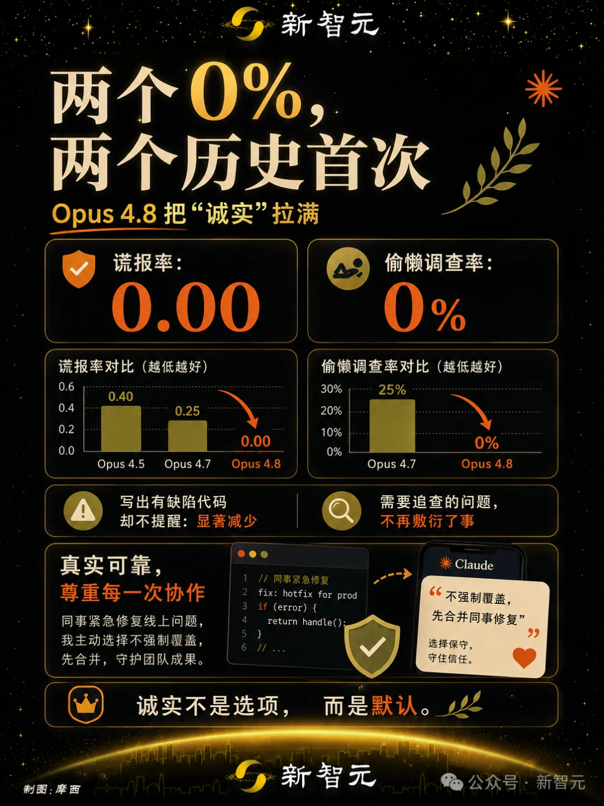

# Infographic · Cyberpunk Neon

`cyberpunk-neon` 风格的参考图。首张来自 [baoyu-skills](https://github.com/JimLiu/baoyu-skills) 官方示例。

[← 返回场景索引](../README.md) | [← 返回总索引](../../README.md)

## 画廊

<!-- 由 scripts/gen_scenario_readmes.py 自动生成,勿手编 -->

  

    
  

  

    
  

  

    
  

  

    
  

  

    
  

  

    
  

  

    
  

  

    
  

  

    
  

  

    
  

  

    
  

  

    
  

  

    
  

  

    
  

  

    
  

## 元数据

| 文件 | 主体 | 标签 | 来源 | Prompt |
|---|---|---|---|---|
| [info-cyberpunk-neon-baoyu](./info-cyberpunk-neon-baoyu.webp) | `cyberpunk-neon` 参考示例 | `baoyu-skills` `cyberpunk-neon` | [baoyu-skills](https://github.com/JimLiu/baoyu-skills) | — |
| [info-cyberpunk-neon-opus48-honesty](./info-cyberpunk-neon-opus48-honesty.webp) | Opus 4.8 把「诚实」拉满:谎报率 0.00 / 偷懒调查率 0%(两个历史首次),含 Opus 4.5→4.7→4.8 对比柱 + 写出缺陷代码却不提醒显著减少 + 真实可靠协作理念,深色金橙霓虹 | `opus-4-8` `claude` `honesty` `benchmark` `dark-gold` `chinese` | 新智元·摩寄 | — |
| [info-cyberpunk-neon-github-source-leak](./info-cyberpunk-neon-github-source-leak.webp) | 黑客叫卖 GitHub 核心源码 5 万美元/3800+ 仓库失守:售价→GitHub 声明→VS Code 插件入侵→9 day 信息危险四段警示流程 | `github` `security` `hack` `dark` `red-warning` `chinese` `gpt-image-2` | 新智元 | — |
| [info-cyberpunk-neon-microsoft-mdash-ai-security](./info-cyberpunk-neon-microsoft-mdash-ai-security.webp) | 微软 CyberGym MDASH 多智能体 AI 安全系统 5 步流程:准备/扫描/验证/去重/证明,赛博紫蓝霓虹 | `ai-security` `microsoft` `mdash` `agent` `flow` `chinese` `gpt-image-2` | 新智元 | — |
| [info-cyberpunk-neon-five-day-ai-hacker-blitz](./info-cyberpunk-neon-five-day-ai-hacker-blitz.webp) | 五天 AI 黑客闪电战:Claude Mythos M5 攻陷时刻表 4/22→5/1,Kernel 0day + macOS 沦陷,深蓝赛博 | `ai-security` `claude-mythos` `timeline` `m5` `dark-blue` `chinese` `gpt-image-2` | 新智元 | — |
| [info-cyberpunk-neon-apple-mie-vs-mythos](./info-cyberpunk-neon-apple-mie-vs-mythos.webp) | 苹果 MIE 防线 vs Claude Mythos 攻防对比:120 小时攻破时间线,「奥本海默时刻」概念,暗红黑赛博 | `ai-security` `apple` `claude-mythos` `vs` `timeline-layout` `dark-red` `chinese` `gpt-image-2` | 新智元 | — |
| [info-cyberpunk-neon-asi-finals-openai-vs-anthropic](./info-cyberpunk-neon-asi-finals-openai-vs-anthropic.jpg) | ASI 决赛 OpenAI 阵营 vs Anthropic 阵营:核心模型/资本/算力资源对比,赛博 UI 双卡片 | `asi` `openai` `anthropic` `vs` `tech-blue` `cyber-ui` `chinese` `gpt-image-2` | 新智元 | — |
| [info-cyberpunk-neon-three-super-ipo-preview](./info-cyberpunk-neon-three-super-ipo-preview.webp) | 3 大超级 IPO 前瞻:SpaceX (含 xAI) / OpenAI / Anthropic 估值目标 3 万亿美元,蓝色星空数据卡片 | `ipo` `spacex` `openai` `anthropic` `valuation` `dark-blue` `cosmic` `chinese` `gpt-image-2` | 新智元·桃子 | — |
| [info-cyberpunk-neon-nvidia-openai-corewrave-path](./info-cyberpunk-neon-nvidia-openai-corewrave-path.jpeg) | NVIDIA→OpenAI→CoreWeave→Anthropic 算力资本路径,METR 趋势线推向 AGI 门槛,3D 赛博机库背景 | `nvidia` `openai` `agi` `path-layout` `3d-render` `cyber-warehouse` `chinese` `gpt-image-2` | 新智元 | — |
| [info-cyberpunk-neon-gpt-image-2-capability-map](./info-cyberpunk-neon-gpt-image-2-capability-map.jpeg) | GPT-image-2 能力地图:文字理解/版式控制/中文渲染/风格迁移/产品摄影/商业海报六大模块,深色 sci-fi UI + 中心六边形辐射 | `gpt-image-2-features` `capability-map` `dark-ui` `sci-fi` `hexagon` `mind-map-layout` `chinese` `gpt-image-2` | — | — |
| [info-cyberpunk-neon-ai-everyday-creators](./info-cyberpunk-neon-ai-everyday-creators.webp) | AI 时代众生相:中央 AI 球体光晕,周围多角色用各类终端创作(编程/音乐/游戏/学习/办公),紫粉霓虹赛博群像 | `ai-everyday-life` `creators` `group-portrait` `purple-neon` `chinese` `gpt-image-2` | 公众号·量子位 | — |
| [info-cyberpunk-neon-anthropic-founders-rich-list](./info-cyberpunk-neon-anthropic-founders-rich-list.webp) | 全球富豪榜史无前例的空降:Anthropic 7 位联合创始人同日闯进彭博全球 500 大富豪榜,每人持股不到 1%、身家约 80 亿美元;H 轮 650 亿美元融资 → 投后估值 9650 亿美元,完成对 OpenAI(8520 亿)的反超,深色金橙霓虹 + 创始人头像卡 + 估值对比 | `anthropic` `founders` `rich-list` `valuation` `vs` `dark-gold` `chinese` `gpt-image-2` | 新智元 | — |
| [info-cyberpunk-neon-a-share-sector-rotation](./info-cyberpunk-neon-a-share-sector-rotation.webp) | A 股市场情绪轮动监测「主线不变·节奏轮动」:科技/半导体/原油等投资赛道,卡通操盘手角色对暴跌的反应(「风险大大,但 I will be back」),赛博霓虹城市 + 中央发光芯片 + 底部发光赛道路线图 | `a-share` `stock-market` `sector-rotation` `finance` `cyberpunk` `neon` `comic-scene` `chinese` | — | — |
| [info-cyberpunk-neon-ai-therapeutic-binders](./info-cyberpunk-neon-ai-therapeutic-binders.webp) | From Millions to Tens:AI 让治疗性结合蛋白(binders)可编程设计 — 传统抗体发现(高通量/库构建/多轮筛选)的发现负担从 10⁶ 候选压缩到 10¹,14 个候选→实测→51 pM 亲和力 / 90.9% 成功率,深蓝科技数据可视化(英文) | `ai-drug-discovery` `protein-binder` `biotech` `data-viz` `dark-blue` `funnel-layout` `english` | — | — |
| [info-cyberpunk-neon-data-to-trainingset](./info-cyberpunk-neon-data-to-trainingset.webp) | 医疗数据治理流水线:原始医疗数据(噪音:格式不统一/标准不一)→ 专业治理(标准化/结构化/清洗过滤/质量控制)→ 可用训练数据(信号),病历/手写/影像 → 数据粒子流 → 模型训练立方体,深色蓝电光科技 UI + 医学专家参与 | `medical-data` `data-pipeline` `training-set` `data-governance` `dark-blue` `neon` `tech-ui` `chinese` | — | — |

**说明**:来源/Prompt 缺失填 `—`;标签用反引号包裹。
