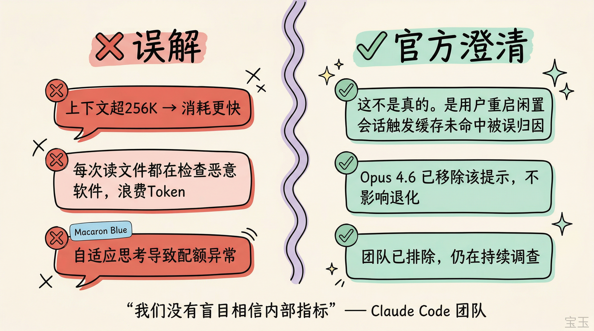
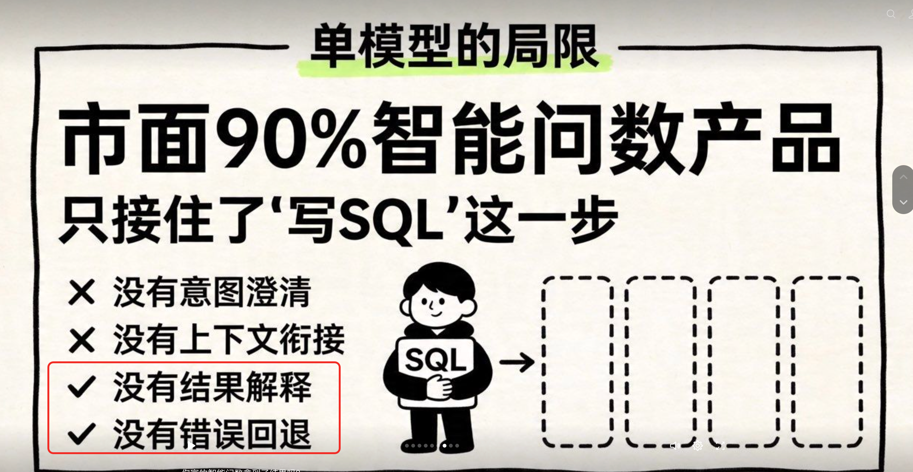

# Infographic · Do Dont

`do-dont` 风格的参考图。首张来自 [baoyu-skills](https://github.com/JimLiu/baoyu-skills) 官方示例。

[← 返回场景索引](../README.md) | [← 返回总索引](../../README.md)

## 画廊

|   |   |   |
|:---:|:---:|:---:|
|  |  |  |
| claude-code-myths | single-model-limitation | baoyu |

## 元数据

| 文件 | 主体 | 标签 | 来源 | Prompt |
|---|---|---|---|---|
| [info-do-dont-claude-code-myths](./info-do-dont-claude-code-myths.png) | Claude Code 常见误解 vs 官方澄清 | `claude-code` `myth-busting` `kawaii` `baoyu-skills` | [宝玉](https://weibo.com/1727858283) | — |
| [info-do-dont-single-model-limitation](./info-do-dont-single-model-limitation.png) | 单模型局限：90% 智能问数产品只接住了写 SQL 这一步 | `ai` `sql` `limitation` `minimal` | — | — |
| [info-do-dont-baoyu](./info-do-dont-baoyu.webp) | `do-dont` 参考示例 | `baoyu-skills` `do-dont` | [baoyu-skills](https://github.com/JimLiu/baoyu-skills) | — |

**说明**:来源/Prompt 缺失填 `—`;标签用反引号包裹。
