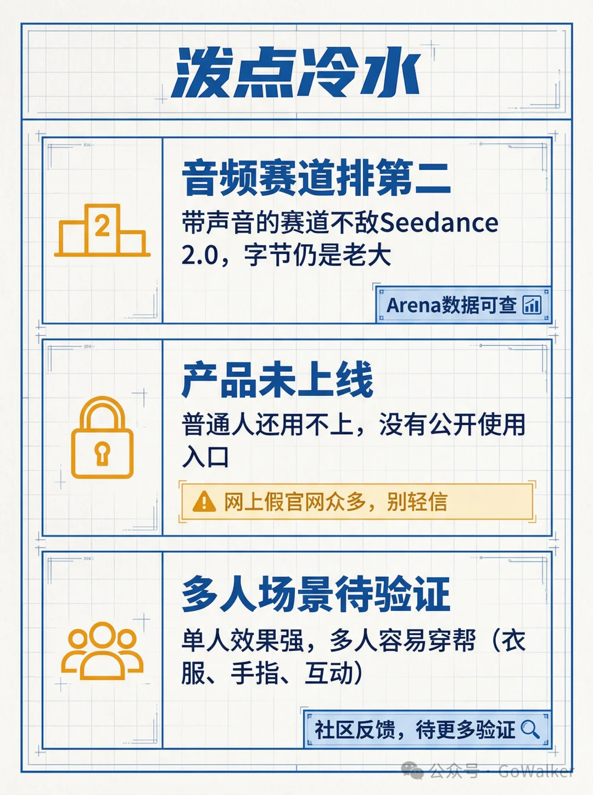

# Infographic · Feature List

`feature-list` 风格的参考图。首张来自 [baoyu-skills](https://github.com/JimLiu/baoyu-skills) 官方示例。

[← 返回场景索引](../README.md) | [← 返回总索引](../../README.md)

## 画廊

<!-- 由 scripts/gen_scenario_readmes.py 自动生成,勿手编 -->

|   |   |   |
|:---:|:---:|:---:|
|  |  |  |
| agent-optimization-methods | claude-agent-sdk | claude-code-three-strategies |
|  |  |  |
| golden-retriever | happyhorse-cold-water | baoyu |

## 元数据

| 文件 | 主体 | 标签 | 来源 | Prompt |
|---|---|---|---|---|
| [info-feature-list-claude-agent-sdk](./info-feature-list-claude-agent-sdk.webp) | Claude Agent SDK 指南 | `claude` `sdk` `3d-isometric` `warm` `illustration` | — | — |
| [info-feature-list-claude-code-three-strategies](./info-feature-list-claude-code-three-strategies.webp) | Claude Code 3 个反直觉策略：缓存热继续聊、复杂任务一次做对、给路径别贴内容 | `claude-code` `token` `strategy` `kawaii` `baoyu-skills` | [宝玉](https://weibo.com/1727858283) | — |
| [info-feature-list-agent-optimization-methods](./info-feature-list-agent-optimization-methods.webp) | AI Agent 优化三要素：提示词优化、模型选择、强化微调 | `agent` `ai` `optimization` `minimal` | — | — |
| [info-feature-list-golden-retriever](./info-feature-list-golden-retriever.webp) | 金毛寻回犬百科：习性、养护、风险注意事项 | `pet` `dog` `knowledge` `warm` `feature-list` `gpt-image-2` | — | — |
| [info-feature-list-baoyu](./info-feature-list-baoyu.webp) | `feature-list` 参考示例 | `baoyu-skills` `feature-list` | [baoyu-skills](https://github.com/JimLiu/baoyu-skills) | — |

**说明**:来源/Prompt 缺失填 `—`;标签用反引号包裹。
