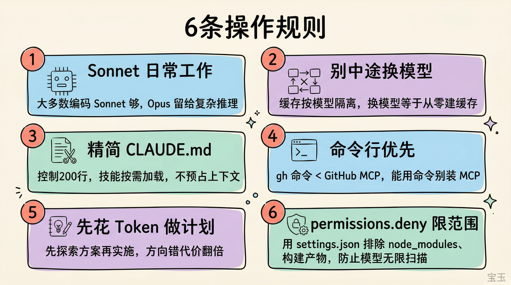

# Infographic · Grid Cards

`grid-cards` 风格的参考图。首张来自 [baoyu-skills](https://github.com/JimLiu/baoyu-skills) 官方示例。

[← 返回场景索引](../README.md) | [← 返回总索引](../../README.md)

## 画廊

|   |   |   |
|:---:|:---:|:---:|
|  |  |  |
| claude-code-six-rules | notebooklm-deep-reading-prompts | notion-3 |
|  |  |   |
| no-agents-md-pain | baoyu |   |

## 元数据

| 文件 | 主体 | 标签 | 来源 | Prompt |
|---|---|---|---|---|
| [info-grid-cards-claude-code-six-rules](./info-grid-cards-claude-code-six-rules.png) | Claude Code 6 条操作规则 | `claude-code` `rules` `kawaii` `baoyu-skills` | [宝玉](https://weibo.com/1727858283) | — |
| [info-grid-cards-notebooklm-deep-reading-prompts](./info-grid-cards-notebooklm-deep-reading-prompts.png) | 6 个 NotebookLM 深度阅读提示词 | `notebooklm` `reading` `prompts` `colorful` | — | — |
| [info-grid-cards-notion-3](./info-grid-cards-notion-3.webp) | Notion 3.0 产品功能 bento 网格:任务追踪/权限/AI connectors/Agent 个性化/数据库性能等 9 模块 | `notion` `bento` `product-launch` `feature-grid` | — | — |
| [info-grid-cards-no-agents-md-pain](./info-grid-cards-no-agents-md-pain.png) | 没有 AGENTS.md 的日子:前后端割裂/不识别私域组件/不知项目规矩/不会启动自测,4 格手绘卡片 | `agents-md` `claude-code` `hand-drawn` `pain-points` `kawaii` | — | — |
| [info-grid-cards-baoyu](./info-grid-cards-baoyu.webp) | `grid-cards` 参考示例 | `baoyu-skills` `grid-cards` | [baoyu-skills](https://github.com/JimLiu/baoyu-skills) | — |

**说明**:来源/Prompt 缺失填 `—`;标签用反引号包裹。
