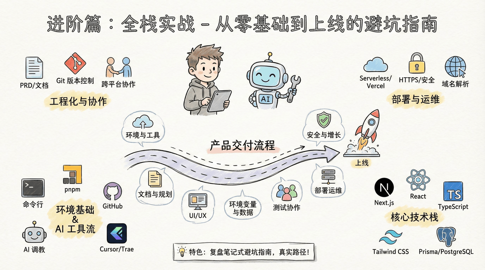
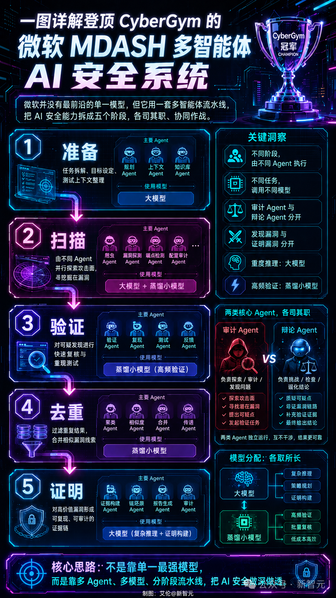
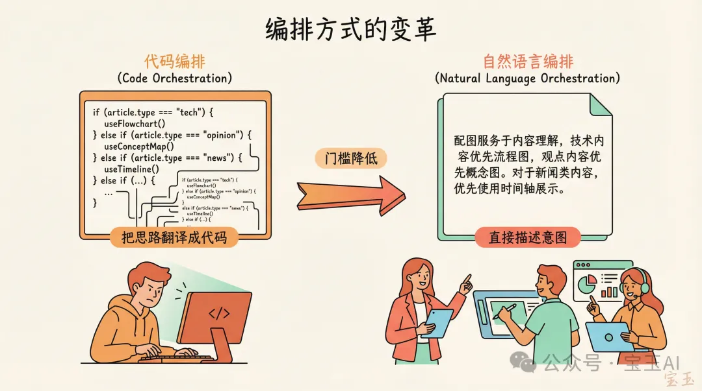
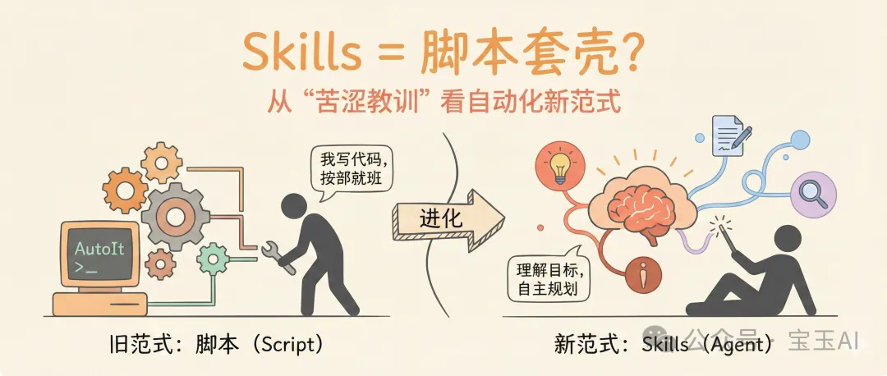

# Infographic · Journey Path

`journey-path` 风格的参考图。首张来自 [baoyu-skills](https://github.com/JimLiu/baoyu-skills) 官方示例。

[← 返回场景索引](../README.md) | [← 返回总索引](../../README.md)

## 画廊

<!-- 由 scripts/gen_scenario_readmes.py 自动生成,勿手编 -->

|   |   |   |
|:---:|:---:|:---:|
|  |  |  |
| claude-feishu-5-agent-flows | fullstack-bug-avoidance | microsoft-mdash-ai-security |
|  |  |  |
| nvidia-openai-corewrave-path | orchestration-evolution | script-to-skills-evolution |
|  |    |    |
| baoyu |    |    |

## 元数据

| 文件 | 主体 | 标签 | 来源 | Prompt |
|---|---|---|---|---|
| [info-journey-path-orchestration-evolution](./info-journey-path-orchestration-evolution.png) | 编排方式的变革：代码编排 → 自然语言编排 | `agent` `orchestration` `evolution` `minimal` | — | — |
| [info-journey-path-script-to-skills-evolution](./info-journey-path-script-to-skills-evolution.png) | Skills = 脚本套壳？从苦涩教训看自动化新范式 | `skills` `script` `agent` `evolution` `baoyu-skills` | [宝玉](https://weibo.com/1727858283) | — |
| [info-journey-path-fullstack-bug-avoidance](./info-journey-path-fullstack-bug-avoidance.png) | 进阶篇:全栈实战 — 从零基础到上线的避坑指南 | `craft-handmade` `fullstack` `ai-coding` `learning-path` `chinese` | — | — |
| [info-journey-path-nvidia-openai-corewrave-path](./info-journey-path-nvidia-openai-corewrave-path.jpeg) | NVIDIA→OpenAI→CoreWeave→Anthropic 算力资本路径,METR 趋势线推向 AGI 门槛,赛博机库背景 | `nvidia` `openai` `agi` `path-diagram` `sci-fi` `chinese` `gpt-image-2` | 新智元 | — |
| [info-journey-path-claude-feishu-5-agent-flows](./info-journey-path-claude-feishu-5-agent-flows.jpg) | Claude Code × 飞书 5 个超实用 Agent 办公玩法:会议知识库/工作复盘/对账/协同画板/报销审批,长图 | `claude-code` `feishu` `agent` `workflow` `office` `chinese` `gpt-image-2` | — | — |
| [info-journey-path-microsoft-mdash-ai-security](./info-journey-path-microsoft-mdash-ai-security.png) | 微软 CyberGym MDASH 多智能体 AI 安全系统 5 步流程:准备/扫描/验证/去重/证明,赛博紫蓝霓虹 | `ai-security` `microsoft` `mdash` `agent` `flow` `cyberpunk` `chinese` `gpt-image-2` | 新智元 | — |
| [info-journey-path-baoyu](./info-journey-path-baoyu.webp) | `journey-path` 参考示例 | `baoyu-skills` `journey-path` | [baoyu-skills](https://github.com/JimLiu/baoyu-skills) | — |

**说明**:来源/Prompt 缺失填 `—`;标签用反引号包裹。
