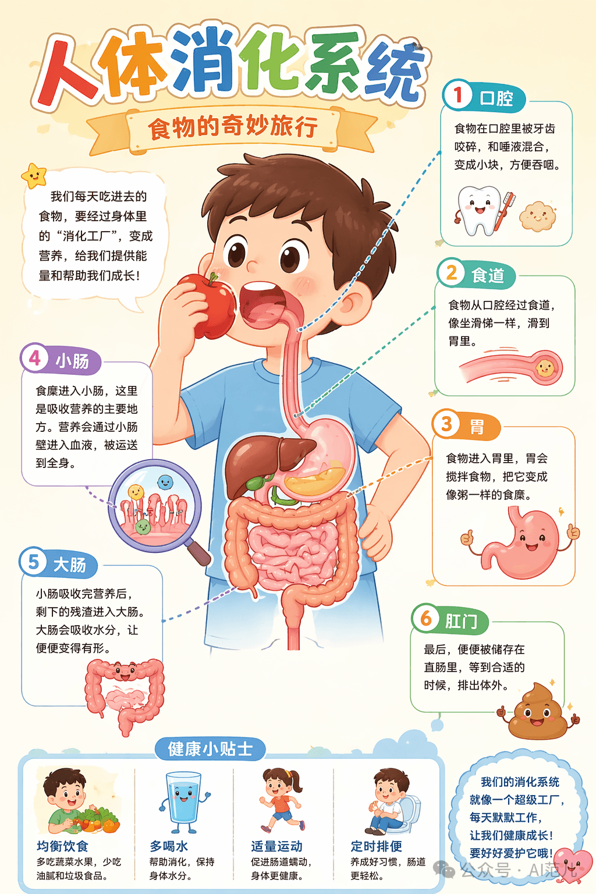

# Infographic · Kawaii

`kawaii` 风格的参考图。首张来自 [baoyu-skills](https://github.com/JimLiu/baoyu-skills) 官方示例。

[← 返回场景索引](../README.md) | [← 返回总索引](../../README.md)

## 画廊

|   |   |   |
|:---:|:---:|:---:|
|  |  |    |
| human-digestion | baoyu |    |

## 元数据

| 文件 | 主体 | 标签 | 来源 | Prompt |
|---|---|---|---|---|
| [info-kawaii-human-digestion](./info-kawaii-human-digestion.png) | 人体消化系统：食物的奇妙旅行，卡通科普风 | `science` `education` `kawaii` `biology` `children` `gpt-image-2` | — | — |
| [info-kawaii-baoyu](./info-kawaii-baoyu.webp) | `kawaii` 参考示例 | `baoyu-skills` `kawaii` | [baoyu-skills](https://github.com/JimLiu/baoyu-skills) | — |

**说明**:来源/Prompt 缺失填 `—`;标签用反引号包裹。
