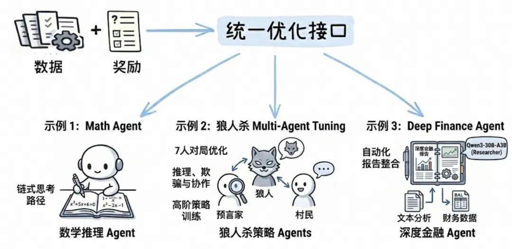

# Infographic · Mind Map

`mind-map` 风格的参考图。首张来自 [baoyu-skills](https://github.com/JimLiu/baoyu-skills) 官方示例。

[← 返回场景索引](../README.md) | [← 返回总索引](../../README.md)

## 画廊

|   |   |   |
|:---:|:---:|:---:|
|  |  |  |
| unified-agent-optimization | gpt-image-2-capability-map | baoyu |

## 元数据

| 文件 | 主体 | 标签 | 来源 | Prompt |
|---|---|---|---|---|
| [info-mind-map-unified-agent-optimization](./info-mind-map-unified-agent-optimization.png) | 统一优化接口：Math Agent / 狼人杀 Multi-Agent / Deep Finance Agent 示例 | `agent` `multi-agent` `ai` `diagram` | — | — |
| [info-mind-map-gpt-image-2-capability-map](./info-mind-map-gpt-image-2-capability-map.jpeg) | GPT-image-2 能力地图:文字理解/版式控制/中文渲染/风格迁移/产品摄影/商业海报六大模块 | `gpt-image-2-features` `capability-map` `dark-ui` `sci-fi` `hexagon` `chinese` `gpt-image-2` | — | — |
| [info-mind-map-baoyu](./info-mind-map-baoyu.webp) | `mind-map` 参考示例 | `baoyu-skills` `mind-map` | [baoyu-skills](https://github.com/JimLiu/baoyu-skills) | — |

**说明**:来源/Prompt 缺失填 `—`;标签用反引号包裹。
