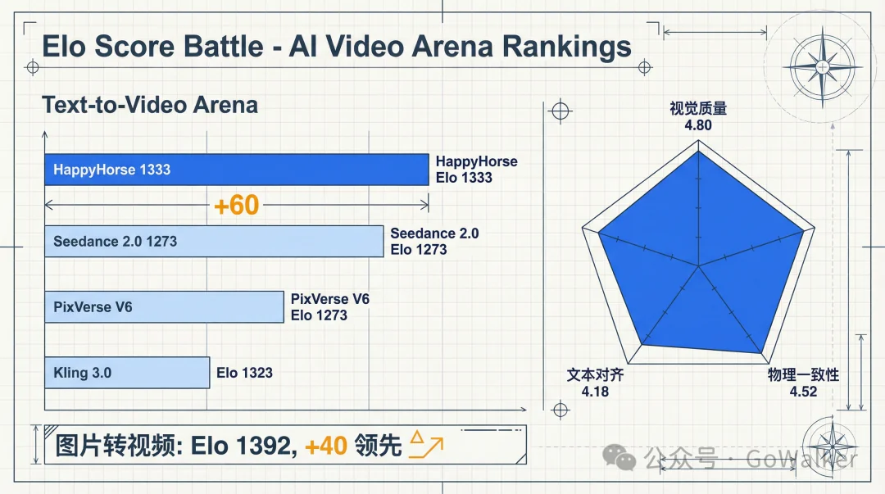
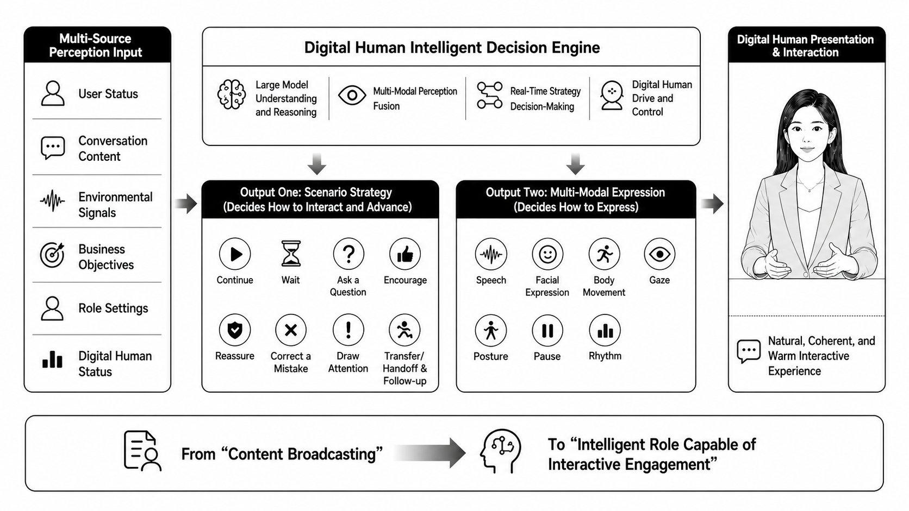
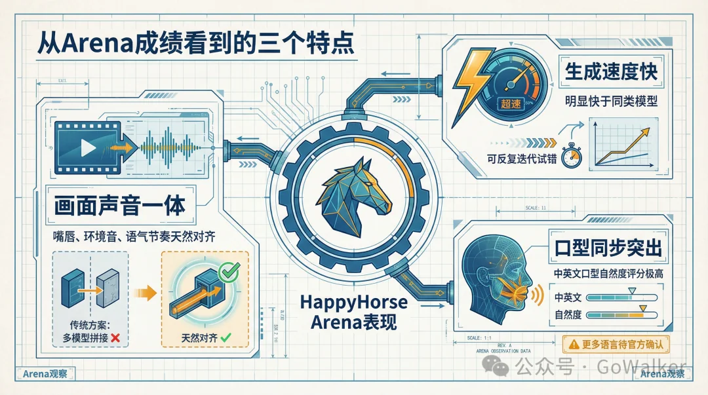
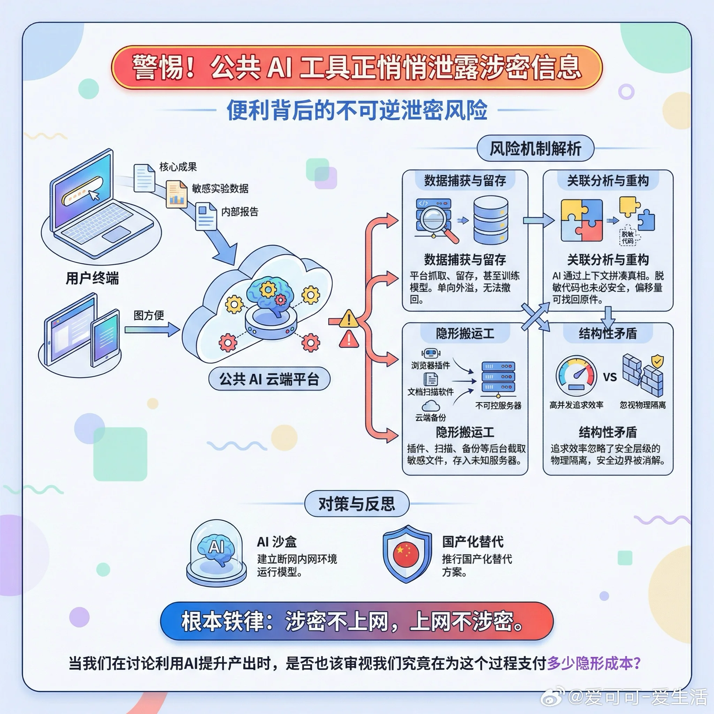
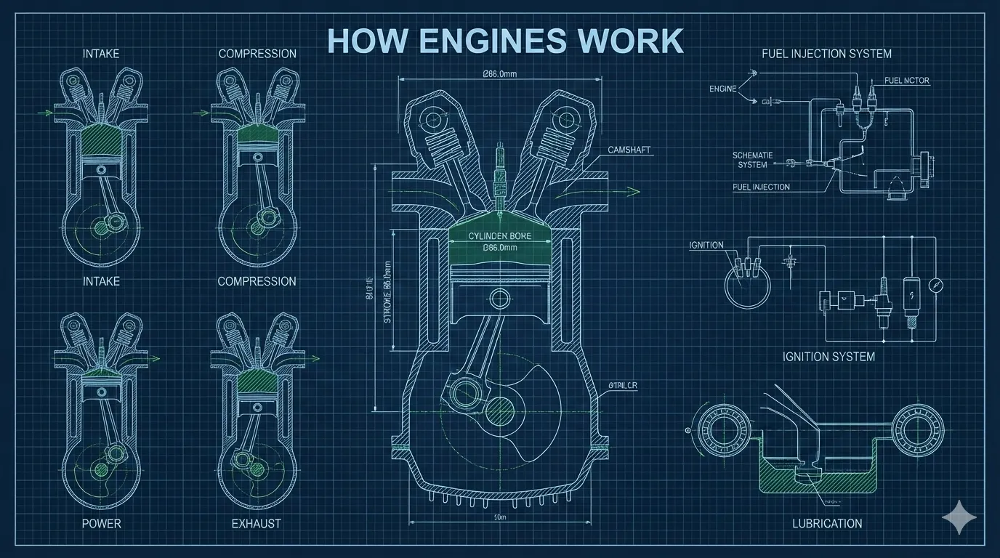

# Infographic · Technical Schematic

`technical-schematic` 风格的参考图。首张来自 [baoyu-skills](https://github.com/JimLiu/baoyu-skills) 官方示例。

[← 返回场景索引](../README.md) | [← 返回总索引](../../README.md)

## 画廊

<!-- 由 scripts/gen_scenario_readmes.py 自动生成,勿手编 -->

  

    
  

  

    
  

  

    
  

  

    
  

  

    
  

  

    
  

## 元数据

| 文件 | 主体 | 标签 | 来源 | Prompt |
|---|---|---|---|---|
| [info-technical-schematic-happyhorse-cold-water](./info-technical-schematic-happyhorse-cold-water.webp) | HappyHorse 视频模型「泼点冷水」:音频赛道排第二(不敌 Seedance 2.0)/ 产品未上线 / 多人场景待验证,蓝图工程图风 | `happyhorse` `video-model` `gowalker` `blueprint` `chinese` | 公众号·GoWalker | — |
| [info-technical-schematic-digital-human-decision-engine](./info-technical-schematic-digital-human-decision-engine.jpeg) | 数字人智能决策引擎架构:多源感知输入(用户状态/对话/环境信号/业务目标/角色设定)→ 决策引擎(大模型理解/多模态感知融合/实时策略决策/驱动控制)→ 双路输出(场景策略 8 动作 + 多模态表达 7 维度)→ 数字人呈现,黑白线框 English | `digital-human` `decision-engine` `architecture` `multimodal` `black-white` `linework` `english` | — | — |
| [info-technical-schematic-baoyu](./info-technical-schematic-baoyu.webp) | `technical-schematic` 参考示例 | `baoyu-skills` `technical-schematic` | [baoyu-skills](https://github.com/JimLiu/baoyu-skills) | — |

**说明**:来源/Prompt 缺失填 `—`;标签用反引号包裹。
