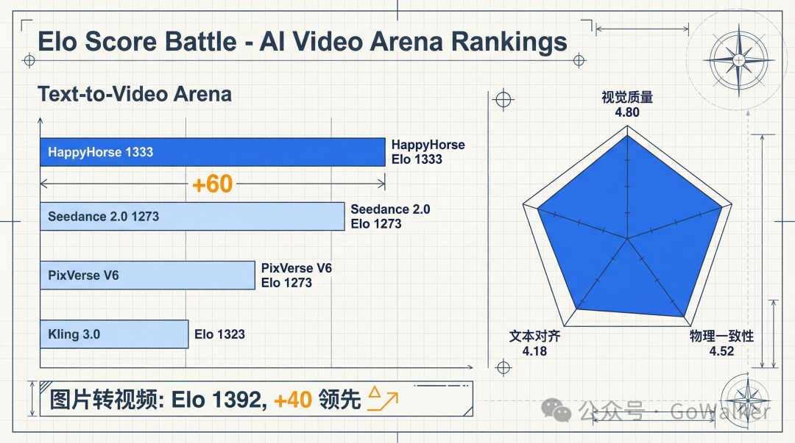
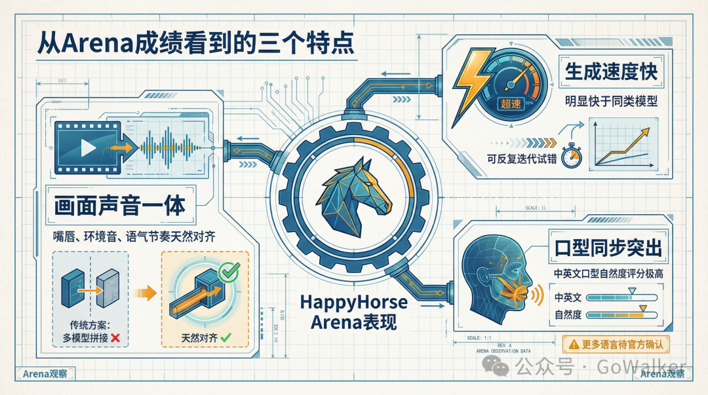

# Infographic · Technical Schematic

`technical-schematic` 风格的参考图。首张来自 [baoyu-skills](https://github.com/JimLiu/baoyu-skills) 官方示例。

[← 返回场景索引](../README.md) | [← 返回总索引](../../README.md)

## 画廊

<!-- 由 scripts/gen_scenario_readmes.py 自动生成,勿手编 -->

|   |   |   |
|:---:|:---:|:---:|
|  |  |  |
| ai-video-arena-elo-ranking | happyhorse-arena-three-traits | jetbrains-git-client |
|  |  |  |
| mojin-xiaowei | public-ai-data-leak-risk | baoyu |

## 元数据

| 文件 | 主体 | 标签 | 来源 | Prompt |
|---|---|---|---|---|
| [info-technical-schematic-jetbrains-git-client](./info-technical-schematic-jetbrains-git-client.png) | JetBrains 独立 Git 客户端：官方弃坑、社区接棒全解析 | `git` `jetbrains` `sketch-notes` `developer-tools` | — | — |
| [info-technical-schematic-mojin-xiaowei](./info-technical-schematic-mojin-xiaowei.jpeg) | 摸金校尉知识图谱:组织、技能、装备、探墓流程全解 | `culture` `comprehensive` `dark` `technical-schematic` `gpt-image-2` | — | — |
| [info-technical-schematic-baoyu](./info-technical-schematic-baoyu.webp) | `technical-schematic` 参考示例 | `baoyu-skills` `technical-schematic` | [baoyu-skills](https://github.com/JimLiu/baoyu-skills) | — |

**说明**:来源/Prompt 缺失填 `—`;标签用反引号包裹。
