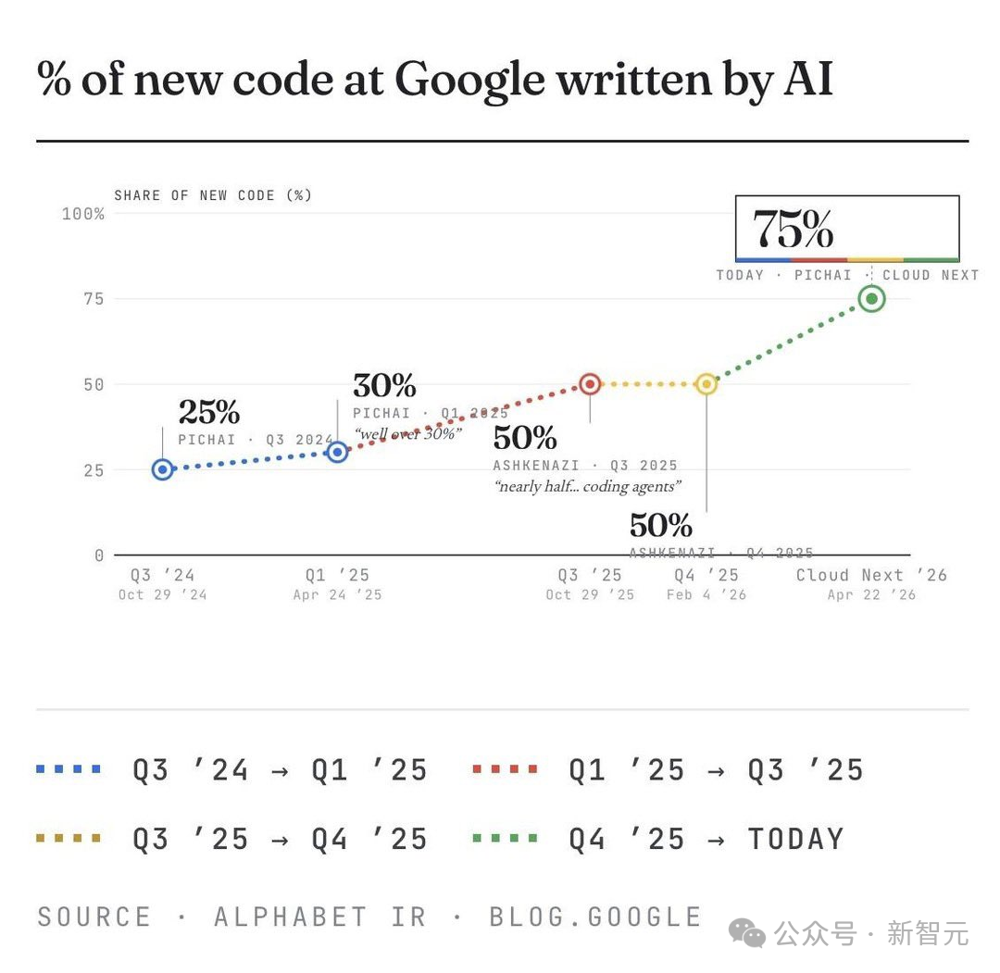

# Infographic · Timeline Horizontal

`timeline-horizontal` 风格的参考图。首张来自 [baoyu-skills](https://github.com/JimLiu/baoyu-skills) 官方示例。

[← 返回场景索引](../README.md) | [← 返回总索引](../../README.md)

## 画廊

|   |   |   |
|:---:|:---:|:---:|
|  |  |    |
| google-ai-code-share | baoyu |    |

## 元数据

| 文件 | 主体 | 标签 | 来源 | Prompt |
|---|---|---|---|---|
| [info-timeline-horizontal-google-ai-code-share](./info-timeline-horizontal-google-ai-code-share.png) | Google 新代码中由 AI 生成的占比演变(Q3'24 25% → 2026 75%) | `data-viz` `line-chart` `google` `ai-coding` `minimal` | [新智元](https://blog.google) | — |
| [info-timeline-horizontal-baoyu](./info-timeline-horizontal-baoyu.webp) | `timeline-horizontal` 参考示例 | `baoyu-skills` `timeline-horizontal` | [baoyu-skills](https://github.com/JimLiu/baoyu-skills) | — |

**说明**:来源/Prompt 缺失填 `—`;标签用反引号包裹。
