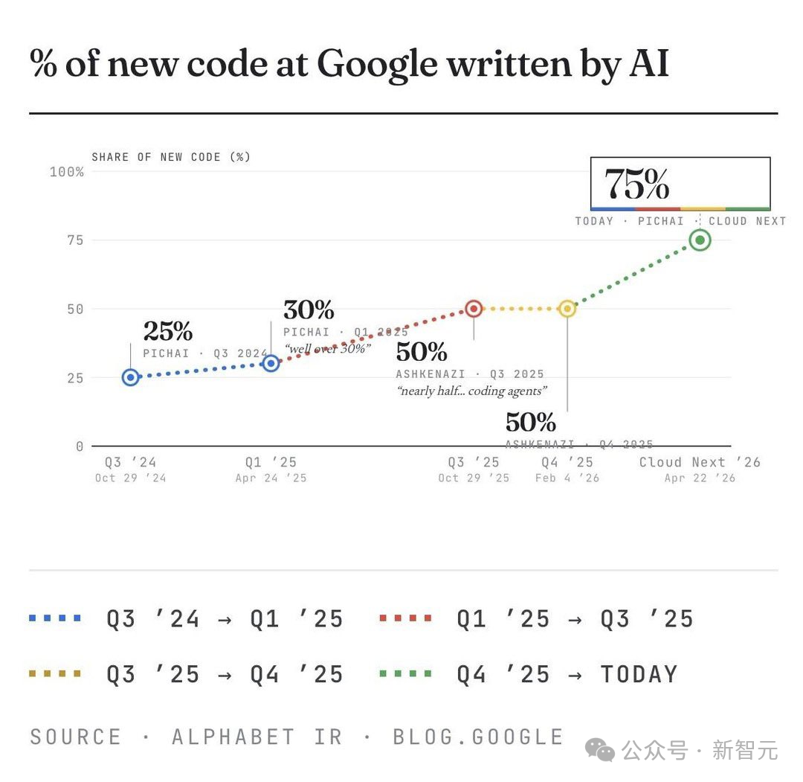

# Infographic · Timeline Horizontal

`timeline-horizontal` 风格的参考图。首张来自 [baoyu-skills](https://github.com/JimLiu/baoyu-skills) 官方示例。

[← 返回场景索引](../README.md) | [← 返回总索引](../../README.md)

## 画廊

<!-- 由 scripts/gen_scenario_readmes.py 自动生成,勿手编 -->

|   |   |   |
|:---:|:---:|:---:|
|  |  |  |
| amazon-anthropic-investment | anthropic-revenue-growth | apple-mie-vs-mythos |
|  |  |  |
| five-day-ai-hacker-blitz | google-ai-code-share | baoyu |

## 元数据

| 文件 | 主体 | 标签 | 来源 | Prompt |
|---|---|---|---|---|
| [info-timeline-horizontal-google-ai-code-share](./info-timeline-horizontal-google-ai-code-share.png) | Google 新代码中由 AI 生成的占比演变(Q3'24 25% → 2026 75%) | `data-viz` `line-chart` `google` `ai-coding` `minimal` | [新智元](https://blog.google) | — |
| [info-timeline-horizontal-anthropic-revenue-growth](./info-timeline-horizontal-anthropic-revenue-growth.jpg) | Anthropic 年化收入飞跃:2024 末 $1B → 2025 末 $9B → 2026 Q1 末 >$30B,卡通漫画风 | `anthropic` `revenue` `comic` `bold` `chinese` | 新智元 | — |
| [info-timeline-horizontal-amazon-anthropic-investment](./info-timeline-horizontal-amazon-anthropic-investment.jpg) | 亚马逊对 Anthropic 战略投资历程:2023.09 → 2024.03 → 2024.11 → 2026.04,4 节点累计 $130 亿 | `amazon` `anthropic` `investment` `tech-blue` `chinese` | 新智元 | — |
| [info-timeline-horizontal-apple-mie-vs-mythos](./info-timeline-horizontal-apple-mie-vs-mythos.webp) | 苹果 MIE 防线 vs Claude Mythos 攻防对比:120 小时攻破时间线,「奥本海默时刻」概念,暗红黑 | `ai-security` `apple` `claude-mythos` `vs` `timeline` `dark` `chinese` `gpt-image-2` | 新智元 | — |
| [info-timeline-horizontal-five-day-ai-hacker-blitz](./info-timeline-horizontal-five-day-ai-hacker-blitz.webp) | 五天 AI 黑客闪电战:Claude Mythos M5 攻陷时刻表 4/22→5/1,Kernel 0day + macOS 沦陷,深蓝赛博 | `ai-security` `claude-mythos` `timeline` `m5` `cyberpunk` `dark-blue` `chinese` `gpt-image-2` | 新智元 | — |
| [info-timeline-horizontal-baoyu](./info-timeline-horizontal-baoyu.webp) | `timeline-horizontal` 参考示例 | `baoyu-skills` `timeline-horizontal` | [baoyu-skills](https://github.com/JimLiu/baoyu-skills) | — |

**说明**:来源/Prompt 缺失填 `—`;标签用反引号包裹。
