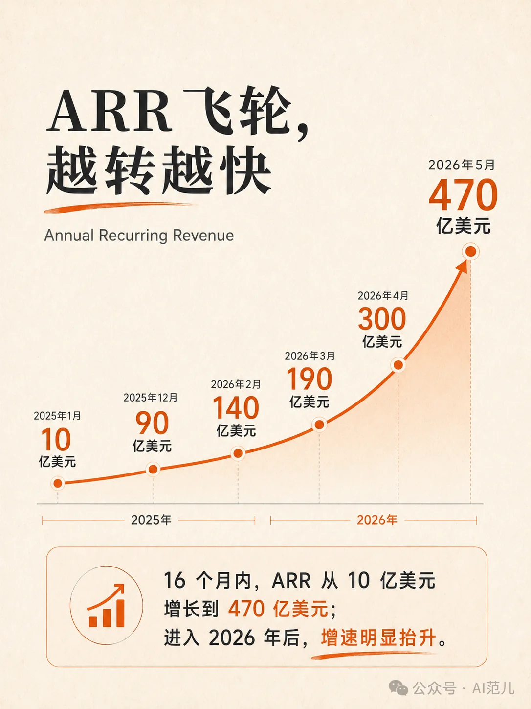

# Infographic · Timeline Horizontal

`timeline-horizontal` 风格的参考图。首张来自 [baoyu-skills](https://github.com/JimLiu/baoyu-skills) 官方示例。

[← 返回场景索引](../README.md) | [← 返回总索引](../../README.md)

## 画廊

<!-- 由 scripts/gen_scenario_readmes.py 自动生成,勿手编 -->

  

    
  

  

    
  

  

    
  

  

    
  

  

    
  

## 元数据

| 文件 | 主体 | 标签 | 来源 | Prompt |
|---|---|---|---|---|
| [info-timeline-horizontal-arr-flywheel-growth](./info-timeline-horizontal-arr-flywheel-growth.webp) | ARR 飞轮越转越快:年化经常性收入 16 个月内从 10 亿 → 90 → 140 → 190 → 300 → 470 亿美元,2025/2026 横轴指数级增长曲线 + 暖米色版面 | `arr` `revenue` `growth-curve` `exponential` `warm-cream` `chinese` | 公众号·AI范儿 | — |
| [info-timeline-horizontal-google-ai-code-share](./info-timeline-horizontal-google-ai-code-share.webp) | Google 新代码中由 AI 生成的占比演变(Q3'24 25% → 2026 75%) | `data-viz` `line-chart` `google` `ai-coding` `minimal` | [新智元](https://blog.google) | — |
| [info-timeline-horizontal-anthropic-revenue-growth](./info-timeline-horizontal-anthropic-revenue-growth.jpg) | Anthropic 年化收入飞跃:2024 末 $1B → 2025 末 $9B → 2026 Q1 末 >$30B,卡通漫画风 | `anthropic` `revenue` `comic` `bold` `chinese` | 新智元 | — |
| [info-timeline-horizontal-amazon-anthropic-investment](./info-timeline-horizontal-amazon-anthropic-investment.jpg) | 亚马逊对 Anthropic 战略投资历程:2023.09 → 2024.03 → 2024.11 → 2026.04,4 节点累计 $130 亿 | `amazon` `anthropic` `investment` `tech-blue` `chinese` | 新智元 | — |
| [info-timeline-horizontal-baoyu](./info-timeline-horizontal-baoyu.webp) | `timeline-horizontal` 参考示例 | `baoyu-skills` `timeline-horizontal` | [baoyu-skills](https://github.com/JimLiu/baoyu-skills) | — |

**说明**:来源/Prompt 缺失填 `—`;标签用反引号包裹。
