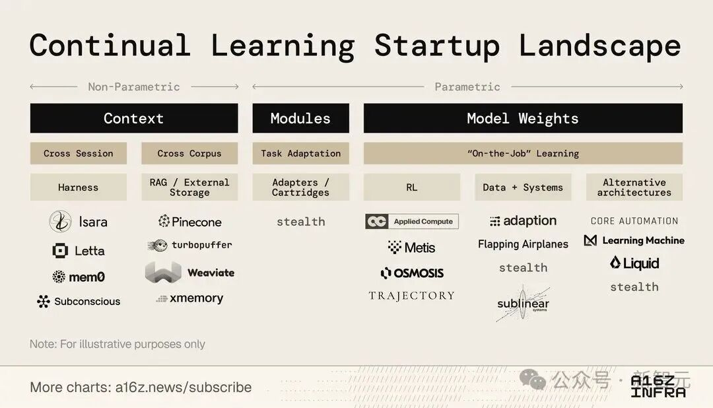
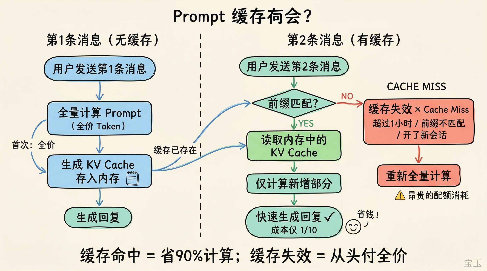
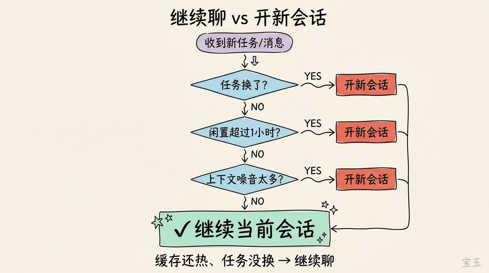
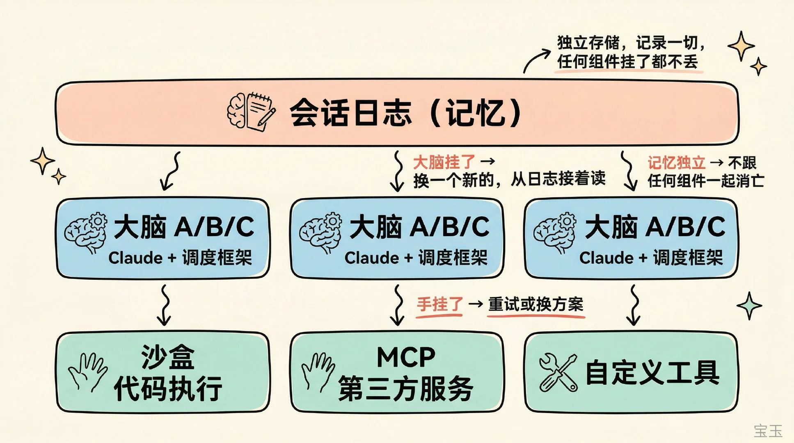

# Infographic · Tree Hierarchy

`tree-hierarchy` 风格的参考图。首张来自 [baoyu-skills](https://github.com/JimLiu/baoyu-skills) 官方示例。

[← 返回场景索引](../README.md) | [← 返回总索引](../../README.md)

## 画廊

<!-- 由 scripts/gen_scenario_readmes.py 自动生成,勿手编 -->

|   |   |   |
|:---:|:---:|:---:|
|  |  |  |
| continual-learning-startup-landscape | prompt-cache-flow | session-decision |
|  |  |    |
| session-log-memory-arch | baoyu |    |

## 元数据

| 文件 | 主体 | 标签 | 来源 | Prompt |
|---|---|---|---|---|
| [info-tree-hierarchy-session-decision](./info-tree-hierarchy-session-decision.webp) | 继续聊 vs 开新会话决策流程图 | `claude-code` `session` `flowchart` `kawaii` `baoyu-skills` | [宝玉](https://weibo.com/1727858283) | — |
| [info-tree-hierarchy-prompt-cache-flow](./info-tree-hierarchy-prompt-cache-flow.webp) | Prompt 缓存命中机制：首条 vs 第二条消息流程 | `claude-code` `cache` `flowchart` `kawaii` `baoyu-skills` | [宝玉](https://weibo.com/1727858283) | — |
| [info-tree-hierarchy-continual-learning-startup-landscape](./info-tree-hierarchy-continual-learning-startup-landscape.jpeg) | a16z infra Continual Learning 创业公司地图:Non-Parametric(Context/Modules)vs Parametric(Model Weights)分类景观 | `landscape-map` `continual-learning` `a16z` `startup` `taxonomy` `minimal` `english` `gpt-image-2` | [a16z.news](https://a16z.news/subscribe) | — |
| [info-tree-hierarchy-baoyu](./info-tree-hierarchy-baoyu.webp) | `tree-hierarchy` 参考示例 | `baoyu-skills` `tree-hierarchy` | [baoyu-skills](https://github.com/JimLiu/baoyu-skills) | — |

**说明**:来源/Prompt 缺失填 `—`;标签用反引号包裹。
