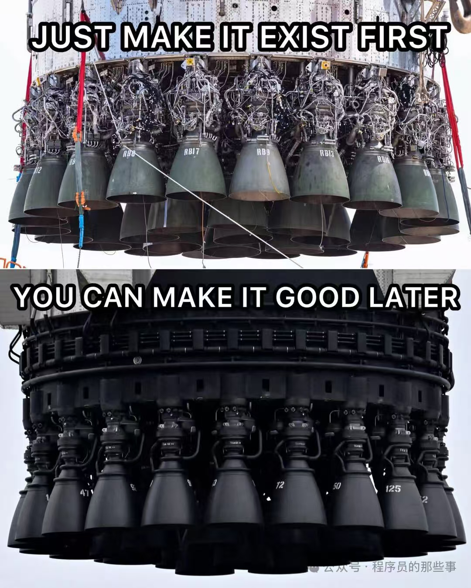

# Meme · 梗图

网络梗图、对比/吐槽 meme、二次创作图:主打文案 + 图像传递观点,常见上下/左右对比、配粗体大字幕。图源多为转发收藏,非 AI 生成时以元数据标签 `meme` `photo` 标注。

[← 返回总索引](../README.md)

## 画廊

<!-- 由 scripts/gen_scenario_readmes.py 自动生成,勿手编 -->

  

    
  

## 元数据

| 文件 | 主体 | 标签 | 来源 | Prompt |
|---|---|---|---|---|
| [meme-rocket-make-it-exist-first](./meme-rocket-make-it-exist-first.jpg) | 「先做出来,再做好」程序员哲学梗:上为 SpaceX 火箭发动机粗装实拍(JUST MAKE IT EXIST FIRST),下为精致量产版(YOU CAN MAKE IT GOOD LATER),上下双段对比 | `meme` `comparison` `rocket` `programmer` `motivational` `photo` `english` | 公众号·程序员的那些事 | — |

**说明**:来源/Prompt 缺失填 `—`;标签用反引号包裹。非 AI 生成的转发图标 `meme` `photo`,不打模型来源标签(如 `gpt-image-2`)。
