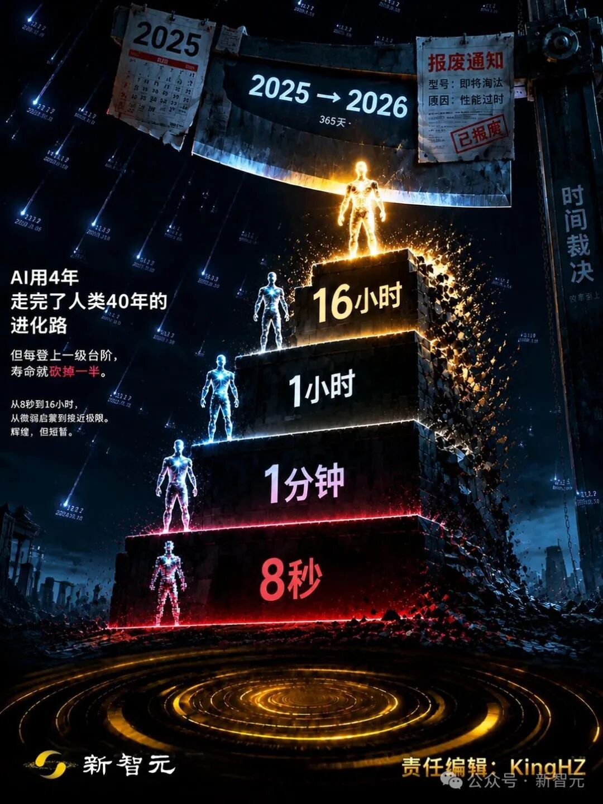
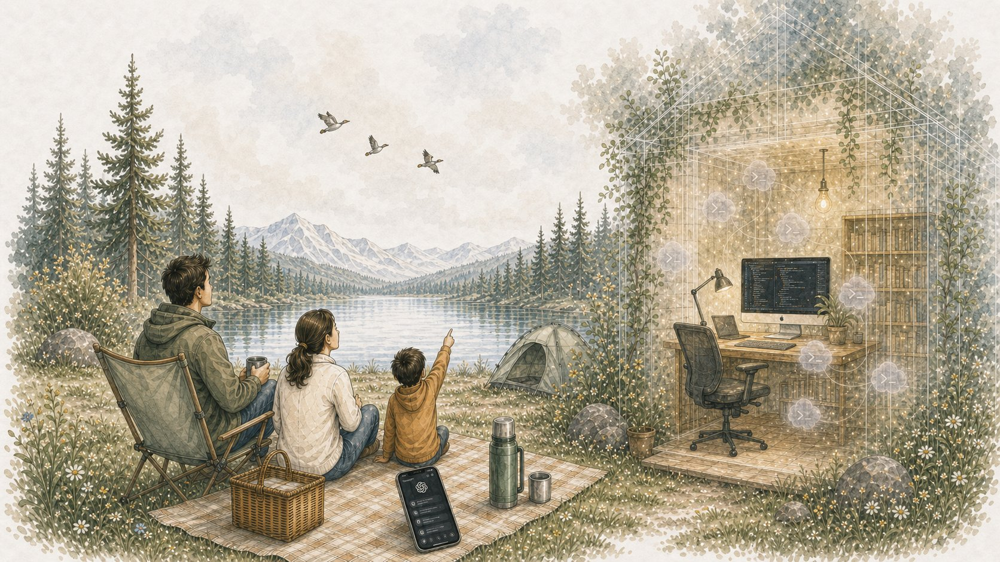
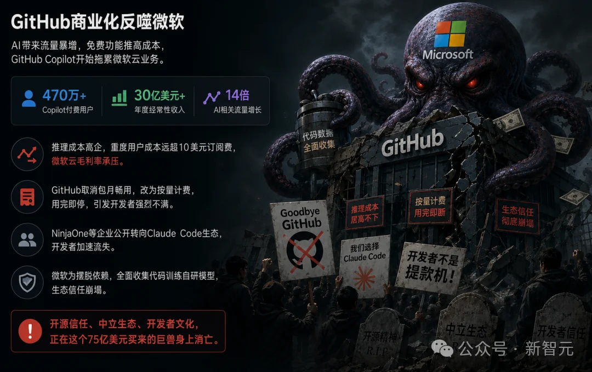
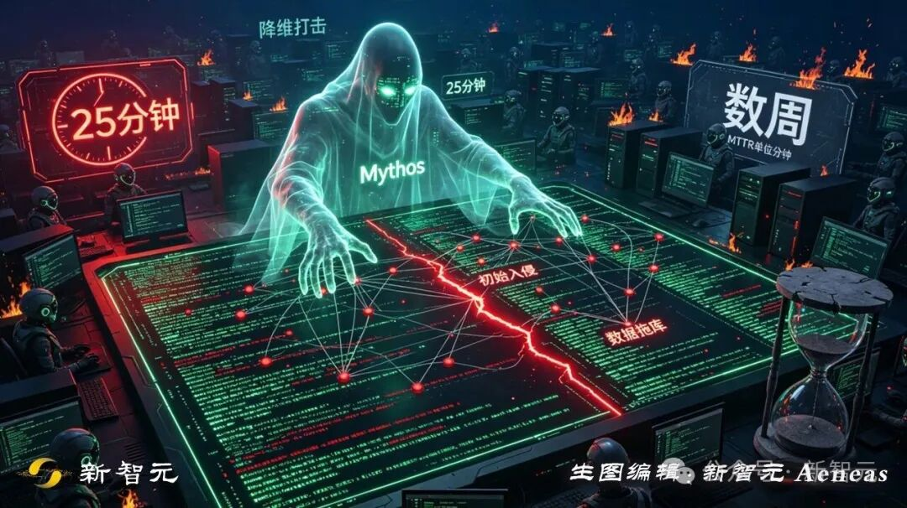

# Poster · 海报

影视/小说/品牌等单图宣传海报,强主视觉。

[← 返回总索引](../README.md)

## 画廊

<!-- 由 scripts/gen_scenario_readmes.py 自动生成,勿手编 -->

  

    
  

  

    
  

  

    
  

  

    
  

  

    
  

  

    
  

  

    
  

  

    
  

  

    
  

  

    
  

  

    
  

  

    
  

## 元数据

| 文件 | 主体 | 标签 | 来源 | Prompt |
|---|---|---|---|---|
| [poster-mortal-cultivation](./poster-mortal-cultivation.webp) | 《凡人修仙传》水墨人物剪影海报：人物轮廓融合修仙世界场景 | `poster` `ink-wash` `chinese` `cinematic` `silhouette` `dark` `gpt-image-2` | — | — |
| [poster-calma-coffee](./poster-calma-coffee.webp) | Calma Coffee 品牌海报：Good things take time，米白 + 拿铁主图 | `poster` `coffee` `brand` `minimal` `warm` `english` `gpt-image-2` | — | — |
| [poster-obsidian-crystal](./poster-obsidian-crystal.webp) | Obsidian「连接思考·沉淀知识」品牌封面:紫色水晶主视觉 + 暗色星网背景 | `poster` `brand` `obsidian` `dark` `purple` `crystal` `gpt-image-2` | — | — |
| [poster-xiaban-red](./poster-xiaban-red.webp) | 「下班!」朱红巨字 + 人物剪影海报,粗线条作业风 | `poster` `red` `bold-type` `chinese` `silhouette` `mood` `gpt-image-2` | 公众号:粗线条作业 | — |
| [poster-ai-evolution-stairs](./poster-ai-evolution-stairs.jpeg) | AI 进化阶梯:8 秒 / 1 分钟 / 1 小时 / 16 小时,2025→2026 报废通知,赛博废墟背景 | `poster` `ai-evolution` `sci-fi` `cyberpunk` `dystopian` `chinese` `gpt-image-2` | 新智元 | — |
| [poster-monkey-singularity](./poster-monkey-singularity.jpeg) | 草原猿猴回望奇点能量塔,左侧自然黄昏 / 右侧紫色赛博粒子,意识跃迁意象 | `poster` `singularity` `evolution` `monkey` `split-scene` `surreal` `gpt-image-2` | 新智元 | — |
| [poster-mythos-cyber-attack](./poster-mythos-cyber-attack.jpeg) | Mythos 降维打击:25 分钟入侵 vs 数周 MTTR,绿色幽灵 + 红色裂缝 + 服务器机房 | `poster` `cybersecurity` `mythos` `dark` `green-red` `dramatic` `gpt-image-2` | 新智元 | — |
| [poster-digital-nomad-remote-work](./poster-digital-nomad-remote-work.jpeg) | 数字游民概念插画:一家三口湖畔露营 + 半透明远程办公小屋叠加,温润水彩风 | `poster` `digital-nomad` `remote-work` `watercolor` `family` `nature` `concept` `gpt-image-2` | — | — |
| [poster-karpathy-anthropic-transfer](./poster-karpathy-anthropic-transfer.webp) | Karpathy 从 OpenAI 转会 Anthropic「TRANSFER」运动转会风海报,橙黑赛博粒子背景 + 双方 LOGO 对位 | `poster` `tech-news` `transfer` `karpathy` `openai-anthropic` `orange-black` `cyber` `sports-style` `chinese-meme` `gpt-image-2` | 新智元 | — |
| [poster-microsoft-anthropic-token-invoice](./poster-microsoft-anthropic-token-invoice.webp) | 微软投了 OpenAI 但开发者都用 Claude Code:Satya 持 Anthropic Token Invoice 头疼、Azure 管道把 token 输向 Anthropic 的写实讽刺场景 | `poster` `meme` `satire` `microsoft` `anthropic` `claude-code` `photorealistic` `chinese-meme` `gpt-image-2` | 新智元 | — |
| [poster-moat-fall-cursor-claude-code](./poster-moat-fall-cursor-claude-code.webp) | 护城河失守:Cursor 与 Claude Code 降维打击,2024→2025 时间线 + 战场史诗背景 + 巨头 logo 倒塌 | `poster` `tech-news` `moat-fall` `cursor` `claude-code` `cinematic` `epic` `chinese` `gpt-image-2` | 新智元 | — |
| [poster-github-reverse-bite-microsoft](./poster-github-reverse-bite-microsoft.webp) | GitHub 商业化反噬微软:章鱼巨兽吞噬 GitHub 大楼 + 470 万 Copilot 付费用户 / 30 亿美元营收数据,戏剧化反派场景 | `poster` `tech-news` `github` `microsoft` `monster` `dramatic` `dark` `chinese` `gpt-image-2` | 新智元 | — |

**说明**:来源/Prompt 缺失填 `—`;标签用反引号包裹。
