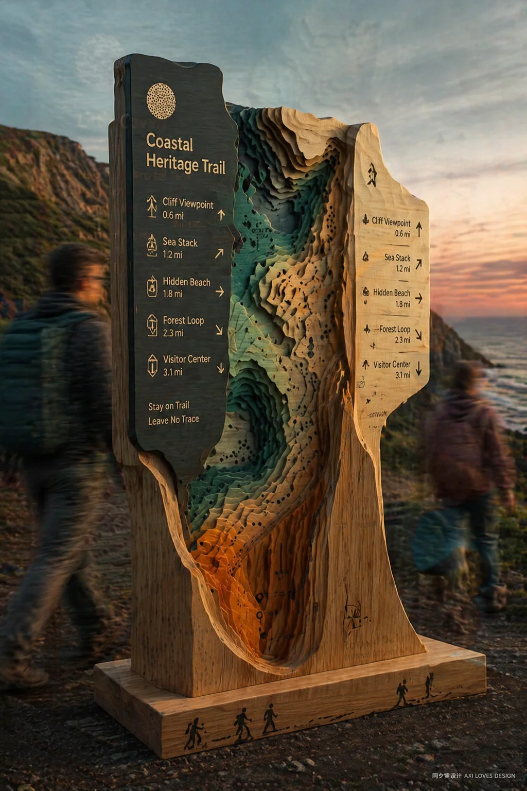
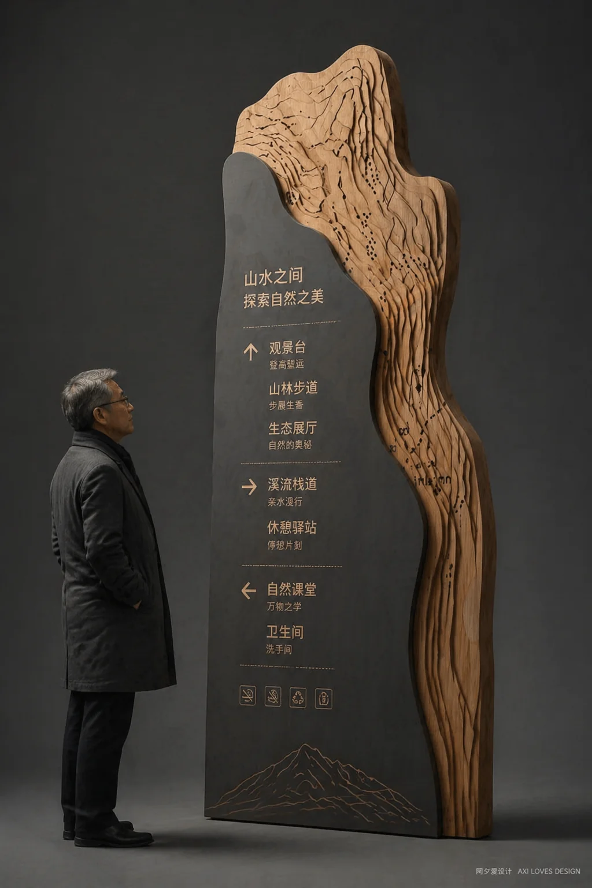
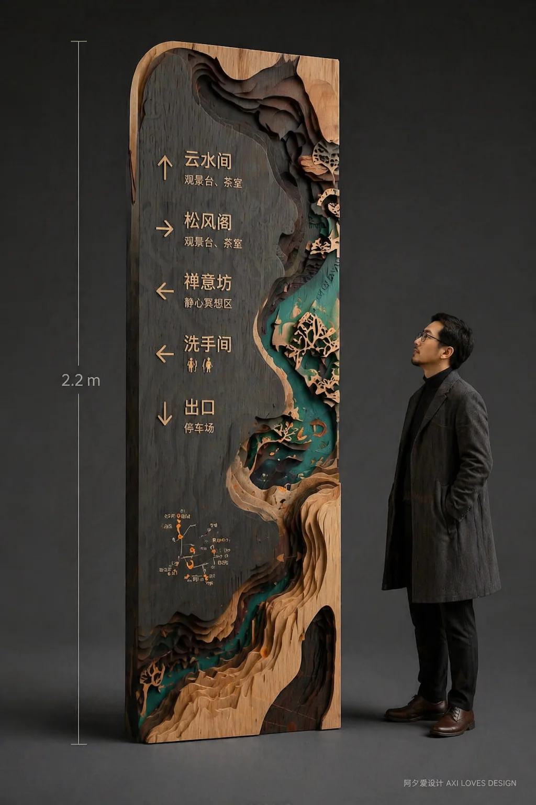

# Product Design · 产品设计

实物产品 / 工业设计 / 空间装置 / 创意设计概念图：木质雕刻、立体结构、品牌识别系统等。

[← 返回总索引](../README.md)

## 画廊

<!-- 由 scripts/gen_scenario_readmes.py 自动生成,勿手编 -->

|   |   |   |
|:---:|:---:|:---:|
|  |  |  |
| coastal-heritage-trail-signage | mountain-trail-signage | zen-pavilion-signage |

## 元数据

| 文件 | 主体 | 标签 | 来源 | Prompt |
|---|---|---|---|---|
| [prod-mountain-trail-signage](./prod-mountain-trail-signage.webp) | 「山水之间」景区导视牌:深灰金属底板 + 实木山形雕刻,中文景点指引 | `product-design` `signage` `wayfinding` `wood` `mountain` `chinese` `gpt-image-2` | — | — |
| [prod-coastal-heritage-trail-signage](./prod-coastal-heritage-trail-signage.webp) | Coastal Heritage Trail 海岸步道导视牌:木质分层雕刻 + 双语指引,户外日落场景 | `product-design` `signage` `wayfinding` `wood` `coastal` `english` `gpt-image-2` | — | — |
| [prod-zen-pavilion-signage](./prod-zen-pavilion-signage.webp) | 「云水间·松风阁」禅意导视牌:2.2m 木质立柱 + 苔藓松景雕刻,人物对比尺度 | `product-design` `signage` `wayfinding` `wood` `zen` `chinese` `gpt-image-2` | — | — |

**说明**:来源/Prompt 缺失填 `—`;标签用反引号包裹。
