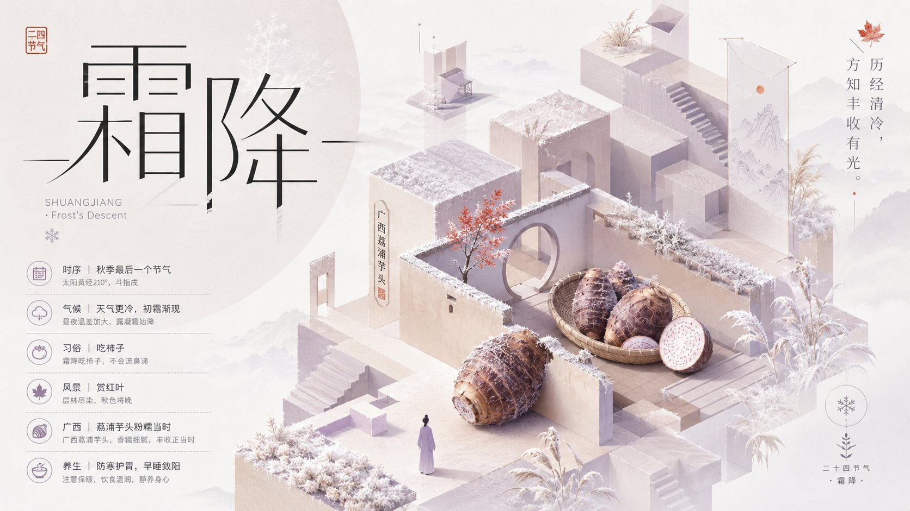
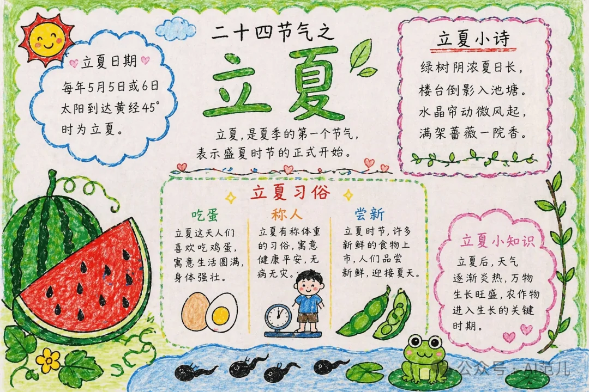

# Seasonal · 节气节日

二十四节气、传统节日主题海报与手抄报。

[← 返回总索引](../README.md)

## 画廊

<!-- 由 scripts/gen_scenario_readmes.py 自动生成,勿手编 -->

|   |   |   |
|:---:|:---:|:---:|
|  |  |  |
| guyu-tea-field | jieqi-liqiu 📝 | jieqi-qiufen 📝 |
|  |  |  |
| jieqi-shuangjiang 📝 | jieqi-xiazhi 📝 | labor-day-poster |
|  |    |    |
| lixia-handnote |    |    |

## 元数据

| 文件 | 主体 | 标签 | 来源 | Prompt |
|---|---|---|---|---|
| [seasonal-lixia-handnote](./seasonal-lixia-handnote.webp) | 立夏节气手抄报：习俗、节令、食物，卡通插画风 | `seasonal` `lixia` `handnote` `kawaii` `chinese-culture` `gpt-image-2` | — | — |
| [seasonal-guyu-tea-field](./seasonal-guyu-tea-field.webp) | 谷雨节气海报：茶田烟雨实景摄影合成，水墨意境 | `seasonal` `guyu` `tea` `photography` `ink` `green` `gpt-image-2` | — | — |
| [seasonal-labor-day-poster](./seasonal-labor-day-poster.webp) | 劳动节快乐海报:脚手架工人剪影 + 红日 + 「节动节」巨字,复古版画风 | `seasonal` `labor-day` `silhouette` `red` `vintage-print` `chinese` `gpt-image-2` | 公众号:粗线条作业 | — |
| [seasonal-jieqi-xiazhi](./seasonal-jieqi-xiazhi.jpeg) | 夏至(XIAZHI · Summer Solstice)海报:横州茉莉 + 金色拱门 + 白衣女子 + 6 项时序/气机/天气/习俗/广西/养生信息 | `seasonal` `jieqi` `xiazhi` `monument-valley` `isometric` `guangxi` `jasmine` `pastel` `chinese` `template-shared` `gpt-image-2` | — | [prompt: 纪念碑谷气质节气海报模板…](./seasonal-jieqi-monument-valley-template.md) |
| [seasonal-jieqi-liqiu](./seasonal-jieqi-liqiu.jpeg) | 立秋(LIQIU · Beginning of Autumn)海报:百色芒果 + 暖橘冷青对比的「夏未尽 / 秋已来」双境空间 | `seasonal` `jieqi` `liqiu` `monument-valley` `isometric` `guangxi` `mango` `dual-tone` `chinese` `template-shared` `gpt-image-2` | — | [prompt: 纪念碑谷气质节气海报模板…](./seasonal-jieqi-monument-valley-template.md) |
| [seasonal-jieqi-qiufen](./seasonal-jieqi-qiufen.jpeg) | 秋分(QIUFEN · Autumn Equinox)海报:壮锦图案 + 对称双拱门 + 红日 + 谷物丰收,中国传统二十四节气 | `seasonal` `jieqi` `qiufen` `monument-valley` `isometric` `guangxi` `zhuang-brocade` `symmetric` `chinese` `template-shared` `gpt-image-2` | — | [prompt: 纪念碑谷气质节气海报模板…](./seasonal-jieqi-monument-valley-template.md) |
| [seasonal-jieqi-shuangjiang](./seasonal-jieqi-shuangjiang.jpeg) | 霜降(SHUANGJIANG · Frost's Descent)海报:荔浦芋头 + 霜白雾色立体几何 + 红枫点缀 | `seasonal` `jieqi` `shuangjiang` `monument-valley` `isometric` `guangxi` `taro` `frost` `chinese` `template-shared` `gpt-image-2` | — | [prompt: 纪念碑谷气质节气海报模板…](./seasonal-jieqi-monument-valley-template.md) |

**说明**:来源缺失填 `—`;Prompt 有 sidecar 写带 20 字摘要的链接,跨 trunk 共享时多行指向同一模板 sidecar(打 `` `template-shared` `` 标签便于识别);标签用反引号包裹。
