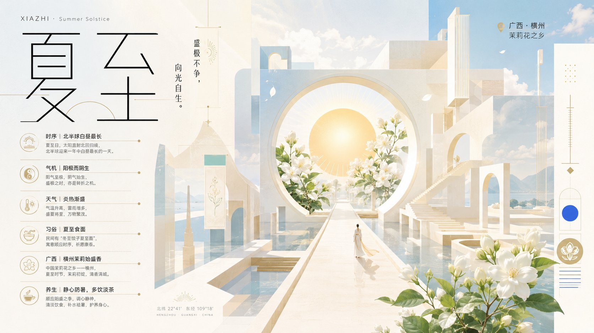
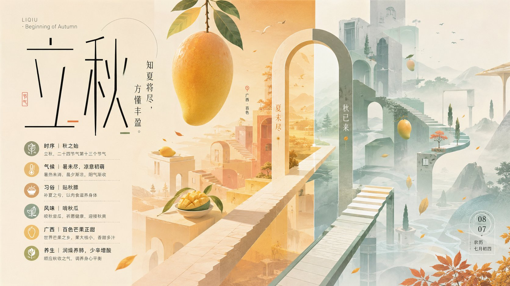

|   |   |
|:---:|:---:|
|  |  |
| 夏至 · 横州茉莉 | 立秋 · 百色芒果 |
|  |  |
| 秋分 · 壮锦丰收 | 霜降 · 荔浦芋头 |

# 二十四节气海报模板(纪念碑谷气质 · 广西特产)

> **prompt 模板**(用户最后一行替换主题即可),用同一份生成 10 张广西特产 × 24 节气海报,本批已落地 4 张(夏至 / 立秋 / 秋分 / 霜降),Prompt 列都指向本 sidecar。节气主题各异,属「模板共享」—— 画廊里**不折叠**,4 张各占一格、各带 📝、连续聚成一簇(脚本对共享 `-template.md` 的组按聚簇而非折叠处理)。
>
> 模板核心:纪念碑谷式等距空间几何 + 中文主标题平面化处理 + 柔和低饱和配色 + 极小人物锚点 + 二级哲理金句 + 节气养生信息层级。

<div class="prompt-head" id="prompt">Prompt 正文</div>

```text
请根据用户最后输入的【主题 / 单词 / 短句】,生成一张「纪念碑谷气质」的极简超现实主义 3D 艺术海报。

核心逻辑(关键):
不要将中文文字强行转成立体建筑。
先理解主题语义,用"空间结构"表达情绪与隐喻;再用"中文排版"作为视觉主标题,两者协同,而不是融合变形。

空间设计:
构建纪念碑谷式几何空间(平台 / 台阶 / 门洞 / 通道 / 悬浮结构),采用等距视角。
空间必须服务主题表达,例如通过高低差、路径、遮挡、孤立、连接等关系隐喻情绪,而不是纯造型堆叠。

中文设计(重点):
中文必须作为清晰、可读的主标题出现,并成为版面视觉核心之一。
采用"平面设计化处理",而不是立体化:
- 可使用极简无衬线 / 细黑体 / 几何结构字形
- 可做轻微拉伸、切割、错位、留白设计
- 可与空间产生遮挡、穿插或叠加关系(而不是变成建筑)
- 保持高级、克制、可读

辅助文字:
可加入少量英文或数字信息(如 vol. / 年份 / 编号),作为版式平衡元素,但权重明显低于中文主标题。

色彩系统(优化重点):
采用"纪念碑谷式动态配色",但适配印刷:
- 以明亮、柔和、低饱和为基础(奶白、雾粉、浅蓝、薄荷绿、砂岩、浅灰等)
- 避免大面积深色与死黑
- 使用同色系明度变化建立空间层级(前 / 中 / 后)
- 点缀 1-2 处高纯度色,用于引导视觉焦点(门洞 / 边缘 / 转折处)

整体色彩需"通透、有空气感、有层次",而不是固定配色方案。

构图与层次:
主体明确,但画面不能空:
- 在四周加入少量"同源结构的弱化延展"
- 使用重复几何、远处体块、边缘切片等方式形成构图闭环
- 建立前景 / 中景 / 后景关系,让画面有深度但不过度复杂

氛围控制:
仅允许极少量意境元素(如淡月、微光、细枝、轻雾或几何符号),点到为止,不堆砌。

人物:
可选极小比例人物(≤8%),作为尺度与情绪锚点,动作安静克制。

最终效果:
一张"空间表达主题 + 中文主导版式"的高端设计海报,具有纪念碑谷式空间语言、清晰视觉层级、克制配色与强设计感,可直接用于艺术展或设计年鉴。

用户输入主题:
本次任务:
生成 小满 之后 10 个二十四节气对应的卡片

注意每张卡片,彼此创意和配色独立,排版独立,没有序列号关联,每张都有排版上的巧思,还有设计思路上的动态变化节奏。

要求每个元素,至少 5 个不同层次信息点 or 知识点,中心元素是 广西代表性特产 or 风格元素 + 融合节气元素,二级标题 都是对应节气的 哲理金句

特别强调:一共 10 个图片,每个图片都是 16:9 尺寸
美学价值:收藏级别
```
