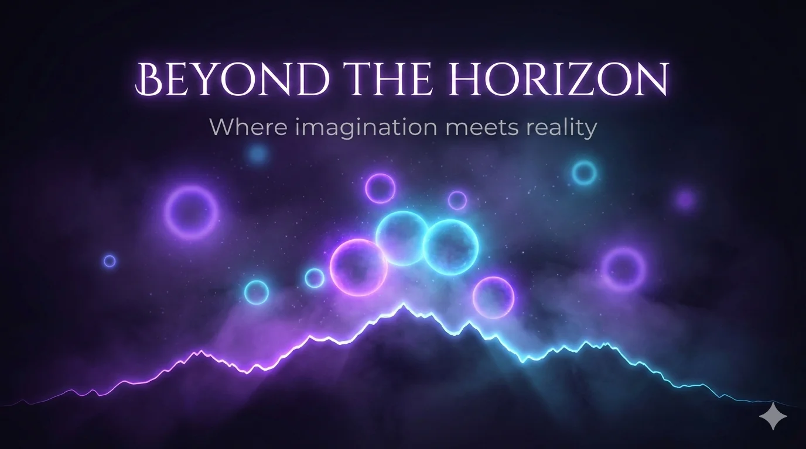
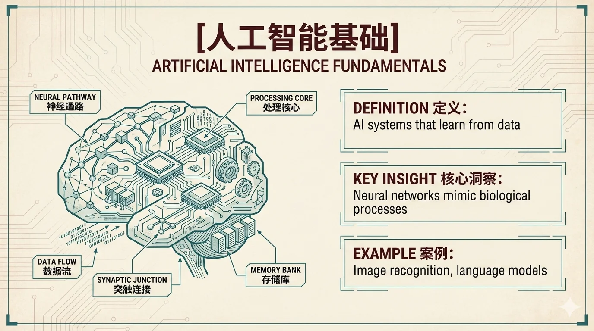

# Slide Deck · 演示文稿

幻灯片、Keynote、Pitch Deck 等演示场景。仅有 **Styles(视觉风格)** 维度。

[← 返回总索引](../README.md)

## Styles 风格画廊

|   |   |   |
|:---:|:---:|:---:|
|  |  |  |
| [blueprint](./blueprint/README.md) | [chalkboard](./chalkboard/README.md) | [bold-editorial](./bold-editorial/README.md) |
|  |  |  |
| [corporate](./corporate/README.md) | [corporate](./corporate/README.md) | [dark-atmospheric](./dark-atmospheric/README.md) |
|  |  |  |
| [editorial-infographic](./editorial-infographic/README.md) | [fantasy-animation](./fantasy-animation/README.md) | [intuition-machine](./intuition-machine/README.md) |
|  |  |  |
| [minimal](./minimal/README.md) | [notion](./notion/README.md) | [pixel-art](./pixel-art/README.md) |
|  |  |  |
| [scientific](./scientific/README.md) | [sketch-notes](./sketch-notes/README.md) | [vector-illustration](./vector-illustration/README.md) |
|  |  |    |
| [vintage](./vintage/README.md) | [watercolor](./watercolor/README.md) |    |

## 可用子分类

**Styles**(16):[`blueprint`](./blueprint/README.md) · [`chalkboard`](./chalkboard/README.md) · [`bold-editorial`](./bold-editorial/README.md) · [`corporate`](./corporate/README.md) · [`dark-atmospheric`](./dark-atmospheric/README.md) · [`editorial-infographic`](./editorial-infographic/README.md) · [`fantasy-animation`](./fantasy-animation/README.md) · [`intuition-machine`](./intuition-machine/README.md) · [`minimal`](./minimal/README.md) · [`notion`](./notion/README.md) · [`pixel-art`](./pixel-art/README.md) · [`scientific`](./scientific/README.md) · [`sketch-notes`](./sketch-notes/README.md) · [`vector-illustration`](./vector-illustration/README.md) · [`vintage`](./vintage/README.md) · [`watercolor`](./watercolor/README.md)

> 每张图一格,同一子分类的多张图连续相邻(标签相同即为同组)。本地收藏图排前、[baoyu-skills](https://github.com/JimLiu/baoyu-skills) 官方示例排后。点任意格跳转到子分类 README 看完整元数据。
