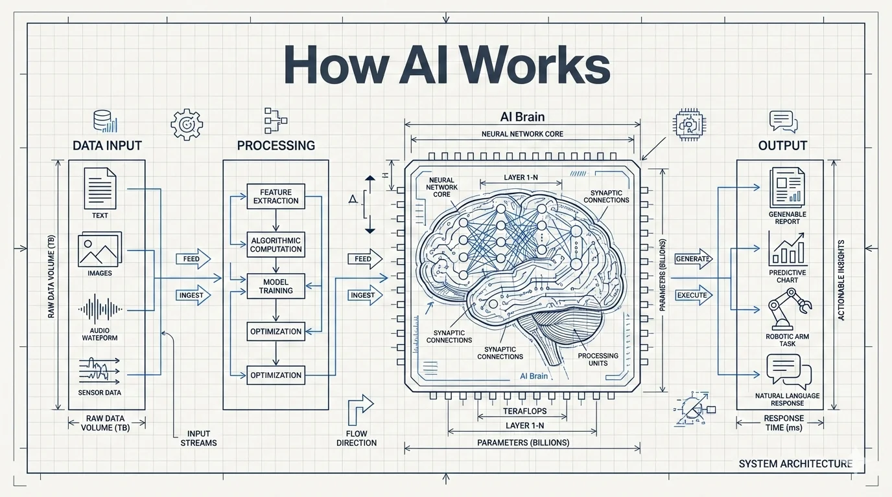
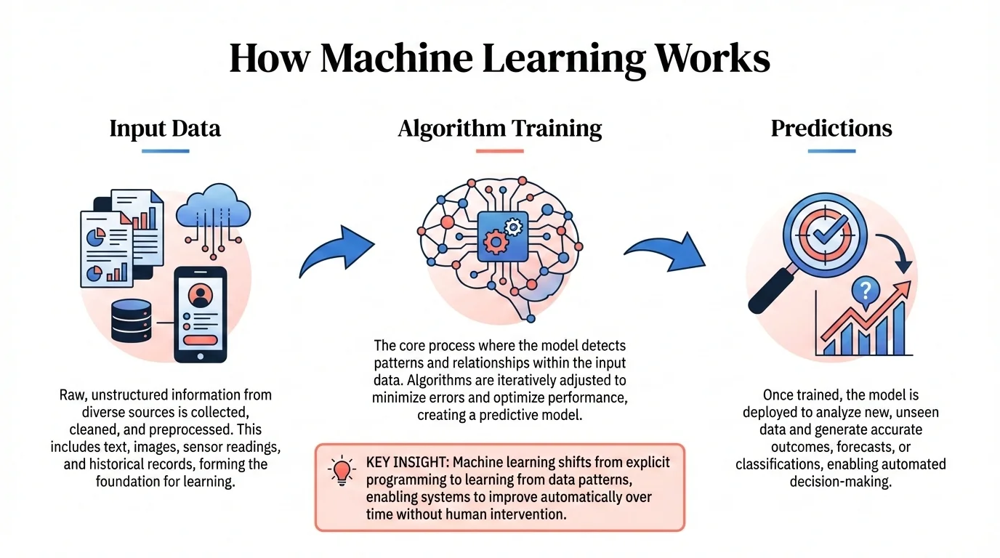
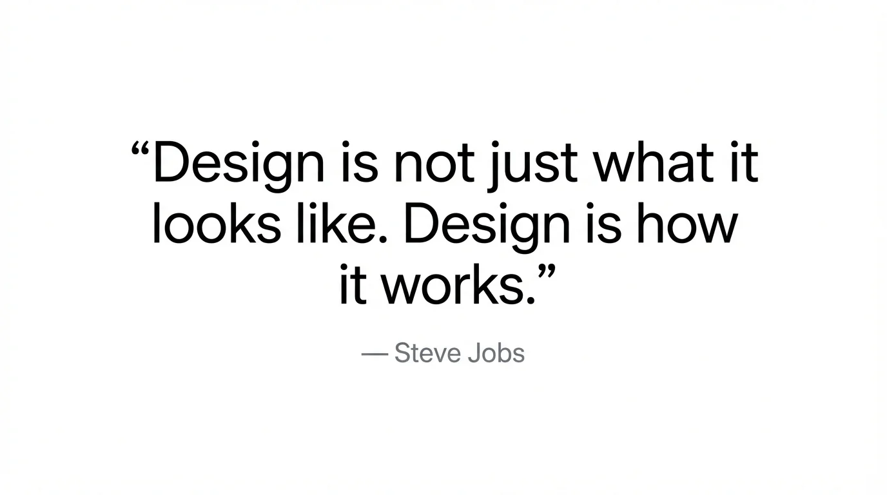
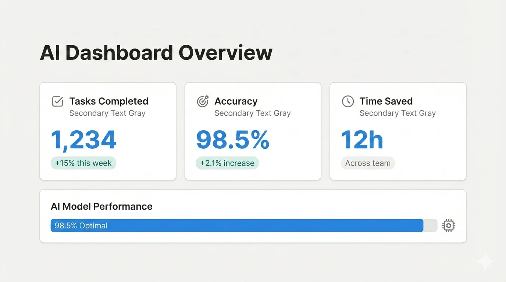
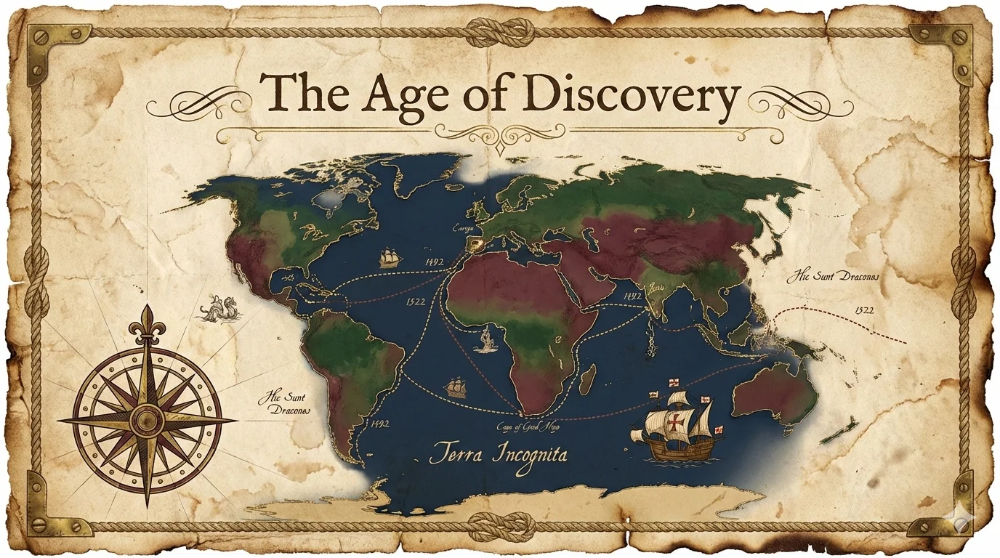

# Slide Deck · 演示文稿

幻灯片、Keynote、Pitch Deck 等演示场景。仅有 **Styles(视觉风格)** 维度。

[← 返回总索引](../README.md)

## Styles 风格画廊

  

    
  

  

    
  

  

    
  

  

    
  

  

    
  

  

    
  

  

    
  

  

    
  

  

    
  

  

    
  

  

    
  

  

    
  

  

    
  

  

    
  

  

    
  

  

    
  

  

    
  

## 可用子分类

**Styles**(16):[`blueprint`](./blueprint/README.md) · [`chalkboard`](./chalkboard/README.md) · [`bold-editorial`](./bold-editorial/README.md) · [`corporate`](./corporate/README.md) · [`dark-atmospheric`](./dark-atmospheric/README.md) · [`editorial-infographic`](./editorial-infographic/README.md) · [`fantasy-animation`](./fantasy-animation/README.md) · [`intuition-machine`](./intuition-machine/README.md) · [`minimal`](./minimal/README.md) · [`notion`](./notion/README.md) · [`pixel-art`](./pixel-art/README.md) · [`scientific`](./scientific/README.md) · [`sketch-notes`](./sketch-notes/README.md) · [`vector-illustration`](./vector-illustration/README.md) · [`vintage`](./vintage/README.md) · [`watercolor`](./watercolor/README.md)

> 每张图一格,同一子分类的多张图连续相邻(标签相同即为同组)。本地收藏图排前、[baoyu-skills](https://github.com/JimLiu/baoyu-skills) 官方示例排后。点任意格跳转到子分类 README 看完整元数据。
