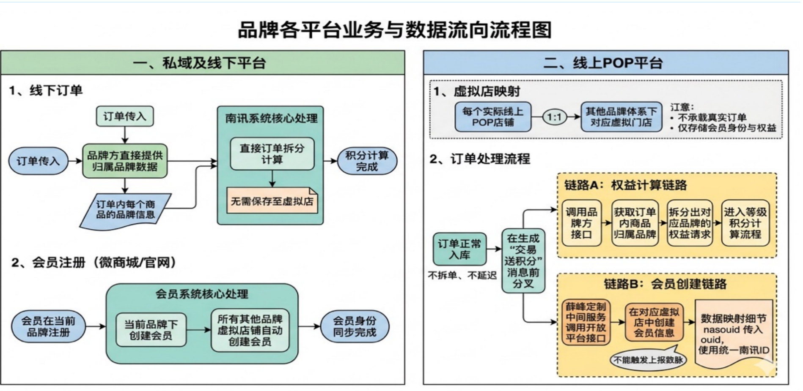

# Slide Deck · Corporate

`corporate` 风格的参考图。首张来自 [baoyu-skills](https://github.com/JimLiu/baoyu-skills) 官方示例。

[← 返回场景索引](../README.md) | [← 返回总索引](../../README.md)

## 画廊

|   |   |   |
|:---:|:---:|:---:|
|  |  |    |
| brand-platform-flow | baoyu |    |

## 元数据

| 文件 | 主体 | 标签 | 来源 | Prompt |
|---|---|---|---|---|
| [deck-corporate-brand-platform-flow](./deck-corporate-brand-platform-flow.png) | 品牌各平台业务与数据流向 | `business` `flowchart` `corporate` `pale-color` | — | — |
| [deck-corporate-baoyu](./deck-corporate-baoyu.webp) | `corporate` 参考示例 | `baoyu-skills` `corporate` | [baoyu-skills](https://github.com/JimLiu/baoyu-skills) | — |

**说明**:来源/Prompt 缺失填 `—`;标签用反引号包裹。
