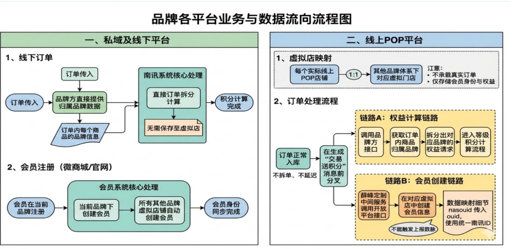

# Slide Deck · Corporate

`corporate` 风格的参考图。首张来自 [baoyu-skills](https://github.com/JimLiu/baoyu-skills) 官方示例。

[← 返回场景索引](../README.md) | [← 返回总索引](../../README.md)

## 画廊

<!-- 由 scripts/gen_scenario_readmes.py 自动生成,勿手编 -->

  

    
  

  

    
  

## 元数据

| 文件 | 主体 | 标签 | 来源 | Prompt |
|---|---|---|---|---|
| [deck-corporate-brand-platform-flow](./deck-corporate-brand-platform-flow.webp) | 品牌各平台业务与数据流向 | `business` `flowchart` `corporate` `pale-color` | — | — |
| [deck-corporate-baoyu](./deck-corporate-baoyu.webp) | `corporate` 参考示例 | `baoyu-skills` `corporate` | [baoyu-skills](https://github.com/JimLiu/baoyu-skills) | — |

**说明**:来源/Prompt 缺失填 `—`;标签用反引号包裹。
