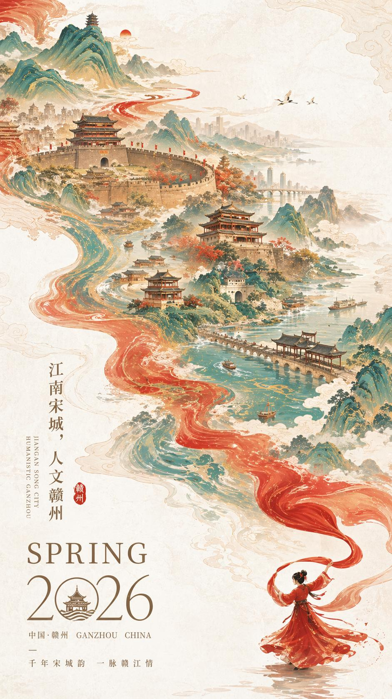

# Travel · 旅游目的地

旅游目的地宣传海报：中国风水墨插画风格。

[← 返回总索引](../README.md)

## 画廊

<!-- 由 scripts/gen_scenario_readmes.py 自动生成,勿手编 -->

  

    
  

  

    
  

## 元数据

| 文件 | 主体 | 标签 | 来源 | Prompt |
|---|---|---|---|---|
| [travel-guizhou-ink-map](./travel-guizhou-ink-map.jpeg) | 多彩贵州旅游信息图：景点地图 + 民族文化 + 特色美食，工笔水墨风 | `travel` `guizhou` `ink` `map` `chinese-culture` `spring-2026` `gpt-image-2` | — | — |
| [travel-ganzhou-song-city](./travel-ganzhou-song-city.jpeg) | 江南宋城·人文赣州旅游海报：古城山水，水墨工笔人物 | `travel` `ganzhou` `ink` `poster` `chinese-culture` `spring-2026` `gpt-image-2` | — | — |

**说明**:来源/Prompt 缺失填 `—`;标签用反引号包裹。
