# XHS Images · 小红书图片

社交平台配图,封面/笔记头图。分 **Styles(视觉风格)** 与 **Layouts(排版布局)** 两个维度。

[← 返回总索引](../README.md)

## Styles 风格画廊

  

    
  

  

    
  

  

    
  

  

    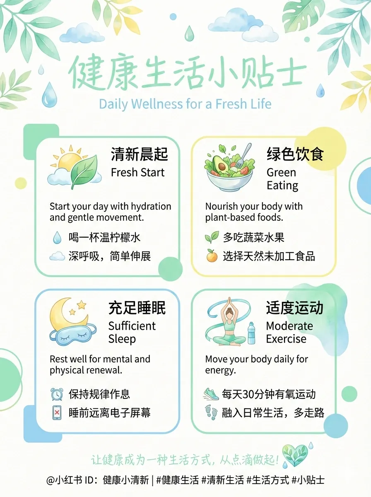
  

  

    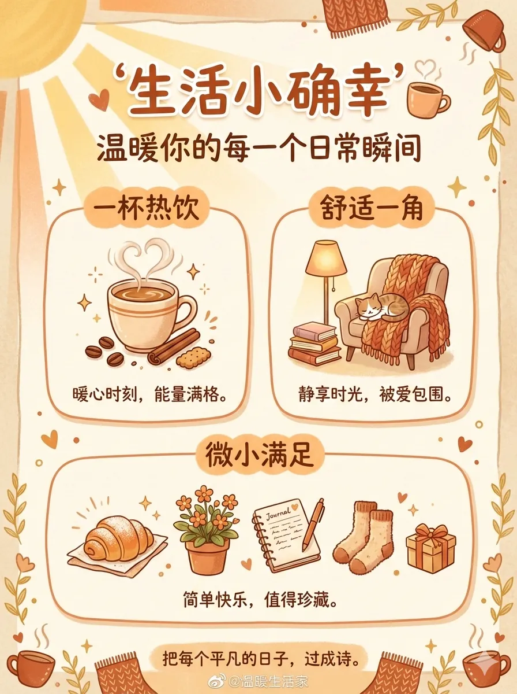
  

  

    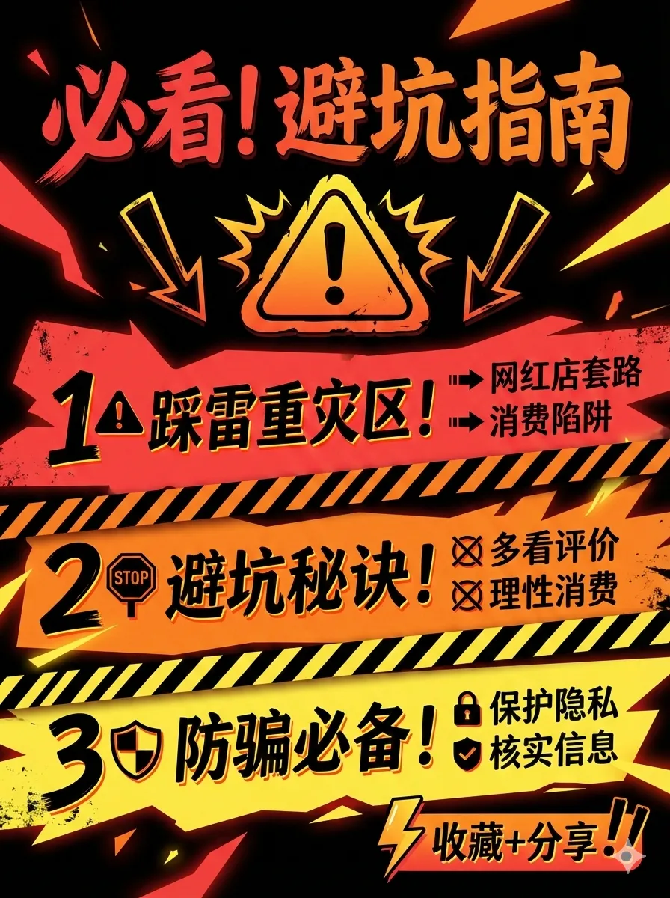
  

  

    
  

  

    
    10
    
      
      
      
      
      
      
      
      
      
    
    <a class="tile-prompt-badge" href="./minimal/xhs-minimal-tea-oil-guide/" title="查看 prompt">📝</a>
  

  

    
  

  

    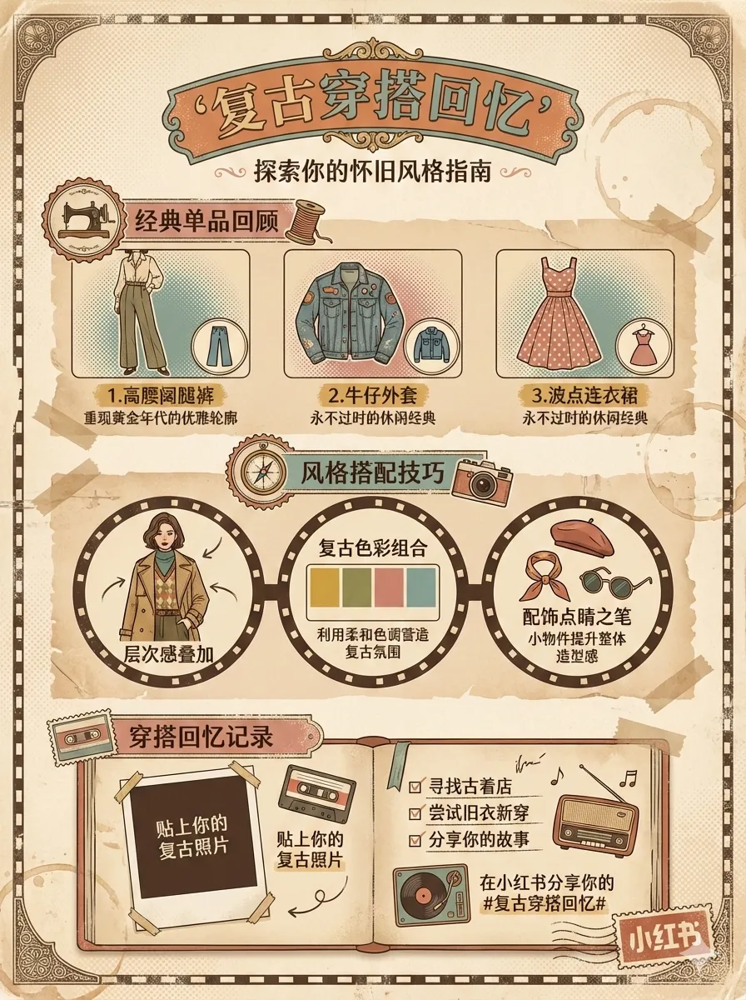
  

  

    
  

  

    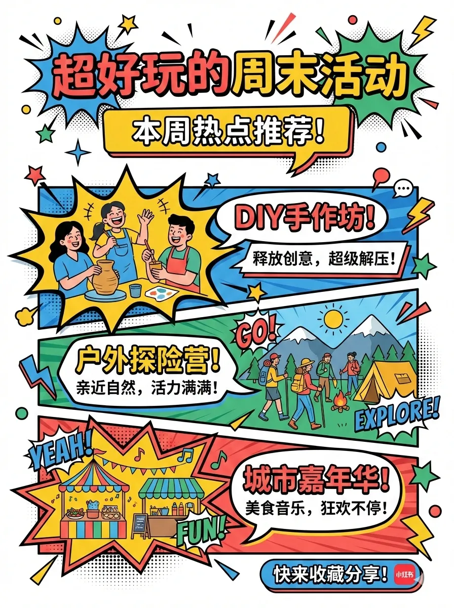
  

  

    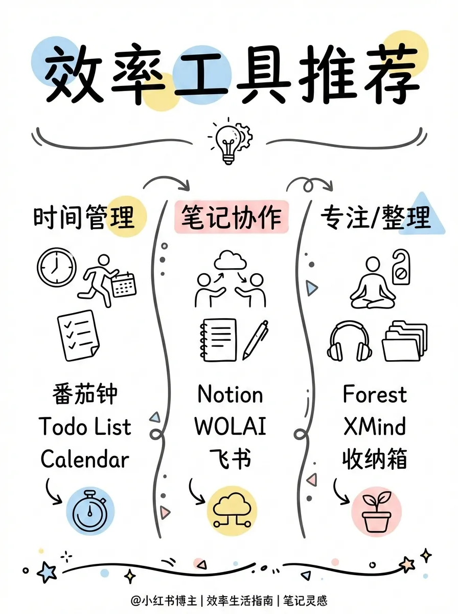
  

  

    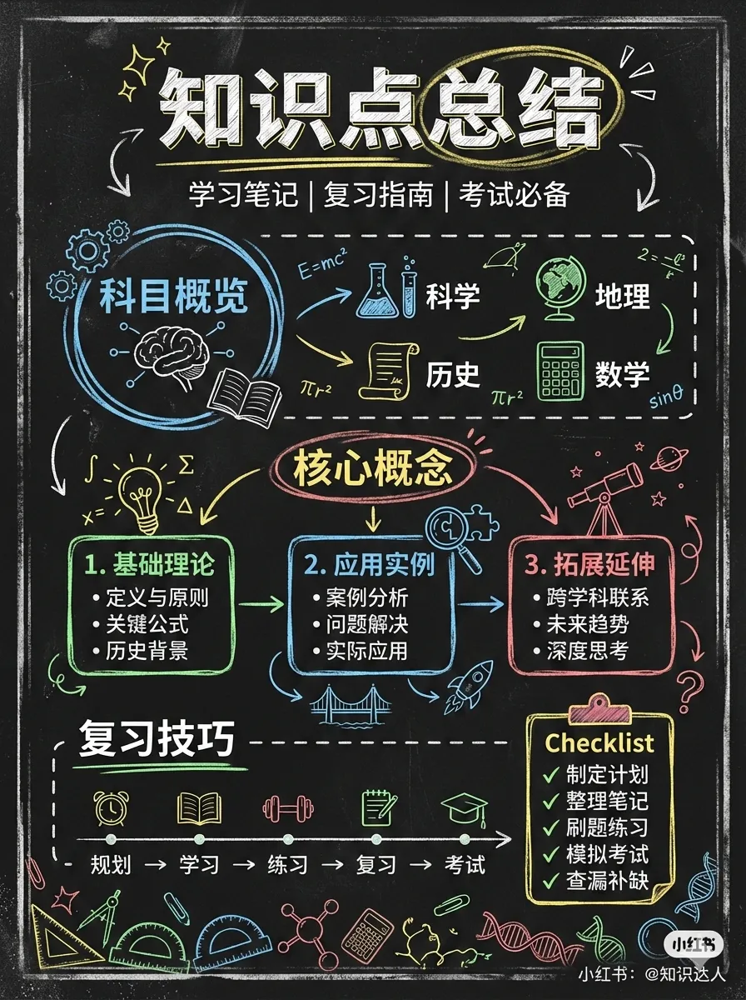
  

## Layouts 布局画廊

  

    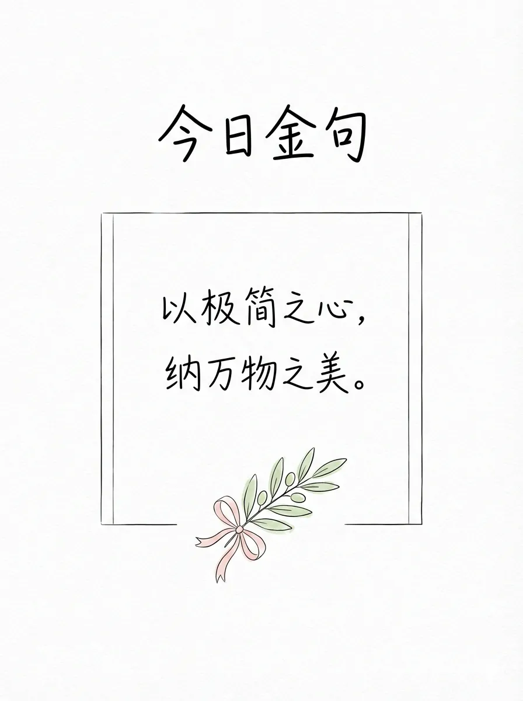
  

  

    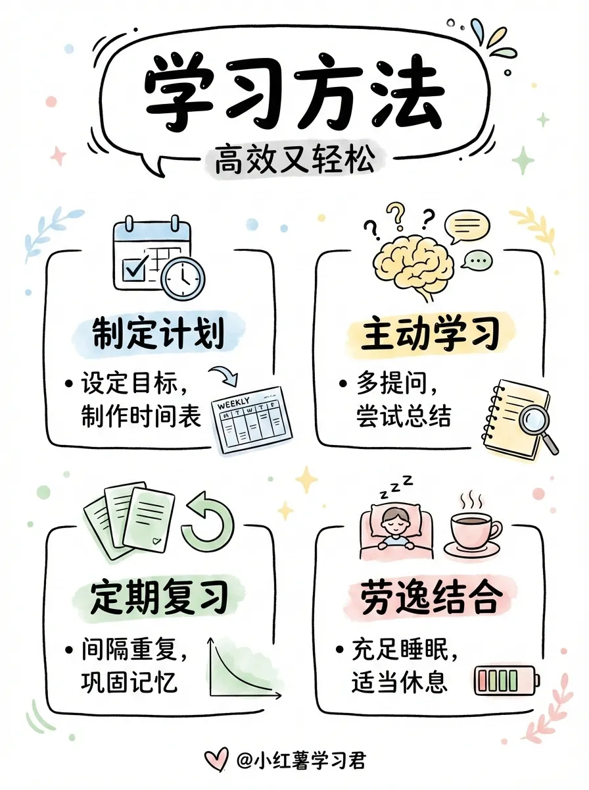
  

  

    
  

  

    
  

  

    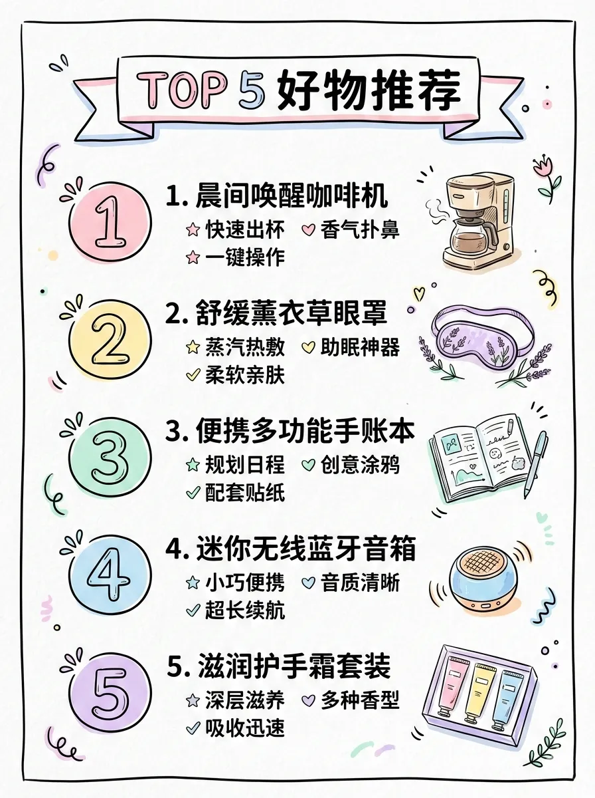
  

  

    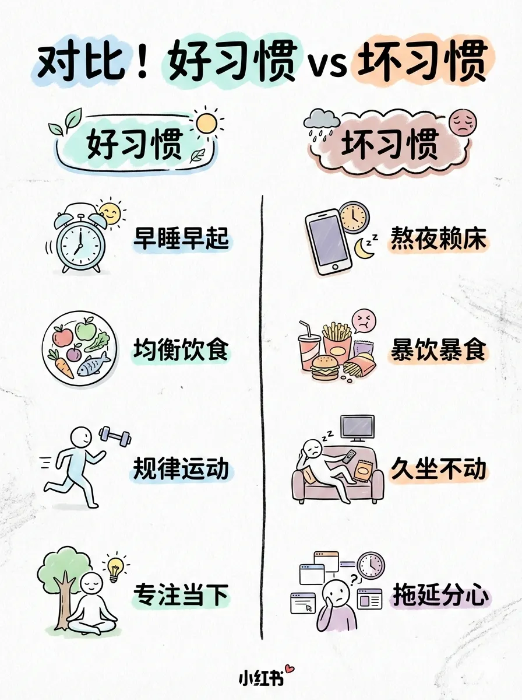
  

  

    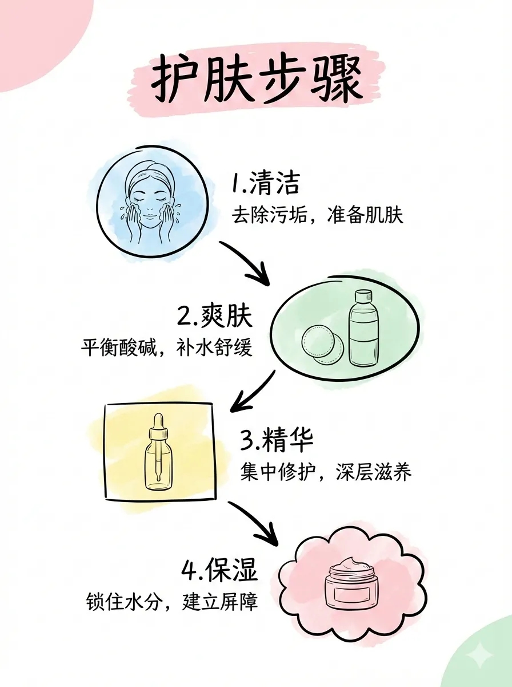
  

## 可用子分类

**Styles**(9):[`cute`](./cute/README.md) · [`fresh`](./fresh/README.md) · [`warm`](./warm/README.md) · [`bold`](./bold/README.md) · [`minimal`](./minimal/README.md) · [`retro`](./retro/README.md) · [`pop`](./pop/README.md) · [`notion`](./notion/README.md) · [`chalkboard`](./chalkboard/README.md)
**Layouts**(6):[`sparse`](./sparse/README.md) · [`balanced`](./balanced/README.md) · [`dense`](./dense/README.md) · [`list`](./list/README.md) · [`comparison`](./comparison/README.md) · [`flow`](./flow/README.md)

> 每张图一格,同一子分类的多张图连续相邻(标签相同即为同组)。本地收藏图排前、[baoyu-skills](https://github.com/JimLiu/baoyu-skills) 官方示例排后。点任意格跳转到子分类 README 看完整元数据。
