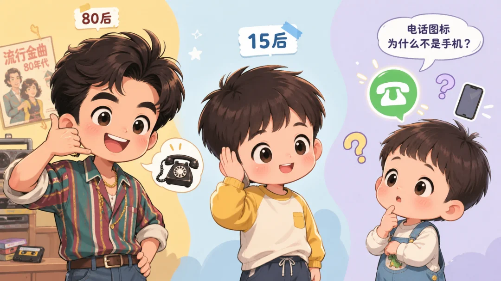
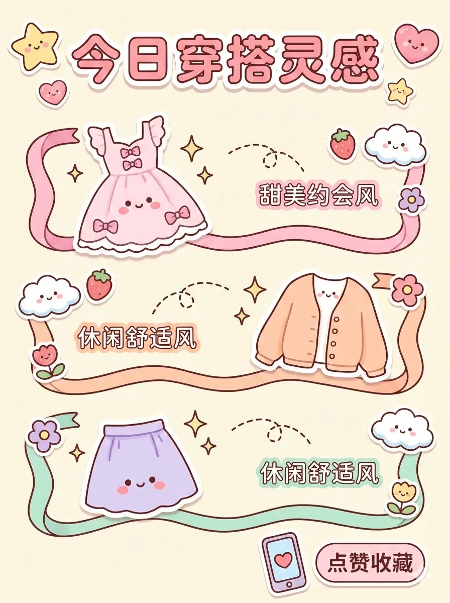

# XHS Images · Cute

`cute` 风格的参考图。首张来自 [baoyu-skills](https://github.com/JimLiu/baoyu-skills) 官方示例。

[← 返回场景索引](../README.md) | [← 返回总索引](../../README.md)

## 画廊

<!-- 由 scripts/gen_scenario_readmes.py 自动生成,勿手编 -->

  

    
  

  

    
  

## 元数据

| 文件 | 主体 | 标签 | 来源 | Prompt |
|---|---|---|---|---|
| [xhs-cute-generation-kids](./xhs-cute-generation-kids.webp) | 80后/15后世代对比卡通:三个不同年代孩子合影,语音气泡「电话座机为什么不是手机？」 | `generation` `kids` `3d-cartoon` `nostalgic` `comparison` | — | — |
| [xhs-cute-baoyu](./xhs-cute-baoyu.webp) | `cute` 参考示例 | `baoyu-skills` `cute` | [baoyu-skills](https://github.com/JimLiu/baoyu-skills) | — |

**说明**:来源/Prompt 缺失填 `—`;标签用反引号包裹。
