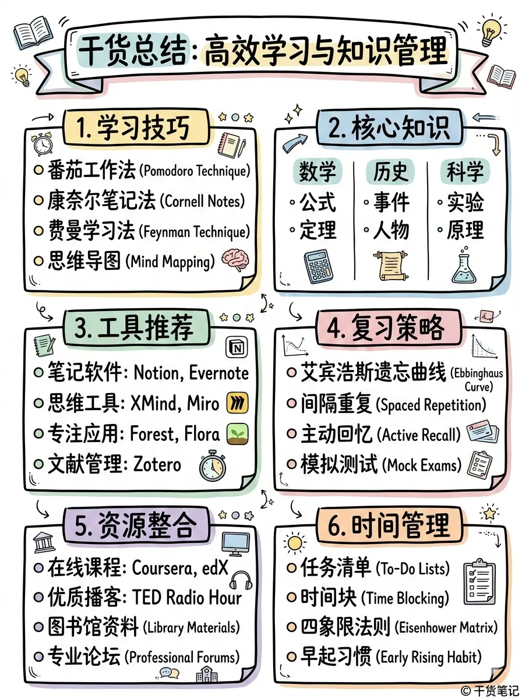

# XHS Images · Dense

`dense` 风格的参考图。首张来自 [baoyu-skills](https://github.com/JimLiu/baoyu-skills) 官方示例。

[← 返回场景索引](../README.md) | [← 返回总索引](../../README.md)

## 画廊

<!-- 由 scripts/gen_scenario_readmes.py 自动生成,勿手编 -->

  

    
  

  

    
  

## 元数据

| 文件 | 主体 | 标签 | 来源 | Prompt |
|---|---|---|---|---|
| [xhs-dense-korean-bbq-platter](./xhs-dense-korean-bbq-platter.jpg) | 今日主角:烤肉拼盘,韩餐桌实拍 + 手写标注气泡(嫩牛肉/焦香鸡肉/灵魂冷面等) | `food` `korean-bbq` `xhs` `lifestyle` `handwritten-notes` `chinese` `gpt-image-2` | 微博 @欧巴聊AI | — |
| [xhs-dense-baoyu](./xhs-dense-baoyu.webp) | `dense` 参考示例 | `baoyu-skills` `dense` | [baoyu-skills](https://github.com/JimLiu/baoyu-skills) | — |

**说明**:来源/Prompt 缺失填 `—`;标签用反引号包裹。
