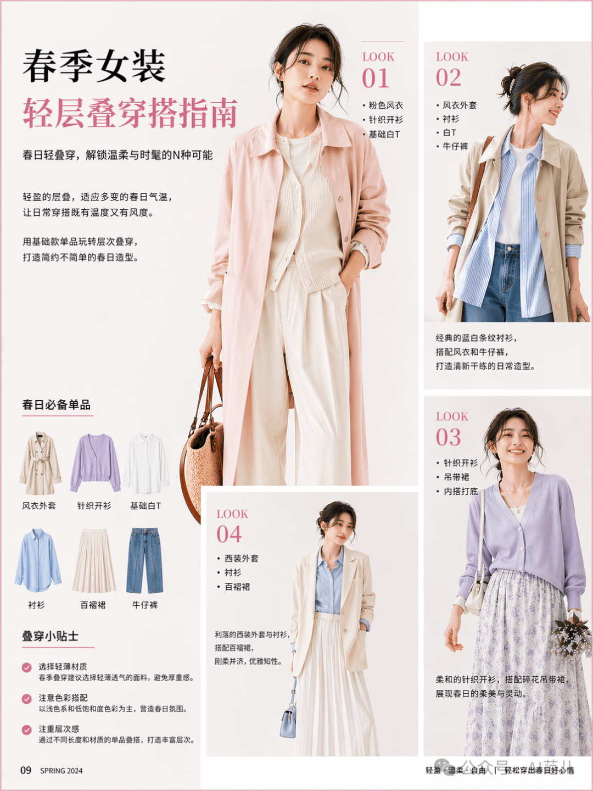

# XHS Images · Minimal

`minimal` 风格的参考图。首张来自 [baoyu-skills](https://github.com/JimLiu/baoyu-skills) 官方示例。

[← 返回场景索引](../README.md) | [← 返回总索引](../../README.md)

## 画廊

|   |   |   |
|:---:|:---:|:---:|
|  |  |    |
| spring-layering-guide | baoyu |    |

## 元数据

| 文件 | 主体 | 标签 | 来源 | Prompt |
|---|---|---|---|---|
| [xhs-minimal-spring-layering-guide](./xhs-minimal-spring-layering-guide.png) | 春季女装轻层叠穿搭指南：Look 示范 + 单品清单 + 生活贴士 | `fashion` `spring` `xhs` `guide` `minimal` `gpt-image-2` | — | — |
| [xhs-minimal-baoyu](./xhs-minimal-baoyu.webp) | `minimal` 参考示例 | `baoyu-skills` `minimal` | [baoyu-skills](https://github.com/JimLiu/baoyu-skills) | — |

**说明**:来源/Prompt 缺失填 `—`;标签用反引号包裹。
